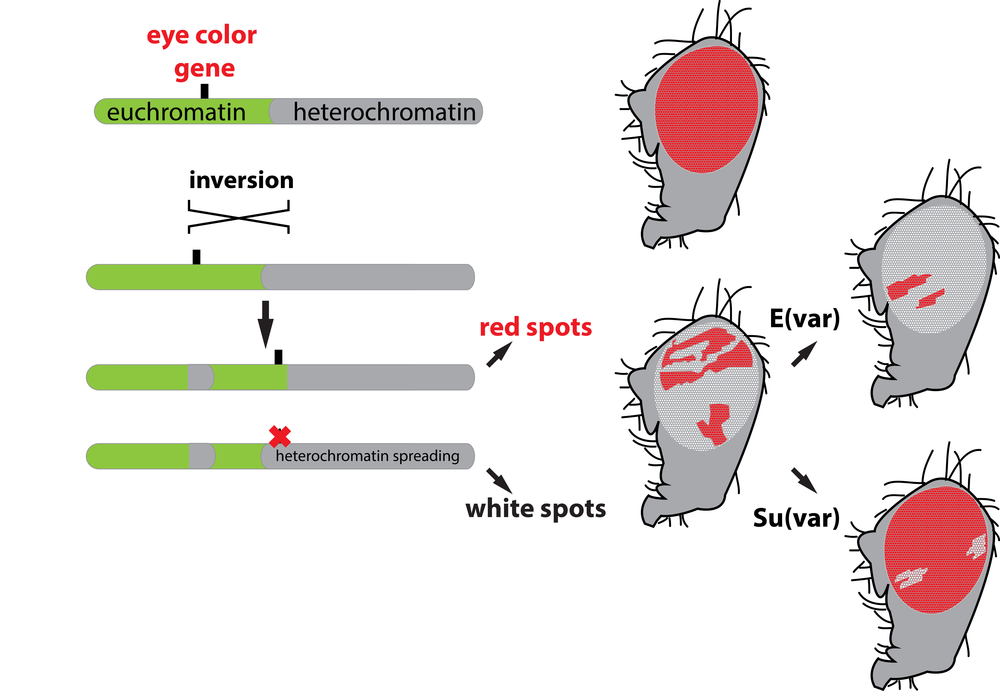
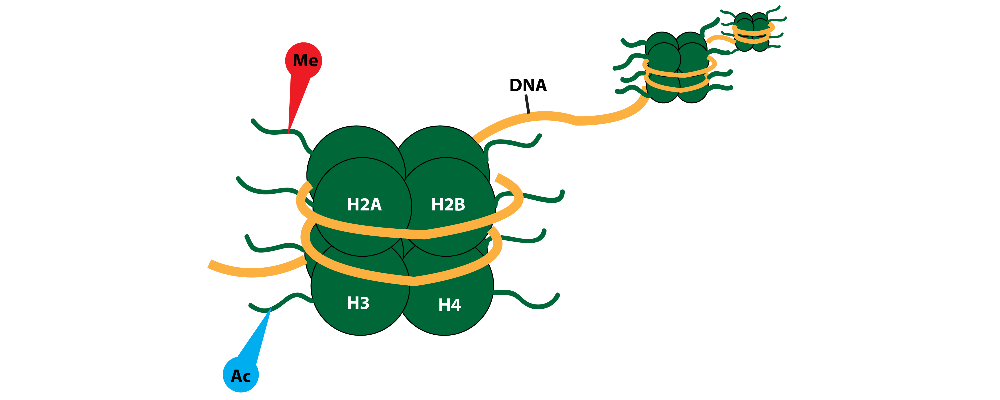

The word epigenetics is thrown around a lot, but what it boils down to is you are more than your genes. Every cell in your body has the same DNA, having descended from a single zygote (the cell that is the result of a fusion of sperm and egg) that gave rise to an entire organism. Despite this, each cell type has its own shape, function, and distinct physiology. Early in development, the zygote becomes two cells, and then four cells, and eventually, the trillions that make up your entire body. A series of events commit each cell toward an increasingly specified path. Some will become heart cells, others, liver cells. How does this happen? Throughout development, the cells signal to each other in a way that communicates what they’re going to become and what their neighbors should do. These signals tell your cells to turn off some genes, while turning on others and this is what makes each cell-type unique. If our genetic code were a book, epigenetics decides which words are read. 

In the early 20th century, it was thought that throughout development, cells might destroy genes unrelated to their function. In 1958, however, John Gurdon demonstrated that the DNA containing nucleus from a differentiated somatic cell from a frog could be placed into an egg, and that egg would develop normally. Somatic cells, or all cells except sperm and egg, are not involved in reproduction. This demonstrated that the difference between a somatic cell and an egg was not the DNA in the cell, but something else entirely. Just a few years earlier, Conrad Waddington found that he could cause the loss of cross-veins in fruit flies  by exposing the larvae to high temperatures for a short period of time. After many generations, these changes eventually became heritable. Waddington hypothesized that the heat caused mutations in genes, but he was wrong. The genetic code was unaltered by the heat, but there were visible changes to the flies and those changes were heritable. Both of these crucial experiments hinted at something beyond the genetic code.

Generally, a cell’s identity and function depends on which of the genes in the genome are turned “on” or turned “off” in that particular cell. One efficient way to turn genes off is to pack them away in dense protein-DNA bundles so that other proteins that create products from those genes can’t access that DNA sequence.  We call regions of the genome that are accessible and more likely to be expressed, euchromatin, and regions that are inaccessible and not expressed, heterochromatin. We first learned about these different regions of chromosomes from experiments in flies with mottled or variegated eye color (Figure 1). Flies normally have red eyes, but if you mutate the gene for red eyes, the fly will have white eyes. One strain of fly had an intact “red eye” gene, but was found to have a mixed eye color of red and white patches due to a mutation that caused the eye color gene to be moved close to a region of heterochromatin called the centromere. This caused some eye cells to lose expression of the red eye color gene, turning portions of the eye white. This phenomenon was called position effect variegation and has served as an excellent system to study how gene expression is regulated by epigenetic changes to chromatin state.

**Figure 1: Position effect variegation helped scientists discover the first known genes involved in epigenetic regulation.**

Using these flies with variegated eyes, scientists were able to screen for genes that either increased or decreased heterochromatin formation. For example, if a gene mutation led to more white eye cells in the flies, that gene was likely important for keeping heterochromatin from spreading. And vice-versa, mutations that kept more eye cells red were associated with genes that promote heterochromatin formation. These two classes of genes are called Enhancers of Variegation (E(var)) and Suppressors of Variegation (Su(var)). We now know that these classes of genes are conserved and help to control chromatin state in many organisms, including humans. 

So what are these E(var) and Su(var) genes, and what do they do? To answer these questions, we need to step back and define chromatin. The DNA in your cells does not exist in isolation, but is associated with many proteins inside the nucleus. Chromatin includes both the DNA and the proteins that it is associated with. The most abundant proteins in chromatin are called histones. These histones are the substrate for much epigenetic regulation that determines whether the DNA that is wrapped around them is expressed or not. Many of the E(var) and Su(var) genes can move these histones around or they can modify parts of the histone proteins, called histone tails. Chemical modification of histone tails can cause that region of DNA to either open up and dissociate from nucleosomes, or can recruit proteins that help to tighten up that region, keeping genes off. E(var) and Su(var) gene groups contain “writers” of these modifications, “readers” that bind to modified histones, and “erasers” that allow these marks to be removed when a gene needs to change its state of expression. Some of the earliest known writers are proteins known as histone methyltransferases (HMTs) and histone acetyltransferases (HATs). The names may be a mouthful, but they actually tell you the function of the proteins. Histone methyltransferases transfer a methyl group, a carbon atom hugged tightly by three hydrogen atoms, onto the histone tails and HATs add acetyl groups to the histone tails.

**Figure 2: Chromatin structure.** 
There are 4 types of histones, and 2 of each kind come together to form a complex called the nucleosome, a little “ball” of 8 histones total. The DNA wraps around these nucleosomes forming “balls on a string.”

We now know that there are dozens of histone modifications that work together to precisely regulate gene expression in every cell, and we are just beginning to understand how they work. One well-studied modification (acetylation) is placed on a specific amino acid (lysine 27) of the tail of histone 3. The shorthand name for this modification is H3K27ac. The addition of an acetyl group to the histone makes the histone protein have a slight positive charge. Because DNA is negatively charged, this chemical modification makes the DNA repel from the histone proteins, so that region of DNA is more open and available to be expressed. Therefore, H3K27ac is often a mark in euchromatin. Knowing this, we can find out which parts of the DNA are most accessible for a specific cell type if we know where that cell type’s  H3K27ac marks are located. To do this, scientists use a special technique called Chromatin Immunoprecipitation Sequencing, or ChIP-seq. How ChIP-seq works is you chop the chromatin into little pieces and then pull out the pieces that have H3K27ac using an specific antibody that recognizes the acetylated histone. Then, you sequence the DNA that was pulled out by the H3K27ac antibody. These DNA sequences will be the regions of the genome that are open and able to be expressed. Scientists can do this for many of the other histone modifications and create a map of where these modifications are found and how they might affect the ability of those regions of DNA to be “on” or “off.”
 
After decades of work, the field of epigenetics has discovered hundreds of ways that the genome can be regulated to make sure the right genes are expressed in the right cells at the right time. In addition to modifications to histone proteins, the DNA itself can be chemically modified. Most recently, scientists have learned that the overall 3D structure of the chromatin can have a major effect on gene expression, not just these local DNA-histone interactions. 
 
We are just beginning to understand how epigenetic changes can affect cell fate and disease states, but further study in this field of biology will have important outcomes for human health. Epigenetic changes have been associated with human diseases that impact much of the population, from obesity and heart disease, to Alzheimer’s and schizophrenia. Many cancers have aberrant expression of E(var) and Su(var) genes and altered patterns of epigenetic marks. Furthermore, the field of epigenetics will be important for regenerative medicine approaches to create new neurons or new muscle cells for patients with degenerative disease. The mystery of how a single cell embryo can give rise to all the unique cell types of the body likely relies upon exquisite epigenetic mechanisms that biologists seek to uncover and understand. The prefix “epi” means above, over, or in addition to, which makes the word epigenetic a fitting one, because as you all know, we are more than our genes. 

###Footnotes

1.	variegated - exhibiting different colors, especially as irregular patches or streaks

###References 

1. Slack JM. Conrad Hal Waddington: the last Renaissance biologist?Nat Rev Genet. 2002 Nov;3(11):889-95. 

2. Allfrey VG, Faulkner R, Mirsky AE. Acetylation and methylation of histones and their possible role in the regulation of RNA synthesis. PNAS. 1964;51(5):786-794.

3. Holliday R. Epigenetics: A historical overiview. Epigenetics. 2006 Apr-Jun;1(2):76-80

