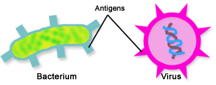

Hands up if you’ve already gotten your flu shot!
Now give yourself a pat on the back, because you’ve just provided your immune system (your body’s Department of Defense) with the mugshots of disease-causing microbes. Vaccines work by teaching your **adaptive immune system** to recognize harmful pathogens. This primes specialized immune cells so that they will be ready to jump into action the next time they come across these microbes.

**So what are these specialized immune cells?**

These immune cells are called **lymphocytes**, which are part of the adaptive immune system. Lymphocytes come in two flavors, **B and T cells**, and are tasked with the extremely important job of identifying and eliminating invading microbes and remembering them in case of future infections. How do they do this? B and T cells exhibit two distinctive characteristics: **antigen specificity** and **immunological memory.**

### Antigen specificity

*[Figure 1](http://www2a.cdc.gov/nip/isd/ycts/mod1/courses/genrec/10110.asp): Antigens on the surface of two pathogens, a bacterium and a virus.*

In order to mount a response, the immune system first has to recognize what it is fighting against. Lymphocytes recognize intruders through specific receptors on their surface. Each B and T cell has its own unique receptor that is highly specific for recognizing only one **antigen** (Figure 1). An antigen is any part of the pathogen that can be recognized by receptors on B or T cells. This allows B and T cells to identify different pathogens and mount immune responses against the specific intruder. In addition to having B cell receptors (BCR) on their cell surface, B cells are able to produce a soluble, non-membrane-bound version of their BCRs – which you might know better as **antibodies**. Meanwhile, T cells have surface bound T cell receptors (TCRs).
Theoretically, each one of us can have up to 1011 different BCRs1 and over 1020 different TCRs 2 . With 6.5 billion people in the world, we could hand every person a unique BCR, and we’d be able to dish BCRs out to slightly over 15 times the world population. We could give out 1,000 distinct TCRs per person, and have enough for the people of a whopping one million Earths! And yes, all of that receptor diversity from just YOU. But with fewer than 30,000 genes in the human body, it is impossible that there is one gene encoding every receptor. B and T cells generate their vast receptor repertoires through an entirely unique mechanism: the DNA itself for the BCR or TCR genes can be rearranged and recombined to create cells with unique surface receptors. After this rearrangement, the full diversity BCRs and TCRs can be generated. Lymphocytes are a special exception to the common rule that all your cells contain the same genetic content. Lymphocytes are not magicians who can make genes appear out of nowhere, but we’ve got to admit, they are experts at shuffling the hand they’re dealt!

### Immunological memory

In order to remember past infections, lymphocytes exhibit a phenomenon known as **immunological memory**. Simply put, once they are introduced to a potential threat, lymphocytes never forget it. This means that adaptive immune responses are stronger and react faster when the same pathogen (or a closely related one) is encountered. This powerful reaction usually enables the body to clear repeat infections before the pathogen reaches large enough numbers to cause illness.
Upon encountering its **antigen** for the first time, a B cell or T cell is activated, and will clone itself again and again. This produces an army of lymphocytes with the exact BCR or TCR, which all recognize the same antigen. Most of these become effector cells, soldiers which will be actively involved in fighting the pathogen. However, a few cells become long-lived memory cells, lasting for years and years and preserving the genetic instructions to recreate that successful BCR or TCR. When the same pathogen comes back in future, memory B and T cells are still on the alert, ready to clone themselves and fight. The result is a faster and stronger adaptive response when a pathogen is re-encountered, which is termed the secondary immune response.
Vaccinations work through this principle. Many of them contain a harmless, dead or inactivated version of the pathogen, providing the initial pathogen encounter with your lymphocytes. This priming your B and T cells to mount a more rapid and potent response against the actual harmful microbe upon re-encounter. That’s just like how providing the police with mugshots of wanted criminals would enable the authorities to stage a more effective plan for arresting the crooks. Even if you do catch an infection and fall ill, take solace in the fact that your adaptive immune response is hard at work committing the offending pathogen to memory so that it’s better prepared in future. Usually, immunological memory enough to trigger a more timely and powerful response to wipe out the pathogen before it does any major damage in a subsequent infection, saving you from falling terribly sick the second time.

### The quick summary:

In essence, the adaptive immune system is absolutely crucial in mounting a swift and effective counter-attack that is tailored specifically against the offending pathogen. Lymphocytes, which make up the adaptive immune system, demonstrate antigen specificity as they have permanently shuffled their genetic makeup to commit to producing unique antigen receptors. Each B or T cell can recognize only one antigen per cell, but there are thousands and thousands of these cells. Only B and T cells which are activated by binding to their corresponding antigen will go on to clone themselves, forming a formidable pool of pathogen-specific lymphocytes. The majority of these clones become effector cells which valiantly fight the infection, while some develop into memory cells which persist for years and remain on high alert, ready to burst into action and boost reinforcements should they see the same invader again.

### References:

[1] Glanville, J., Zhai, W., Berka, J., Telman, D., Huerta, G., Mehta, G. R., Ni, I., Mei, L., Sundar, P.D., Day, G.M.R., Cox, D., Rajpal, A., & Pons, J. (2009). Precise determination of the diversity of a combinatorial antibody library gives insight into the human immunoglobulin repertoire. Proceedings of the National Academy of Sciences, 106(48), 20216-20221.
[2]  Zarnitsyna, V. I., Evavold, B. D., Schoettle, L. N., Blattman, J. N., & Antia, R. (2013). Estimating the diversity, completeness, and cross-reactivity of the T cell repertoire. Frontiers in Immunology, 4, 485.

