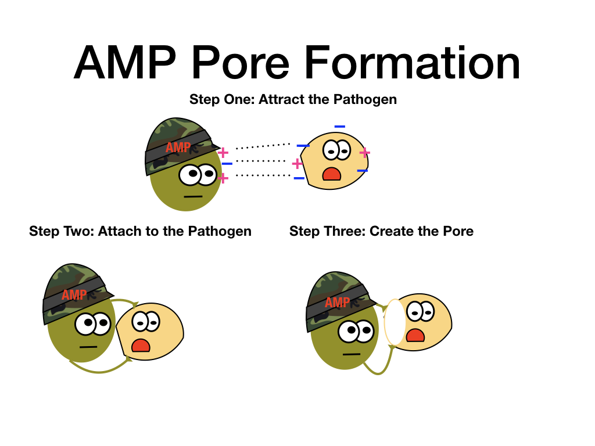
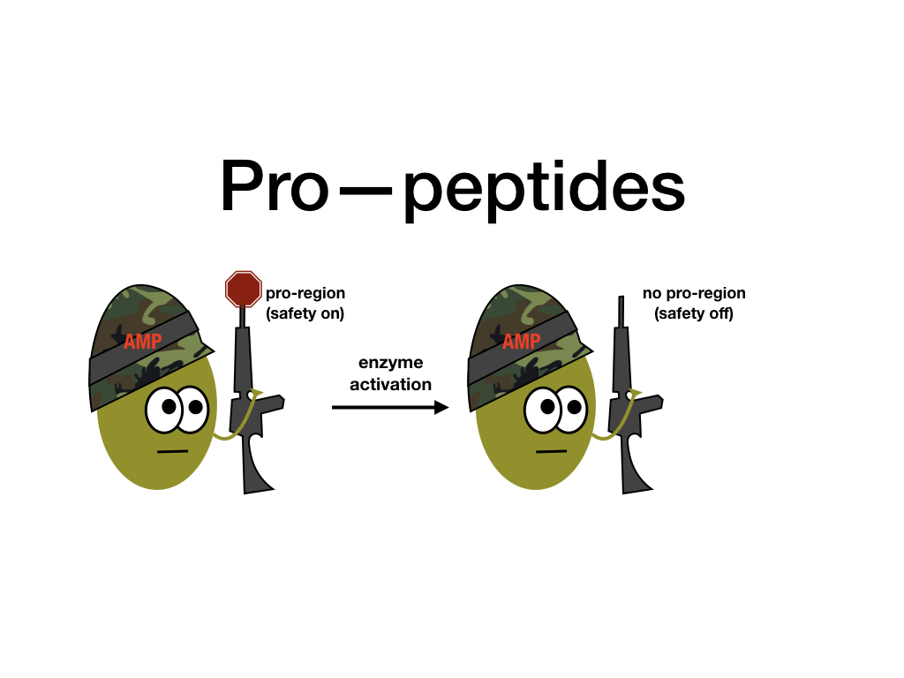

**Antimicrobial peptides (AMP)** are a diverse group of proteins that act as an essential tool our immune system uses early on in the course of an infection as part of our first lines of defense. [^1].  AMPs can defend against a variety of threats to their host, such as bacteria, viruses, fungi, and some types of cancer cells[^1].  AMPs are like foot soldiers of an army attack.  They are quick-acting, deadly, and keep the battle under control until other components of the immune system are activated.  They are produced in tissues prone to a breach of physical barriers – in our skin, intestinal lining, lungs, eyes, and reproductive tract[^1].

### How do AMPs carry out their deadly attacks? They follow three steps[^1]

1.    ***Attraction:***
The saying “opposites attract” works well for AMPs.
AMPs use their regions of positive and negative charge to bind to the negative or positive charged regions on pathogens like bacteria.
2.    ***Attachment:***
After AMPs and the pathogen are attracted, the AMP attaches itself to the pathogen like the clingy date that won’t let go of your hand.
3.    ***Pore Creation:***
Once AMPs are attached to a pathogen, they use their hydrophobic regions to enter the lipid membrane of the pathogen. Once they have penetrated the pathogen, they create a pore[^2].

### How does creating a pore kill a pathogen?

Cells have a membrane to control their internal environment.  Think of AMPs creating pores like a cannon ball hitting an enemy ship to create a hole.  The enemy ship will take on water and eventually sink _and_ be highly vulnerable to attack in the meantime.  The pathogen will react like the enemy ship, they will take in too much water till they burst! When this burst happens, they can lose essential cargo like proteins and ions (which will hurt their pH balance and could turn off critical life support systems by de-activating key enzymes).  Additionally, they are much more vulnerable to other parts of the immune system army and easier to kill.

### AMPs are identified based on six characteristics[^2]
1.    ***Size*** – 6 – 59 amino acids long
2.    ***Sequence*** – rich in positively charged and hydrophobic (water repellent) amino acids
3.    ***Charge*** – contain regions of strong positive charge and negative charge
4.    ***Conformation*** – very structured
5.    ***Amphipathicity (having hydrophobic and hydrophillic parts)*** – AMPs have parts that are attracted to water and parts that are attracted to cell membranes– (so they work like soap in that parts of soap can attract dirt and other parts of soap attract water)
6.    ***Pro-peptides***
Pro-peptides means that AMPs are ready to kill at a moment’s notice, much like a gun with the safety on.  However, they **need to be activated** before they can kill so that they don’t kill the cells of their host by mistake. This helps to lower friendly fire and host damage[^2].  AMPs are activated and set to kill when they are cleaved by an enzyme and lose their “pro-region”[^2].  Like removing the safety of a gun, AMPs are not lethal until the pro-region is removed.

### Why do we care about AMPs killing ability?
Why are AMPs still studied today since we naturally make them?
Studies from AMPs really took off back in the 1950’s and 1960’s when we first realized that antibiotic resistance was becoming a serious problem, one that still haunts us today and it is on an even steeper climb than in the 1960’s. So, researchers are still trying to learn more about antimicrobial peptides today as means of treating these multi-drug resistance bugs, like MRSA or other superbugs.  Think of research on AMPs like this, instead of relying on an alien Superman that villains have learned how to fight with kryptonite, we are turning instead back to ourselves as to be the heroes with our own powers, antimicrobial peptides.  Researchers hope to design new AMPs to serve as the next generation of fighters to combat the multi drug resistant pathogens that have developed.

**References**
[^1]:   Hancock, R. E. W., Haney, E. F. & Gill, E. E. The immunology of host defence peptides: beyond antimicrobial activity. Nat. Rev. Immunol. 16, 321–334 (2016).
[^2]:  Goyal, R. K. & Mattoo, A. K. Multitasking antimicrobial peptides in plant development and host defense against biotic/abiotic stress. Plant Sci. 228, 135–149 (2014).

