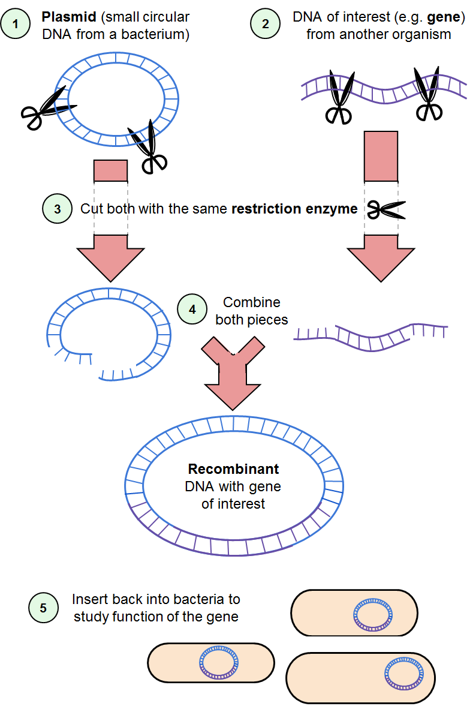

Scientists have the tools to change and advance our world every day. For example, advances in genetic technology have given us the power to manipulate DNA, the molecule responsible for life as we know it. With this ability, we can treat genetic diseases that used to be incurable, make cheaper crops that have more nutrients that people need, and combat disease-carrying mosquitoes.  But with many new discoveries comes the risk of harmful use. If we can modify human genes to cure a genetic disease, can we also cause disease? Genetically modified produce can alleviate world hunger and streamline farming practices, but are we damaging our soil and other resources in the process? And getting rid of disease-carrying mosquitoes sounds beneficial, but are we threatening other non-harmful species simultaneously? It turns out that scientists have thought about questions like these even before these powerful technologies existed. When the first DNA manipulation tool was developed, experts in the field set a precedence for self-regulation in biological research. In 1975, 140 of the world's top scientific minds met in the Asilomar Conference Center in California to discuss their responsibility in using the great power they had acquired.

The scientific breakthrough that prompted this grand meeting was recombinant DNA, the ability to combine segments of DNA that don’t naturally occur together — scientists could, for example, mix and match genes from two different species. In the previous three decades (1940s-1970s), scientists described the complicated biochemistry of genes with great detail. They elucidated the molecular composition and structure of the DNA and how its “information” (the genetic code contained in the DNA molecules) is used to make protein. They deciphered mechanisms of gene activation and repression (turning genes “on” or “off”), and even harnessed the power of restriction enzymes, biochemical tools that cells use to “cut” DNA and “sew” it back up. In the 1970s, scientists finally used all this knowledge to make custom pieces of DNA, which some critics deemed “playing God" [1].

**Image 1:  First gene-editing technology. Scientists use molecular "scissors" (restriction enzymes) to cut two pieces of DNA. One piece is a small circular DNA called a plasmid, which acts as a holder for the DNA of interest. The other piece is the DNA of interest. The cuts leave overhangs (edges of single stranded DNA) that can then "stick" to each other if it is a complementary sequence. Once the _recombinant plasmid_ is created, the DNA of interest can be studied.**

### First DNA hybrids and a complete halt on research

Concerns about recombinant DNA studies first surfaced following the accidental creation of a hybrid — or recombinant — virus. A relatively harmless human virus, studied in monkey kidneys for vaccine development, acquired DNA from a monkey virus (which doesn’t infect humans) called SV40. SV40 caused cancer in monkeys and other lab animals and led to cancer-like characteristics when human cells were infected with the virus _in vitro_ (cultivated in a dish or test tube). Now a human virus had obtained DNA from SV40. Could it infect humans and cause cancer? This possibility made scientists reluctant to share the virus freely, and the National Institutes of Health (NIH) Biohazards Committee, now called the [Institutional Biosafety Committees](http://osp.od.nih.gov/office-biotechnology-activities/biosafety/institutional-biosafety-committees), was founded to oversee recombinant DNA research. In the interest of safety, the committee restricted sharing of the virus, which was not a popular decision among medical researchers. Many scientists believed that this hybrid virus offered too much opportunity for scientific discovery to restrict access to it. In fact, some laboratories ignored the restriction on virus distribution.

The fear of genetic hybrids was still fresh when renowned biologist Dr. Paul Berg published his recombinant DNA technology in [1972](http://www.genomenewsnetwork.org/resources/timeline/1972_Berg.php).  Scientists could now create their own DNA hybrids in bacteria and were excited to use it to study cancer and other disease genes. Fearing the potential repercussions of these experiments, Berg and ten other influential genetics experts signed a letter [2] published in three major scientific journals (where scientific discoveries are published for the scientific community) asking for a halt on experiments that required putting cancer and other “dangerous" genes into bacteria (they even objected to inserting antibiotic resistance genes, an extremely useful technique [commonly used](http://blog.addgene.org/plasmids-101-everything-you-need-to-know-about-antibiotic-resistance-genes) today in molecular biology research). This letter sparked the grand conference at Asilomar, and for eight months experiments stood still while scientists met to agree on how this research could be done safely. The task at the conference was so challenging that when the Rolling Stone magazine published an extensive narrative—a somewhat poetic, comical, and incredible read—they titled it “The Pandora’s Box Congress” [1]. The author, Michael Rogers, compares biologists in that moment—at the birth of recombinant DNA technology—with nuclear physicists in the years before the atomic bomb.

### The Asilomar conference

The conference was funded by the NIH and the National Science Foundation (NSF). One of the three organizers was Dr. Paul Berg himself, who five years later won the Nobel Prize in Chemistry for his discoveries on recombinant DNA. Among the attendees was Dr. James Watson, who had been co-awarded a Nobel Prize in 1962 for discovering the structure of the DNA molecule and who was a strong proponent of immediately continuing all experiments. Another well-known expert at the conference was Dr. Sydney Brenner (2002 Nobel laureate), who saw the conference as “an opportunity… for scientists to show that they can regulate themselves” [1]. In the words of the journalist Rogers, if something were to “wipe out [the conference center] and the scientists within, it would likely set back the progress of molecular biology a decade or so.”

After three and a half days of exhaustive discussion and talks by scientists and lawyers, participants agreed on a set of restrictions to put in place in order for research to continue. In 1976, an official set of guidelines was published, and for the past forty years, research with recombinant DNA has yielded unmeasurable scientific progress with no public health repercussions. Another success of the Asilomar conference, in Dr. Berg’s opinion [3], was earning the trust of the public by proving that scientists could assess risk in a forward-thinking manner and agree on the regulation of their own work.

### Asilomar set a precedent for scientists today

Last year, in a [similar gathering](https://law.stanford.edu/2015/04/04/of-science-crispr-cas9-and-asilomar/), leading scientists again discussed the risks and potential restrictions of recombining DNA. This time, it was prompted by the discovery of CRISPR-Cas9, a biochemical tool that can alter virtually any piece of DNA inside a cell much more precisely than ever before. With this tool, genetic modifications that scientists have dreamed about for years are now possible, like the infertile mosquitoes to fight off malaria and Zika. These mosquitoes will have a genetic manipulation called a “gene drive,” which allows them to pass on a certain gene to more than 50% of their offspring. In this case, scientist aim to reduce mosquito population growth by passing on a gene that makes them infertile. As positive as this can be for public health, there are concerns of unknown threats to the ecosystem. Another technology of concern made possible by CRISPR-Cas9 is the genetic manipulation of human embryos. Following the example set at the Asilomar conference, the National Academies of Science (NAS) have already set a comprehensive plan in motion, including a [committee](http://www8.nationalacademies.org/cp/CommitteeView.aspx?key=49717) of technical experts and a report [4] on the ethics and safety of the gene drive technology, and an [initiative](http://www.nationalacademies.org/gene-editing/index.htm) to thoroughly analyze the “clinical, ethical, legal, and social implications of human gene editing”.

In the excitement over new discoveries and their potential to change the world, a group of experts set a precedence of scientific self-regulation in the gene editing field forty years ago. Since then, recombinant DNA technology has been used to add foreign genes to microbes, plants, and animals like fruit flies, mice, and even [cats](https://www.theguardian.com/science/2011/sep/11/genetically-modified-glowing-cats). The same technology has been used to remove genes, or change how they are turned “on” or “off,” and the field has learned invaluable biology from those experiments. Now, scientific self-governance is still the standard. There are plenty of federal committees within the NAS, NIH, and NSF dedicated to biosafety/biosecurity regulations and recommendations. Most of these present-day regulation agencies are run by scientists who care about scientific advancement and also about the responsibilities to the community in which we make those discoveries. “With great power comes great responsibility,” and it is reassuring to know that influential scientists take responsibility to keep the world safe from negative repercussions of their work.

### References

1.	[Rogers, M. (1975). The Pandora’s Box Congress. Rolling Stones magazine. 139:34-78.](http://libgallery.cshl.edu/items/show/85616)
2.	[Berg, P., et al. (1974). Potential biohazards of recombinant DNA molecules. Science. 185(4148):303.](https://www.mcdb.ucla.edu/Research/Goldberg/HC70A_W10/pdf/BergLetter.pdf)
3.	[Berg, P. (2008). Recombinant DNA: A model for regulation. Nature. 455:290-291.](https://weblogin.stanford.edu/login/?RT=V+mh6tnU2ROrH5RJGabxgvsD1eWBoUyEl8uWJFQy1v7L0OAI4Hb0MX5ou7+t92hs4S2go5kIeKNIlr3fxBk17fUywgQguop63Hz9xVvCSi3HIMo6nyc6LwGEi7rnH+ATu4ZhyRCZNnXDGSpyhLNBzi2LZfQTTzqD3BfbY2i0nhOObDcGRYAT1AHYTlSukIINpz8BNyEmzErLjGA65Y07DEpVp7mwQa++FyZEAW5Fptj0lL0EB/D0uizMWMvYOhQ/5OrbZVKB4eVcSmG3KVkBDzd4CDuLREi0HhY8PLhKgGJwTNVNBz8F7TXVeI7KVTZ3xw3twA==;ST=V+mXbzDP8MIuBVR2B6TdVZT7QvrZ+S1V4f2A5Iv1fMs5DVlEL0sBvnqfOXYOmHMeGz9eNRksK98/I7kYDXEdAQHnZQg0gkatN88/tck3WI17EbmZJTO8WKiT5+IZXFOBXdUabnoFO7XZBCkyOgaaHuPQH7/WChO9d9TF2o4da1VAT+86r4ja+mOVDrql23qvOicqwA==)
4.	[Committee on Gene Drive Research in Non-Human Organisms. (2016). Gene Drives on the Horizon:
Advancing Science, Navigating Uncertainty, and Aligning Research with Public Values. The National Academies Press.](http://nas-sites.org/gene-drives/2015/08/04/about-the-study/)
