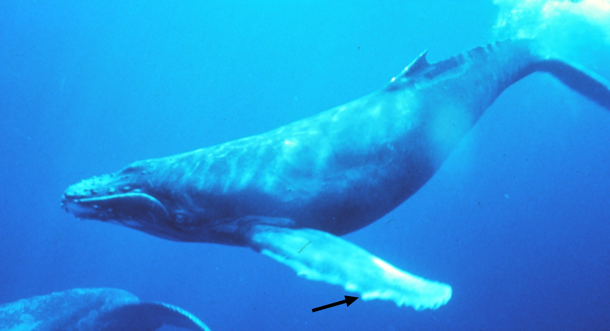
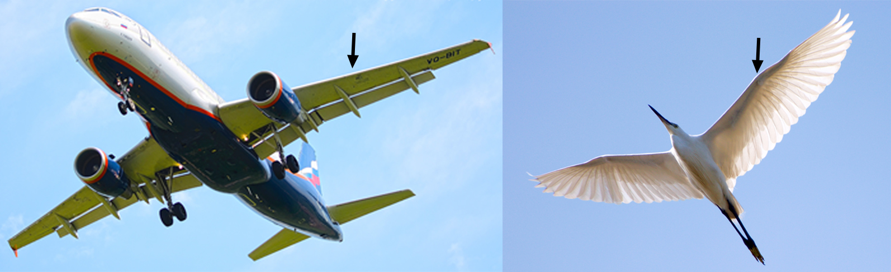
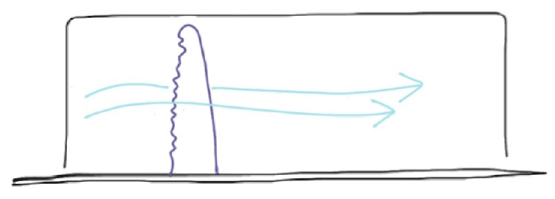

Every Olympics, a new type of swimsuit debuts as the latest in competitive swimwear designed to have the least drag pulling the swimmer back during a race. Unsurprisingly, these swimsuits give the swimmers the streamlined look that we associate with speed. Similarly, boats and rockets have slim noses and sleek, torpedo-like silhouettes. Wings on birds and planes are smooth and tapered. Swimmers don swim-caps and position their arms and legs to be as long and pointed as they can underwater. Given this trend toward smooth and sleek design, it was no surprise that the bumpy protrusions along the front, or leading edge of humpback whale flippers caught the eye of marine biologist Dr. Frank Fish, who heads the Liquid Life Laboratory at West Chester University in Pennsylvania. Why have bumps where other animals (and manmade creations) are smooth?

*The humpback whale has bumps called tubercles along the front, or leading edge, of its flipper. Photo via Wikimedia commons and modified by Diana Li.*

*Unlike the humpback whale, the wings of planes and birds have a smooth leading edge. Images via Wikimedia commons and modified by Diana Li.*

Puzzled by the presence of these bumps, or tubercles, Dr. Fish and his colleagues aimed to understand what exactly these tubercles do. How would water passing over the tubercles behave? In what ways would the humpback whale’s swimming change if its flipper had a smooth leading edge? But answering these questions would prove challenging. Conducting experiments on huge, 50 foot, 80,000 pound underwater animals would be extremely difficult to say the least, and there would be no way to alter the flippers of these animals in real life. Instead Dr. Fish’s team recreated flippers using durable plastic. They constructed one that closely resembled a real flipper with tubercles and another one that was smooth and lacked bumps.

To see if there were differences in how water interacted with the bumpy and smooth flippers, the researchers tested each flipper in a wind tunnel. Now, I know what you must be thinking: water and air are different! But they have a lot more in common than you might think. From a physics standpoint, they are both technically fluids; at a sufficient speed, air can still flow over the flipper just like water would. Testing the flippers in a wind tunnel is less tricky than using a water tunnel (air is very easy to find and it won’t spill on things), and the researchers already knew the different characteristics of the fluids and accounted for them during their analysis. 

During the experiments, the researchers mounted each flipper upright so that the bumpy or smooth edge was the first to encounter the wind. 

*Each flipper was mounted so that the leading edge (either bumpy or smooth) would be facing the oncoming wind. Diagram by Diana Li.*

The mount could also rotate to change what is known as the angle of attack. This angle describes the difference between the flipper and the direction of the oncoming wind; an angle of 0º means both are aligned in the same direction, and an angle of 90º means the flipper is rotated so the broad side is facing the wind. The mount was also connected to equipment that could measure the forces felt by the flipper against the wind. One force, termed drag, pushed against the flipper. Drag is what swimmers try to minimize but what parachuters wish to maximize. The other force was lift. Lift, combined with a small angle of attack, is what allows planes and birds to use their wings to fly. The next time you’re in the car, stick your arm partway out of the window with your fingers together and palm facing down. Slowly rotate your hand clockwise and counter-clockwise (but make sure someone else is driving!). You’ll feel how changing the angle of attack affects the drag and lift acting on your hand.

As expected, the researchers found that drag on both flippers increased as angle of attack did. This made sense; the increased angle of attack exposed more of the broad side of the flipper to wind in the tunnel. Both models of the flipper were pretty similar in how much drag they experienced. But lift was a different story. Both flippers generated the same amount of lift at very small angles of attack. However, the amount of lift generated by the smooth flipper dropped drastically past an angle of just 8º. The bumpy flipper managed to keep producing ample lift at angles twice that, up to 16º. Why is this a big deal? Imagine an airplane doing a loop-the-loop in the sky. As the plane enters the loop, the angle of attack of its wing increases.

*Values for the angle of attack of the plane’s wing increase as the plane begins its loop-the-loop. Plane image via Wikimedia commons. Diagram by Diana Li.*

If we pretend the plane’s wings are the same as the smooth flipper, not enough lift is being generated to hold up the plane beyond an angle of 8º and the plane would fall out of the sky. This problem could be avoided if the plane went fast enough to maintain its momentum, just like how swinging a bucket of water in a loop-the-loop turns out fine if you swing fast enough. But whales can’t always swim fast – it would take a *lot* of energy to move 80,000 pounds quickly! It turns out that the tubercles on their flippers end up allowing them to make tighter turns at slower speeds. Sounds like a good deal to me, but how do tubercles do all this?

Let’s shrink down to the tubercles’ level. Each tubercle is like a little mountain on the whale’s flipper, and between the tubercles are valleys. The valleys act as tracks to guide the incoming fluid into neat little lines that then pass over the rest of the flipper. Without valleys, the incoming fluid wouldn’t have a path to travel across the flipper to the other side. The unguided fluid particles would bump into each other and create a mess called turbulence, causing them to get whisked away from the flipper’s surface partway through. When the valleys aren’t there to help the fluid make good contact with the flipper, only a little bit of force can be generated – and that means much less lift.

Zooming back out to the big picture (and whales are *big*), what does this all mean to a humpback whale? Just because humpbacks are huge and hefty, doesn’t mean they can’t be acrobatic, or “aqua-batic,” as Dr. Fish likes to say. Humpback whales cooperatively hunt through a behavior called [bubble net feeding]( http://video.nationalgeographic.com/video/ngexpeditions/humpback-bubble-net). Because whales are air-breathers, they can release bubbles underwater that end up surrounding schools of small fish or krill and trapping them in a net of air. This hunting strategy requires multiple whales swimming around their prey in tight formation while releasing bubbles, and the circles that they swim in can be as small as 5 feet in diameter – compare that to a whale’s 50-foot body length. Thanks to the tubercles that line their flippers, the humpbacks can turn and corkscrew with great control to form these small circles. Plus, they can move at speeds slow enough to not bump into each other during their highly coordinated feeding activity. Armed with tubercles, humpback whales might even give ballet dancers a run for their money! It’s just a matter of time before they start learning to pirouette too. 

####Further reference*
Miklosovic, D. S.; Murray, M. M.; Howle, L. E.; Fish, F. E. (2004) Leading-edge tubercles delay stall on humpback whale (Megaptera novaeangliae) flippers. Physics of Fluids. 16(5):L39-L42

*pdf available upon request

