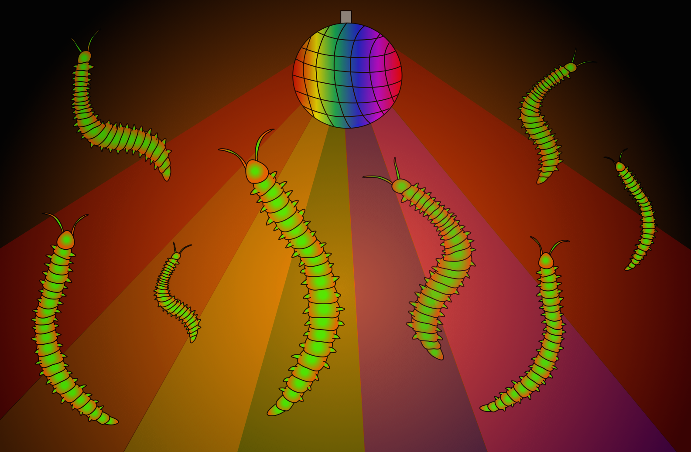
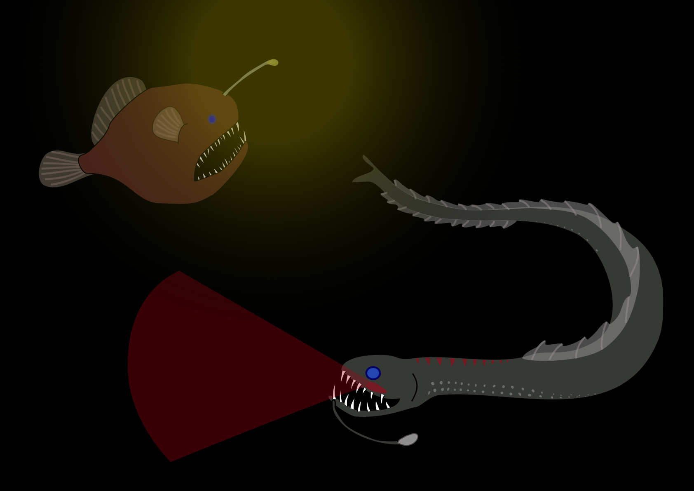
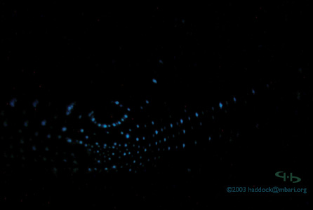
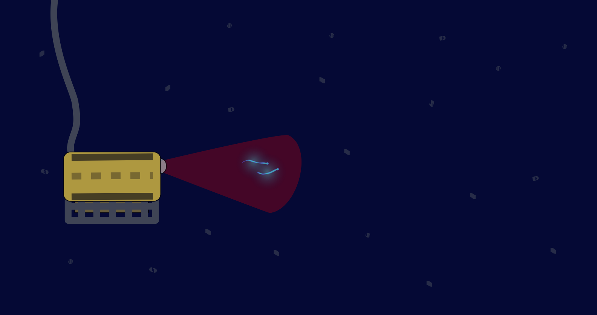

Deep beneath the ocean, far beyond the reach of the sun’s rays, the waters pulsate and twinkle with electric blue light. Not distant stars, but marine organisms create this otherworldly glow, an enchanting adaptation called bioluminescence. At night, even surface waters scintillate—Puerto Rico is famous for bioluminescent bays that lap the beach with neon waves, and nighttime scuba divers who turn off their lights and wave a hand through the water may be treated to a shower of sparks. 

For such a spectacular ability, bioluminescence is surprisingly commonplace in the ocean. In the deep waters, where there’s little to no sunlight, it’s estimated that between 75-90% of all organisms create their own living light. What’s more, an astonishingly diverse array of creatures uses bioluminescence: bacteria, worms, jellyfish, squid, fishes, and even sharks, to name a few. In almost all cases, these organisms create bioluminescence through a chemical reaction between oxygen and a light-emitting protein, called a luciferin, facilitated by an enzyme, called a luciferase. Many can synthesize their own luciferins and luciferases, but some incorporate them from their diet, or capture bioluminescent bacteria. Bioluminescence is thought to have independently evolved dozens of times across the tree of life, and organisms have devised myriad uses for illuminating the ocean. 

###Bioluminescence as a signal lamp

Some animals create light in order to communicate. Just like fireflies, one of the few examples of bioluminescence on land, marine animals flash to communicate in an environment where other visual displays would be impossible. Certain worms may cue into bioluminescent displays for mating aggregations (just as disco lights signal that a party is happening). Male ostracods, tiny sea fleas, emit glowing orbs of mucus, leaving a luminous trail Caribbean dive guides call a string of pearls. Different species leave unique patterns and spacing of these pearls, so females can follow the right trail to the waiting male. 

###### For a polychaete worm, bioluminescence points to the party.

###Bioluminescence as a searchlight

Predators can use light to find or attract a meal. Fishermen are familiar with this phenomenon—a glowing lure or lights at night may bring swarms of squid. The anglerfish knows, too: she dangles a sac of bioluminescent bacteria from an appendage on her forehead, and lunges from the darkness when unfortunate prey draw near. Certain squid can emit a bright flash of luminous mucus to temporarily blind or stun their prey. Other predators are subtler. Dragonfish use red bioluminescent patches underneath their eyes like night vision goggles. Most other deep-sea animals have lost the ability to perceive red light, which doesn’t penetrate the ocean depths, so the dragonfish can secretly illuminate, then devour, their unknowing prey: the ultimate sneak attack. 

###### The dragonfish uses red bioluminescent patches like night vision goggles, while the anglerfish uses a bioluminescent lure to hunt. Illustration by Natalie Low.

###Bioluminescence as an invisibility cloak

Prey animals have developed equally crafty defensive bioluminescence. While many animals use light to make themselves more visible, some use it to disappear. Animals that live higher up in the water are vulnerable to predators that might look up and see them silhouetted against any sunlight filtering down. Hatchetfish have light organs called photophores arranged along their bellies to break up their shape, a camouflage method called counterillumination. Certain squid are even able to adjust their photophores to match the brightness of sunlight or moonlight. 

###### The *Abraliopsis* squid uses patterns of light organs, called photophores, to mask its silhouette from predators lurking beneath. Photo courtesy of [http://biolum.eemb.ucsb.edu/](http://biolum.eemb.ucsb.edu/).

###Bioluminescence as a warning flare

Prey animals may also employ more active evasive bioluminescence. Some species of shrimp emit a glowing cloud of luminescence and dart in the opposite direction, creating a decoy. Squid do the same, and some even have photophores on the tips of their arms, which they can release like a lizard shedding its tail. 

Still others use light to fight back, glowing brightly in response to disturbance to warn others: a “burglar alarm.” The atolla jellyfish emits a fireworks display of flashes when attacked, which may serve to illuminate its attacker and attract an even larger predator-cum-savior. 

###New technology sheds light on bioluminescent behaviors

Even as vibrant a visual display as bioluminescence can be difficult to study. It’s expensive and time-consuming to watch animals that live thousands of feet below the ocean. Many of the behaviors described above have been observed but not captured on film, or even just inferred based on anatomical studies. Much of what we know has been gleaned by bringing animals up into the lab and startling them to evoke the bioluminescent response. Steve Haddock of the Monterey Bay Aquarium Research Institute (MBARI), one of the preeminent scientists studying bioluminescence, likens these experiments to trying to decipher human communication by bringing a person into an unfamiliar room and poking them. “They would be yelling and screaming, and we would say, ‘Well, now we just have to decipher what that all means!’ It’s pretty unrealistic relative to what’s really going on in the environment.” 

###### New video technology uses red light to document bioluminescent behaviors in animals' natural habitat. Illustration by Natalie Low. 

New high definition video technology utilizes red light—much like the predatory dragonfish—to sneak up on luminous animals and watch their natural behavior. The bright white lights scientists usually use to observe the deep sea tend to scare animals away, not to mention wash out pale blue bioluminescence. Haddock was particularly pleased to capture the first-ever video footage of the pyrotechnic display of an escaping arrow worm, which sheds glowing particles in spiral plumes as it darts away. He had first observed this response through the porthole of a submarine a few decades earlier, as a novice grad student. At the time, arrow worms weren’t thought to be bioluminescent at all. Haddock spent years combing through trawl samples to identify the rogue glowing worm, and formally proved its glowing behavior nearly a century after the species had first been discovered. Capturing the glowing trail in situ with ultra-high definition video was a full circle moment for Haddock. He’s looking forward to using this technology to capture more unique and astounding uses of deep-sea living light. 

###Further reading:

Upcoming part 2: bioluminescence research
[The UCSB bioluminescence page](http://biolum.eemb.ucsb.edu/)
[Human uses/cultural history of bioluminescence](https://www.hakaimagazine.com/article-long/secret-history-bioluminescence)

