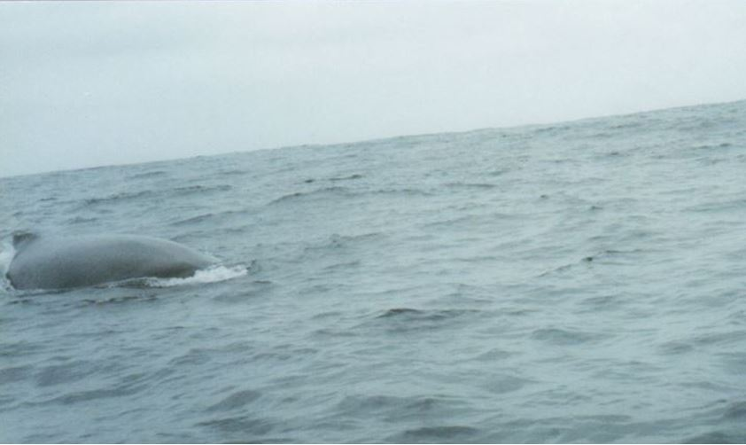
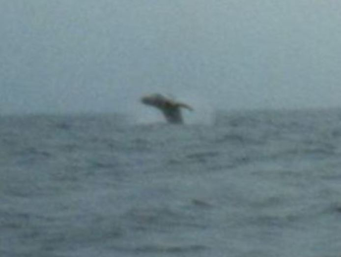
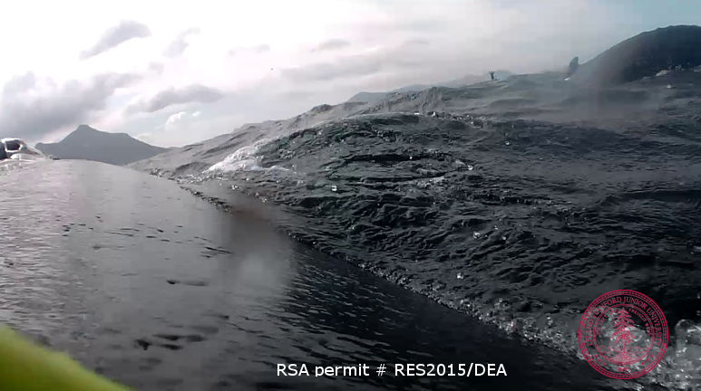
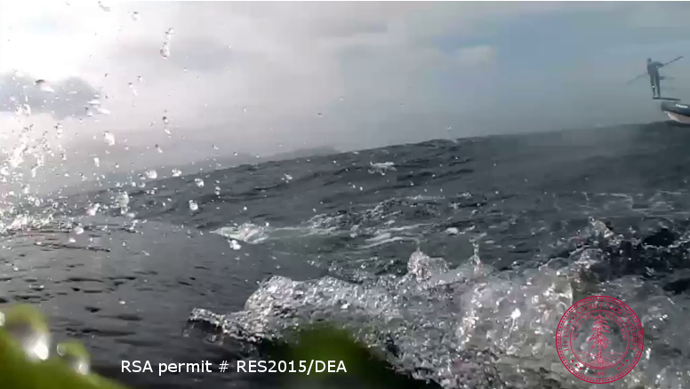
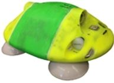
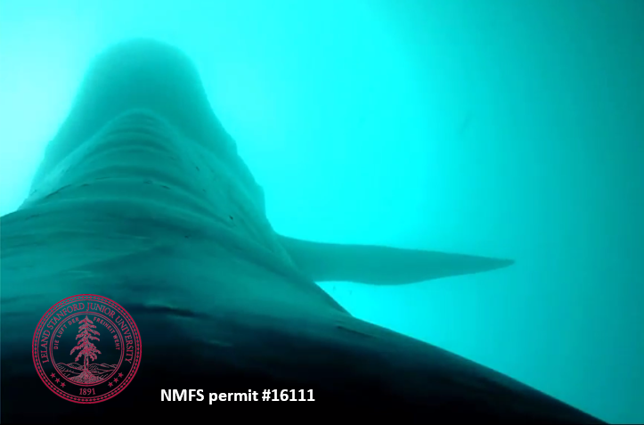

Here is a picture of the first whale I ever saw:

Well, it was pretty exciting at the time.

And 10 minutes later, I captured a picture of a breach!

**Photo credits: David Cade.**

To this day we still don’t have a great understanding of why humpbacks in particular are prone to throwing their entire 30 ton bodies out of the water. Regardless, it’s quite the sight (when it’s not so fuzzy).

These were the first two pictures of a humpback whale taken by me, with a 35mm point and shoot camera when I was 25 years old. Yes, I was pretty proud of myself. I had never seen a live whale until that humpback swam under my small [panga](https://en.wikipedia.org/wiki/Panga_%28boat%29) in Ecuador on my way out to visit the boobies, frigate birds and (land) iguanas of the “poor-man’s Galapagos”- the Isla de la Plata. Despite multiple whale-watching attempts in Massachusetts, Oregon, Washington, California, the Gulf of California and the Caribbean, I struck out on seeing a whale until this moment in Ecuador. Needless to say I was thrilled by the whole experience. If you had told me then that a decade later I would be collecting images taken from the whale’s point of view, I wouldn’t have believed you - how is such a thing even possible?

But then here they are: the first two pictures of me taken by a humpback whale:

**Photo credits: mn151106-4, a Humpback whale.**

**An example of an camera that can be attached to the back of a whale.**

Now I work in the Goldbogen Lab at the Hopkins Marine Station of Stanford University. Our lab strives to illuminate the details of how whales feed and move underwater where they have, until recently, been unobservable. Whales generally are only at the surface to breathe, but a blue whale, for instance, might feed at depths of over 300 meters (150 fathoms/1000 feet). Technological advances have allowed us to put small, suction cup-attached instruments on the backs of whales to study their motion underwater. These sensors are non-invasive and attach for approximately 6-24 hours before detaching and floating to the surface where we can recover them (and their data!).  Our newest tags also have video cameras which help us visualize the animal’s environment - and sometimes snap nice shots like the images above. While sensors in the tag do a good job of measuring the movement of the whole animal, cameras have allowed us to also study how different parts of the animal work together.

As the largest marine predators, blue whales offer extreme examples of creatures that are supremely adapted to their environment. They support their enormous bodies by feeding on some of the ocean’s smallest residents: krill. Our current research focuses on the [lunge-feeding process](http://jeb.biologists.org/content/214/1/131#ref-30) where the whale accelerates to high speed, opens its mouth and engulfs a volume of water that can exceed 140% of its body mass with each gulp before then filtering the water out through its baleen.

The data from our tags can tell us how the motion, or kinematics, of a whale’s head and mouth are timed to coincide with the fastest accelerations and speeds of a lunge. In a typical lunge, a blue whale might quadruple its speed from around 1 meter/second to up to 4 meters/second (9 miles/hour). Exactly when the mouth opens during this process has a huge effect on how fast that 200 tons of engulfed water pushes on the tissue that lines the whale’s throat. All of these pieces allow us to determine the overall energetics of this process and then determine how much food is required to make feeding worthwhile for these giant animals.

**A blue whale opens its mouth to lunge at a patch of krill.**

Most large whales were hunted nearly to extinction in the 20th century; however, the ability to find food is currently the biggest threat to their recovery. As changing ocean conditions increasingly affect the density and distribution of prey that these whales feed on, understanding more precisely their energetic and metabolic requirements will allow us to better predict and understand what they need to survive and recover as a population. As our lab works to interpret the data from this new technology and to answer questions about blue whale and humpback whale feeding, check out our [lab webpage](http://goldbogen.stanford.edu/) for updates in the coming months!
