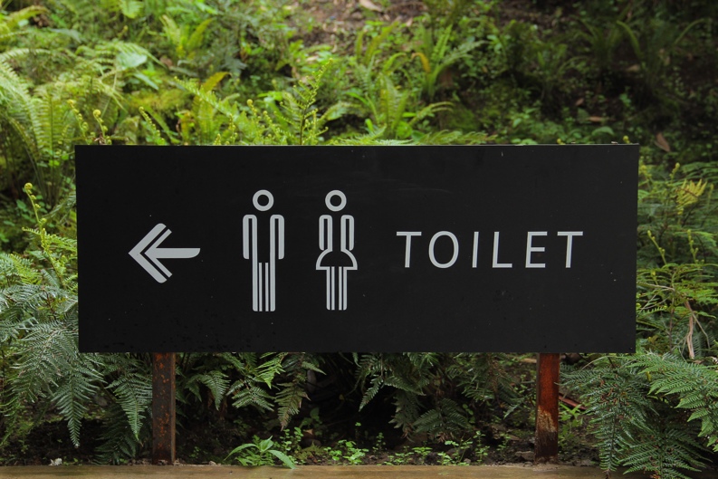
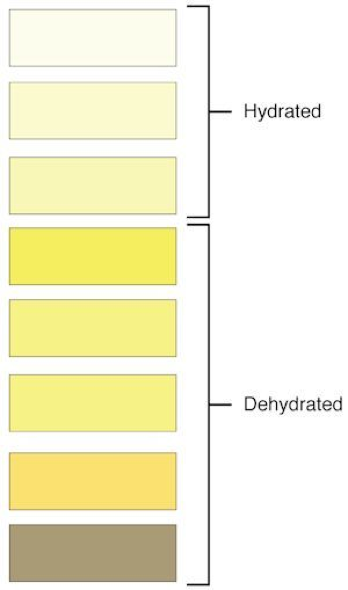

You might have read about the [5 Biggest Hydration Myths](https:\\thedishonscience.stanford.edu/posts/biggest-hydration-myths/), and now you're wondering *how* to check your hydration.

Water is *essential* to our body’s function. It is a large part of all of our organs (our muscles are 80% water!), makes up our blood volume, and is necessary to maintain blood pressure and body temperature.  Approximately 60-65% of our bodies are made up of water, but we lose some of this water every day through our skin (i.e. sweating), breathing, going to the restroom, and digesting the food we eat. So we need to replace the water that we lose to keep our body functioning normally.

**So if water is so important, how do you know if you’re hydrated?**
 

> You've probably heard: if your urine is lemonade color or lighter, you're hydrated (1).

 This color could change depending on whether you take certain supplements (like Echinacea) or eat certain foods (2).   And yes, you can assess your urine color directly in the toilet bowl (so no, you don't have to do any weird urine "catching").

Alternately, if you're REALLY good at math and have a good memory, you can count how many times you go to the restroom each day. 

> Researchers found that people who *urinated at least 7 times per day* were hydrated, while people who went less than 5 times per day were dehydrated (3,4).

In my opinion, the quickest way to know whether you're hydrated is to look at your urine color in the toilet (see chart below). But, if it's been more than 2 hours since you've gone to the restroom, that can be another clue that you need to drink more fluids (or get out of that really boring meeting you're in!).
 
  

**What about hydration for mood & cognition?**

 Did you know that mild dehydration (~1% drop in body weight) can make you feel more lethargic, grumpy, and mentally slower? (5,6).  Although 1% dehydration may seem like a lot (it’s about a 1.5 lb drop in a 140-150 lb person), most people walk around mildly dehydrated throughout their day. Also, you will almost always become 1% dehydrated (or more!) during moderate intensity exercise if you sweat a normal amount.
 

> So... if you feel tired and sluggish during the day and your workouts are slacking, you might need to increase the amount of fluids you're drinking.

 
**How do I stay hydrated before, during, and after exercise?**

> - 1 hour before exercise, drink an extra 8 oz. (i.e half of a water bottle) of water to make sure you start hydrated.  
> - During exercise, drink when you're thirsty and never restrict your water intake.
> - After exercise, slowly drink back 20 oz. (a little bit more than one commercial water bottle) for every 1 lb. of body weight that you lost- you can check how much weight you lost during exercise by weighing yourself before and after the workout (without clothes). 
> 
> -- ***Hint #1***: if you drink fluids with sodium (e.g. electrolyte drinks) or lightly salt  your food, this will help you to absorb the water faster and rehydrate post-workout (7).  Just watch the sugars in drinks- you don't need any of those! 

> -- ***Hint #2***: don't drink the fluids back too quickly!  Your body can only absorb water at a certain rate (you’ll pee out the rest); so try not to drink more than 8 oz. every 15 minutes.

 
Overall, there are various ways to make sure you’re staying hydrated; the easiest is probably just to check your urine color after you go to the restroom. Never try to limit your water intake, and make sure to drink back the water you lose after exercise.
 
**Drink up, and keep moving!**

References:

1.          Armstrong, Lawrence E., et al. "Urinary indices of hydration status." International journal of sport nutrition 4.3 (1994): 265-279.
2.          Kenefick, Robert W., et al. "Quantification of chromatographic effects of vitamin B supplementation in urine and implications for hydration assessment." Journal of Applied Physiology 119.2 (2015): 110-115.
3.          Burchfield, J. M., et al. "24-h Void number as an indicator of hydration status."European journal of clinical nutrition 69.5 (2015): 638-641.
4.          Tucker, M. A., et al. "Reliability of 24-h void frequency as an index of hydration status when euhydrated and hypohydrated." European journal of clinical nutrition (2016).
5.          Ely, Brett R., et al. "Hypohydration and acute thermal stress affect mood state but not cognition or dynamic postural balance." European journal of applied physiology 113.4 (2013): 1027-1034.
6.          Armstrong, Lawrence E., et al. "Mild dehydration affects mood in healthy young women." The Journal of nutrition 142.2 (2012): 382-388.
7.          Shirreffs, Susan Margaret, et al. "Post-exercise rehydration in man: effects of volume consumed and drink sodium content." Medicine and Science in Sports and Exercise 28.10 (1996): 1260-1271.

<!--stackedit_data:
eyJoaXN0b3J5IjpbMTM4NTAwNDQxNCwxMDgyNjc0MTIxXX0=
-->
