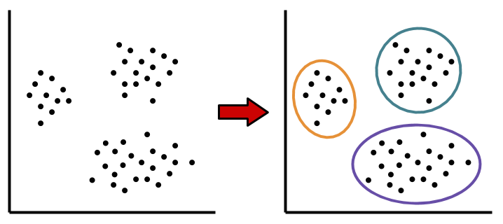
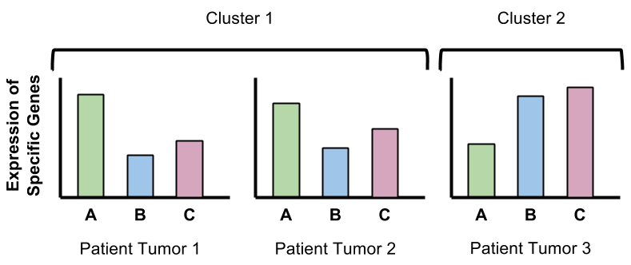
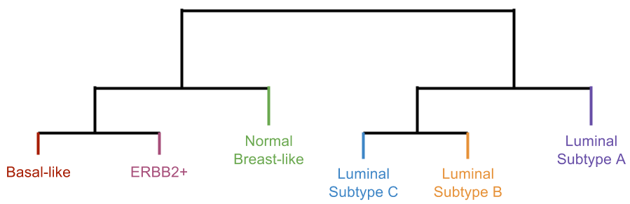
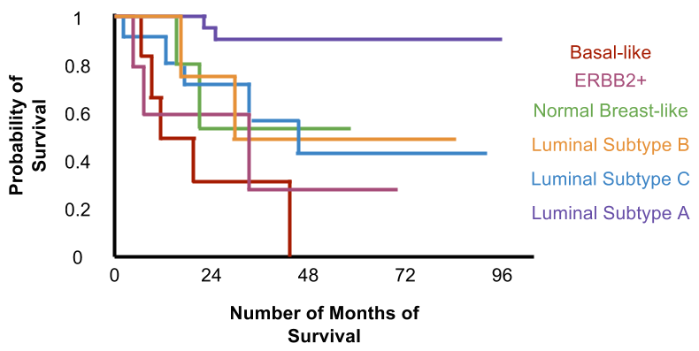
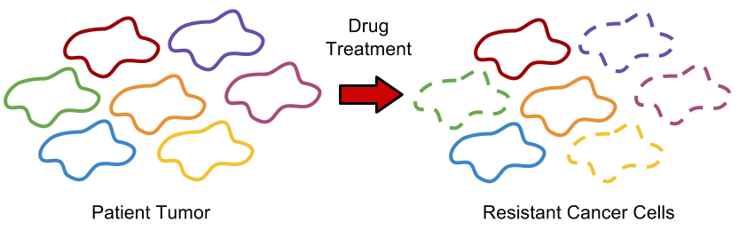

**Breast cancer** is the most common cancer in women and about a quarter of a million new cases of breast cancer are diagnosed every year. In the past, breast cancer patients were prescribed the same blanket treatment. However, “breast cancer” itself is not just one disease; patients who are diagnosed with breast cancer may have tumors that differ in many significant ways, including amount of aggression and sensitivity to drug treatments.

Thus, researchers have long investigated whether “breast cancer” may encompass several classifications of tumors that behave differently and have different mortality rates. How can we describe these different cases? How can we identify the differences in a patient’s breast cancer to determine what treatment would be best for them? Researchers and clinicians have answered these questions by analyzing patient tumors using computational methods. Their data analysis has revealed the existence of new subtypes that benefit from therapies targeted specifically to their cancer, helping us refine our treatments and improve patient survival.

####**Unsupervised learning can reveal patterns in biomedical data.**

 In [**supervised learning**](http://thedishonscience.stanford.edu/posts/pigeon-image-learning/), the computer sifts through data and finds particular patterns in the features of this data that separate the data into different groups or classes. Once these patterns are discovered, the computer can then assign new examples to the appropriate group based on their features.

However, this process requires training the computer by providing correctly labeled examples. The computer learns by analyzing this example data and it practices making predictions. As the computer builds its understanding of how features relate to whether an example belongs to one class or another, it tests its predictions by comparing its guess to the correct answer. Yet, there are multiple instances where the correct answer is not known, but we still hope to gain insight into the data and discover interesting patterns. This type of problem is an **unsupervised learning** problem. Multiple computational methods have been created to try to find “structure” within data, and these methods have been applied to biological data to find out more about how the body works in normal and disease cases.

####**Gene expression information shows how the tumor behaves in a particular patient.**

One example of unsupervised learning is to understand the many kinds of cancer that arise in patients. Different instances of breast cancer can be binned into different broad groups or subtypes, usually based on features observed in the tumor tissue taken at diagnosis. Only recently with the invention of advanced lab technologies can doctors now use **molecular features** to describe cancer, including DNA mutations and gene expression levels in the cancer cells making up the tumor.

The DNA inside each cell encodes many genes. Cells use the genes as a template to produce messenger RNA, which is then used to produce a protein encoded by the gene. In general, the DNA of each gene will produce an RNA that makes one particular protein, which performs a specific function in the cell. DNA alone does not perform actions in the cell, but the RNA produced from the DNA leads to changes in the proteins present in the cell thereby effecting what the cell can do. **Gene expression**, as measured by levels of RNA for each gene, reflects the state and behavior of the cell.

An early use of unsupervised learning to uncover different types of breast cancer was performed in a study in 2001. The scientists of this study aimed to characterize gene expression from multiple tumor samples to see how one person’s tumor might differ from another’s on a molecular level. RNA was taken from tumors isolated from multiple patients diagnosed with breast cancer. These scientists measured RNA amounts for over 8,000 genes in each individual tumor. From this data, scientists investigated new ways of classifying patient diseases despite not knowing the identity or quantity of classes at the start of the study.

####**Clustering reveals different groups of patients with similar types of tumors.**

The RNA data were analyzed using a common computational method in unsupervised learning known as **clustering**. **Clustering analysis** is a way of grouping individual examples in a data set based on their similarities. In this case, the clustering was performed to group together tumor samples from each individual patient based on their similarities in gene expression levels. That is, tumors that showed similar patterns of gene expression (e.g. high expression of gene A, low expression of gene B and gene C) would be placed in the same group. 

Tools for unsupervised learning like clustering allow scientists to explore data and uncover interesting, possibly meaningful patterns. Such patterns may be obvious when looking at measurements in low dimensions, like 2D (i.e. two measured features) or 3D (i.e. three measured features). But when measuring levels of RNA for over 8,000 genes, these patterns in high-dimensions will not be as obvious. What would different groups of data points look like in 8,000 dimensions? With so many dimensions, we cannot visualize this data.
 
####**Clustering based on gene expression produces groups or subtypes of tumors that may respond better to certain therapies and have different prognoses.**

Terms like luminal and basal describe certain populations of cells that come from different parts of the breast. The breast tissue is built as a series of ducts or tubes, which are the site of the production of milk during lactation when the mother must feed her infant. The luminal cells make up the lining of the duct, while the basal cells sit on the outside of these ducts.

Clustering breast cancer tumors based on gene expression lead to two major groups separated based on expression of the estrogen receptor (ER) and associated genes: non-luminal and luminal/ER+. Estrogen receptor is an important gene in breast cancer as some cases of breast cancer have tumors that express or even overexpress estrogen receptor. Estrogen receptor is a protein on the surface of the cell that binds to the hormone estrogen and tells the cell to grow and divide. The gene for this receptor is expressed in a small number of normal breast cells. These particular tumors may use estrogen signaling to promote their growth and survival. As a result, several inhibitors of estrogen receptor signaling like Tamoxifen have been developed to treat breast cancers that rely on estrogen signaling.

The non-luminal branch further broke down into three groups: basal-like subtype, ERBB2 subtype, and normal breast-like group. For example, the ERBB2 subtype had a clear overexpression of the growth receptor, ERBB2, which lead to its naming. The luminal branch broke down into three groups: luminal subtype A, luminal subtype B, and luminal subtype C.  

Since unsupervised learning is an **open-ended process**, it can be difficult to know how many clusters is the correct number and whether the way that each sample is assigned to a cluster is accurate. Thus, analyzing data using clustering can be an iterative process, meaning that the clustering analysis may be repeated multiple times with different settings. From each of these results, the scientists could interpret several different meanings. All of these results were also analyzed and compared to what is already known in the field. In this case, some of the resulting groups found in this study matched those defined in previous work. This observation increased the authors' confidence that their method had worked (i.e. their results were a reflection of the truth).

Further analysis to determine if these clusters related to clinical data — such as how long it took for the cancer to progress and whether the patient survived — also confirmed the usefulness of clustering patients based on gene expression of their tumor. Each group identified by clustering was related to patient outcome to see if any group did better or worse in the long run or whether all groups had similar outcomes. This comparison showed that patients split into different subtypes based on their tumor properties had significant differences in survival: patients of the luminal subtype A had the best prognosis while patients of the basal subtype had the worst prognosis. 

####**The amount of data we have from patients to understand cancer diversity is growing continuously.**

Using unsupervised clustering, these scientists discovered new subtypes of breast cancer from high-dimensional gene expression data. This work from over a decade ago changed the way we have thought about breast cancer and helped doctors realize that breast cancer may be a larger disease category made up of several different diseases. This variation in cases of breast cancer and how they could be organized was not obvious without the use of molecular data (i.e. tumor gene expression) and unsupervised learning. From this information, doctors can now test patient tumors and acquire better information about their prognosis and appropriate treatment options.

In the last 15 years since the initial study, scientists have begun to appreciate that there is not only diversity in tumors between patients, but also heterogeneity in the cancer cells that exist within a single patient. The initial study from 2001 measured average gene expression across the entire tumor, which consisted of a large collection of cancer cells. However, researchers have discovered that a tumor can be made of lots of different cancer cells: some may divide quickly, while others may not divide at all, some may tend to migrate to other tissues, while others may stay in the same place, and so on. Treating patient tumors can be less successful since the drug may eliminate some of these cancer cells, but not all of them, leading to a relapse for the cancer patient.

Current efforts have focused on creating gene expression profiles in single cells or small groups of cells collected from a tumor. Using unsupervised learning scientists can cluster data from individual cells or small populations of cells to understand the different kinds of cells in a tumor. Once these classes are identified, new anti-cancer drugs can be developed to target these cell classes and doctors can better develop an individualized treatment plan for the patient by identifying combinations of drugs that work against the classes of cells present in their tumor. In the future, large data sets that characterize an individual patient’s tumor and advanced computational analysis may guide personalized healthcare decisions.

####REFERENCES:
http://www.cdc.gov/cancer/breast/statistics/

http://www.cancer.org/cancer/breastcancer/detailedguide/breast-cancer-key-statistics

Therese Sørlie, Charles M. Perou, Robert Tibshirani, Turid Aas, Stephanie Geisler, Hilde Johnsen, Trevor Hastie, Michael B. Eisen, Matt van de Rijn, Stefanie S. Jeffrey, Thor Thorsen, Hanne Quist, John C. Matese, Patrick O. Brown, David Botstein, Per Eystein Lønning, and Anne-Lise Børresen-Dale (2001). Gene expression patterns of breast carcinomas distinguish tumor subclasses with clinical implications. PNAS 98 (19) 10869-10874; doi: 10.1073/pnas.191367098
