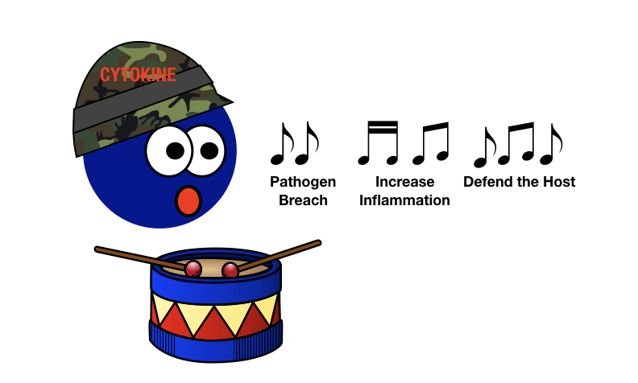
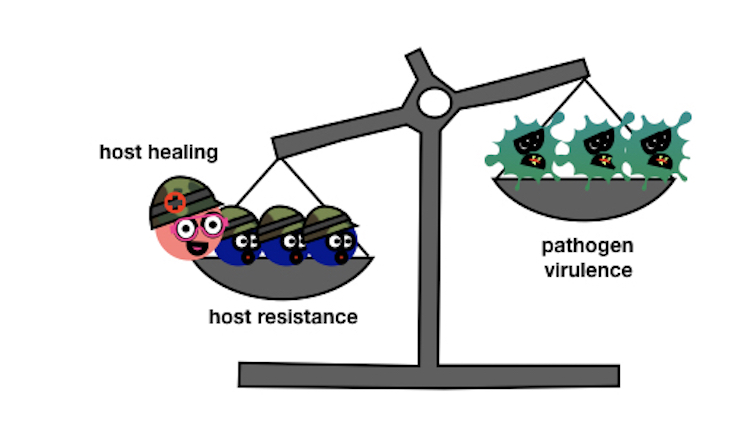



### Inflammation and Cytokines  
  
When infected cells in your body die, a message triggers inflammation and gets the fighting soldiers (your immune system) to the battle scene. However, in order for this vital communication to occur, special messengers are needed. **Cytokines are these key messengers that alert and recruit the immune system.**  Cytokines are proteins or glycoproteins (proteins with sugar chains) that enable ***context-dependent*** communication in the host3.   
Immune cells, skin cells, cells that line blood vessels and even smooth muscle cells can all secrete cytokines to communicate within the your body, the host3. Inflammation spreads beyond the initial damaged site to the rest of the host by systemic circulation of cytokines4. 
Picture cytokines acting like drummer boys on the battlefield. In the same way the drum rolls signal commands to the troops, cytokine signaling recruits immune cells (like T cells) to the site and activates them to fight pathogens.  

   

### The Dangers of Cytokine Storms 
Your immune system is your body’s way of defending itself. You have defense mechanisms set in place in case your body is invaded by bacteria,viruses or some other pathogen. When a breach occurs and the pathogen begins infecting and subsequently killing your cells, the cell death sets off local alarms about the damage and triggers an inflammatory response5. Cytokines, the drummer boys of the immune system, spread the alarm to boost and maintain inflammation. 

Inflammation has four components4: 

 1. rubor (redness)
 2. calor (heat)
 3. tumor (swelling)
 4. "function laesa” (loss of function)

 These four components work to increase blood flow to enable the immune cells (your soldiers) to reach the inflammation site quickly and in large numbers.  As part of the inflammatory defense mechanisms, the local temperature of the inflammation site increases to slow down the invaders and swelling is the result of immune cells crowding the injured area both to kill invaders and to start the healing process4.  Pain is also generated in the area to further warn the host of danger4. This inflammatory response protects the host and fights off the infection. 

**Cytokine storms** happen when the danger signal never shuts off, a phenomenon that can be deadly to the host! 

### The Dynamics of an Immune Response: Balance is Key 

During the course of an infection, the **pathogen’s virulence** and the **host resistance** fight for dominance. A third factor also influences the dynamic within the host, **host healing mechanisms**4! 

Compensatory repair or healing processes are initiated very once the drummer boys have sounded the alarm4. Think of these healing responses as army medics, treating the wounded soldiers and clearing the battlefield. As long as **the host resistance and host healing are stronger than pathogen virulence, the host will recover from the infection**. In a mild infection, the host resistance tapers off once the pathogen is neutralized and the healing processes have taken care of enough of the damage for the threat to be gone5.  

Cytokine storms occur when the host resistance doesn’t slow down but instead continues to wage war within the host 5. Though the exact causes are not known, one factor that is known is that the damage done by the pathogen and/or the inflammatory process spreads beyond the local area of infection to the rest of the host's body4,5. **When local inflammation turns systemic, a cytokine storm has begun**4. In this case, the battle will not stop even as the enemy weakens. The drummer boys will keep pounding out the call to battle and the battlefield size will increase. The soldiers will continue fighting, even as they hurt themselves, propelled by the alarm. The army medics will become overwhelmed and the battlefield will continue to worsen. Cytokine storms mostly end with the death of the host4.  
###  Cytokine Storms  in Disease
Some of the diseases that are associated with cytokine storms include **severe COVID-19, influenza, dengue, yellow fever, malaria, severe acute respiratory syndrome coronavirus (SARS), graft versus host disease in transplant rejection and sepsis**4,6,7. Sepsis is the iconic example of cytokine storm and is responsible for the majority of deaths in intensive care units (ICU) worldwide 6.  In 2017, there were 11 million sepsis deaths worldwide 7. The high number of deaths, estimated 50 to 100 million, has made infamous 1918-1919 H1N1 “Spanish Flu” pandemic one of the most devastating pandemics in history8. 
One of the reasons this pandemic was so horrible was because of the unusually high number of deaths of 20-40 year olds, a group that usually has a low risk of dying from influenza8. Researchers believe that the cytokine storm component of the 1918 Spanish Flu is responsible for the high mortality rate of the 20-40 year olds and the overall high death rate8. 

### How to Stop Cytokine Storms
  
Though cytokine storms result in death most of the time, there are a few treatments. These treatments target the immune system to limit the host response4. These type of drugs are known as immunomodulatory drugs since they limit inflammation during infections4. Anti-TNF therapy is one example of this type of drug5. Since TNF is viewed as one of the key cytokines involved in the formation of cytokine storms, inhibiting TNF may prevent a storm from forming or gaining strength 5. 
Another more recent therapy involves sphingosine-1-phosphate receptor 1 agonists (S1P1 receptor agonists)5. This drug inhibits cytokines and their subsequent recruitment of immune cells, effectively shutting down the drummer boys and the alarm signals5. S1P1 receptor agonists were highly effective in treating the 2009 influenza strain in mice and may work in humans as well5.  

The main difficulty involved in treating cytokine storms is limiting the inflammation while still enabling the host to clear the infection. You don't want to stop the army from fighting if the enemy is stil present. Studying the time course of cytokine storms may provide some answers as to when to give the inflammation inhibitors and when to give anti-viral drugs. Moreover, a time course study could enable doctors to detect when a cytokine storm is likely to begin so that they could treat it before it grows too strong to stop. One other component that should be explored includes the host healing mechanisms. If the host can heal from injury or infection faster, then the cytokines may shut down before reaching the deadly systemic level needed for a storm.  

### Concluding Remarks  
Your immune system is your body’s way of defending itself. It has many different components, including its drummer boys, cytokines. Cytokines function as messengers for the immune system and when the host is able to balance resistance with healing and fighting virulent pathogens, they are a great help in keeping you alive. Much like instabilities in the atmosphere (humidity and pressure differences) result in thunderstorms, tornados and hurricanes, imbalances in your body can result in dangerous cytokine storms.  
 
 #### Works Cited  
  
1.  NWS Analyze, F. and S. O. NWS Analyze, Forecast and Support Office. (2016). at <http://www.nws.noaa.gov/om/hazstats.shtml>  
2.  Billings, M. The 1918 Influenza Pandemic. (2005). at <https://virus.stanford.edu/uda/>  
3.  Yiu, H. H., Graham, A. L. & Stengel, R. F. Dynamics of a cytokine storm. PLoS One 7, e45027 (2012).  
4.  Tisoncik, J. R. et al. Into the eye of the cytokine storm. Microbiol. Mol. Biol. Rev. 76, 16–32 (2012).  
5.  Liu, Q., Zhou, Y. & Yang, Z. The cytokine storm of severe influenza and development of immunomodulatory therapy. Cell. Mol. Immunol. 13, 3–10 (2016).  
6.  Clark, I. A. The advent of the cytokine storm. Immunol. Cell Biol. 85, 271–273 (2007).  
7. [https://www.dw.com/en/sepsis-a-common-cause-of-death-from-coronavirus/a-52758193](https://www.dw.com/en/sepsis-a-common-cause-of-death-from-coronavirus/a-52758193)
8.  Morens, D. M. & Fauci, A. S. The 1918 Influenza Pandemic: Insights for the 21st Century. J. Infect. Dis. 195, 1018–1028 (2007).
