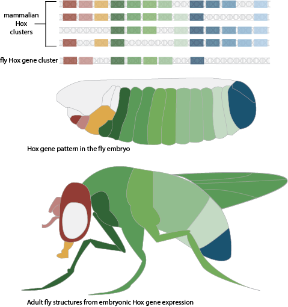

The Bay Area is a great place for hiking, and just last weekend I visited a nearby state park. On the trail, I saw two lizards with long tails sunning themselves on a rock and a millipede moving quickly toward the shade. A lizard’s leg is made up of muscles, bones, and nerves, just like a human hiker’s leg, but the details and shapes are very different.  Why does a millipede have hundreds of legs, but most insects have only six?  Inspired by the diversity of body plans found in nature, I wanted to learn about a developing animal’s “blueprint” for building the correct limbs in the right places.  This blueprint is a special set of genes – ***the Hox genes.***  
****

###**Discovery of the First Hox Gene**

The term homeotic comes from the fact that mutations in these genes cause one body part to transform into another.  The Hox gene family was first discovered in fruit flies in the lab of **Thomas Hunt Morgan**.  In 1915, scientists in Morgan’s lab were working with a large collection of fruit fly mutants when they noticed something quite striking – some of the mutant flies had a duplication of the thorax such that the flies had two sets of wings.  Morgan’s researchers later found that this mutation was caused by a gene they named bithorax.  This gene became the first know Hox gene. Around the same time, **William Bateson** was also observing these homeotic transformations in other organisms.  Bateson observed crayfish with extra oviducts, bees with legs in the place of antennae, and polydactyly (extra fingers or toes) and extra ribs in humans.  Since these early experiments, today we understand that all animal body plans, from fruit flies to humans, are formed due to activity of the homeotic, or Hox, genes. 

So what exactly are Hox genes, and how do they work?  When a Hox gene is switched on during the development of an animal, the gene produces a protein called a **homeobox transcription factor**.  Transcription factors find specific sites near other genes and help to turn those genes on or off.  For example, the bithorax gene expressed in a fly abdomen produces a transcription factor that makes sure the correct genes turn on to build a fly leg. A different Hox gene regulates building a wing.  The bithorax mutant gets an extra set of wings because the “leg program” never turns on, and the “wing program” continues to direct formation of another wing structure instead. Different Hox genes regulate these diverse “programs” in all parts of the developing embryo.  Therefore, it’s very important that the Hox gene responsible for building a specific structure is turned on only in the correct location.  In fact, scientists were able to build eye-like structures on a fly abdomen just by expressing the “eye” Hox gene in abdomen-fated cells of the developing fly [^1]. Flies have one set of Hox genes, called a cluster.  One of the really interesting things about a Hox gene cluster is that they are aligned on the genome in the order that they are expressed along the body.  This means if you were looking at the genome as a piece of rope, the left side of the rope would contain information about how to make structures of the head, while the right side would control patterning of a tail. 

####**Evolution of the Hox Gene Locus**

Much of our knowledge about Hox genes was first discovered in flies, but Hox genes also affect our own body plans. All animals with sequenced genomes have been shown to have some version of these Hox genes.  While flies have one Hox cluster, humans have four clusters in different locations of the genome, most likely due to a replication of the original Hox cluster during the course of evolution.  More Hox clusters means more redundancy in the developmental program.  For example, many mammalian Hox genes have four different copies, called paralogs.  If one is mutated, the animal may still be able to develop normally.  

Unfortunately, this idea of redundancy makes studying Hox genes in mammals more difficult.  Often, researchers need to mutate multiple genes in order to uncover which structures those genes are responsible for.  Despite the difficulties, several labs, such as Nobel Prize winner **Mario Cappechi**’s group, have done this successfully and shown that Hox genes in mice also control the ability to properly develop limbs[^2].  For example, removing two copies for a particular Hox gene reduces the bones of the mouse forelimb.  Hox genes in mammals have also been shown to control proper formation of the vertebra, the number of digits on your hands and feet, and facial structures such as eyes, ears, and mouth.

####**Conclusion**

Next time you go to the zoo or on a hike, look at the animals around you.  The animal world is beautiful because of all the shapes and sizes of our legs, arms, noses, and tails.  That beautiful diversity, from pesky insects to your pet dog or cat, is due in large part to the duplication and evolution of Hox genes.  

####**Further Reading:**
Myers PZ. (2008). Hox Genes in Development: The Hox Code. *Nature Education*. *1*(1): 2.

Quinonez SC, and Innis JW. (2014). Human HOX gene disorders. *Molecular Genetics and Metabolism*. *111*(1): 4-15.

####**References:**
[^1]: Halder G, et al.(1995). Induction of Ectopic Eyes by Targeted Expression of the Eyeless Gene in Drosophila. *Science*. *267*(5205): 1788-1792.

[^2]: Davis AP, et al. (1995). Absence of radius and ulna in mice lacking hoxa-11 and hoxd-11. *Nature*. *375*(6534): 791-795.