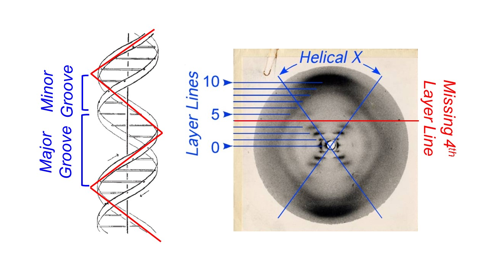

Picture a molecule of DNA. What does it look like? You probably envisioned the twisted ladder-like structure known as the double helix. Today, “double helix” is so intertwined with our understanding of DNA that a Google image search of the phrase brings up diagram after diagram of the molecule. But how was this structure discovered? How did scientists determine such an intricate design without being able to see DNA under a microscope? The answer came largely from this picture seen above.

That looks like DNA, right? I didn’t think so either, but this image forever changed our understanding of DNA.

### **Photo 51**
This photograph, known as Photo 51, was produced in 1952 by chemist and molecular biologist **Rosalind Franklin** and graduate student **Raymond Gosling** at King’s College in London, using a technique called X-ray crystallography. The discovery of DNA’s structure was initially credited to **James Watson** and **Francis Crick**, biologists at the Cavendish Laboratory in Cambridge, who first proposed their double helix model in the April 1953 issue of the scientific journal Nature[^1]. Franklin’s article containing Photo 51 followed in the same issue, presented as experimental evidence supporting Watson and Crick’s theory[^2]. However, it is now well known that Franklin played an important role in developing this theory. Some even argue that Watson and Crick would not have made their monumental discovery without knowledge of Franklin’s work. In his book *The Double Helix*, James Watson himself wrote, “The instant I saw the picture my mouth fell open and my pulse began to race."[^3]

 The evidence for a double helix was glaringly obvious—for those who understood X-ray crystallography.

####**The basics of X-ray crystallography**

X-ray crystallography was invented in 1912 by physicist **William Henry Bragg** and his son **William Lawrence Bragg** and is still used today to determine molecular structures. While the specific technologies have progressed tremendously, the basic concept behind the technique remains the same. An X-ray beam is shot at a crystal—or in Franklin’s case, a fiber of DNA—and the X-rays diffract and ricochet off of individual atoms like a ball in a pinball machine.  The diffracted beams are detected on either X-ray sensitive film or an image plate, creating a pattern of dark spots called reflections. The distance and angle from to center of the image to each reflection is measured, and complicated mathematics called the Fourier transform convert these measurements into an atomic structure.  

####**Why use X-rays?**

Scientists often rely on microscopy to visualize small objects but as with any form of microscopy, the level of detail that can be seen is limited by the wavelength of the electromagnetic radiation, or light source, used. For standard light microscopy, the shortest possible wavelength is around 300 nanometers (nm).  While this is small enough to allow us to see living cells, for example, it is not small enough to distinguish the individual atoms within that cell. Atoms within a molecule are on average 0.1 nm, or 1 Angstrom (Å) apart, which is about the same size as the wavelength of an X-ray. Thus, using X-rays as the light source allows us to visualize detail at the atomic level.  

####**Why use crystals?**

A single X-ray beam bouncing off of a single atom does not make much of an impact on the detector or film. In order to get dark, distinct reflections, such as those seen in Photo 51, multiple X-ray beams need to hit the detector or film in the same spot. This is only possible if the molecules being analyzed contain a repeating pattern in their structure and all of the molecules are arranged in the same orientation. When X-rays hit molecules that are aligned, the waves diffract in phase, which means that their intensities combine to become stronger and, therefore, visible on the detector. If the molecules are misaligned, the X-rays diffract out of phase and partially cancel each other out, leading to fuzzy, faint reflections[^4].

In order to obtain the clearest reflections, scientists often make crystalized forms of the object they are analyzing. The molecules in a crystal are all oriented in the same direction, allowing for this additive effect, known as constructive interference. Interestingly, Franklin did not work with a crystallized form of DNA as no one had figured out how to crystallize DNA yet. Instead, she used a fiber of vertical DNA molecules about the thickness of a human hair. This fiber was much less organized than a crystal, making it difficult to obtain a clear image. Thus, the clarity of Photo 51 is a testament to Franklin’s expertise at this challenging technique.

####**Deciphering Photo 51**

To the trained eye, specific details of Photo 51 provide multiple clues to the structure of DNA. Most notably, the large “X” in the middle of the image was highly indicative of a double helix. Two years before Photo 51 was produced, **Alex Stokes**, a colleague of Franklin’s, mathematically predicted the diffraction pattern that would result from a helical molecule[^4], and Photo 51 closely matched his predictions. This “X” is formed by X-rays that diffract off of the “zig” and “zag” of each DNA strand as it makes helical turns around the axis.

The reflections that make up the “X” were so intense that Franklin reasoned that they were caused by the phosphorus groups within the DNA backbone. Phosphorous groups were known to cause intense reflections due to their chemical nature, and thus, Photo 51 showed that the DNA backbone was on the outside of the helix, while the base pairs faced the center. This was a major aspect of Franklin’s contribution to the structure of DNA, since previous models placed the phosphorous backbone in the center of the helical axis[^5].

More information was gleaned from the layer lines, the horizontal lines that extend in either direction from the middle of the image. The first layer line represents the largest repeating unit, a single turn of the helix, while the tenth layer lines represents the smallest repeating unit, the individual base pairs. By calculating the length of these repeating units, Franklin concluded that there are 10 base pairs in every turn of the helix. Watson and Crick also used the layer lines to develop their model. The fourth layer line lacks any reflections, indicating that X-rays were diffracted out of phase in this particular spot. Watson and Crick hypothesized that this was because the two strands of DNA are slightly offset from each other, creating major and minor grooves in the double helix.

####**Conclusion**
While DNA and double helix go hand-in-hand today, a great deal of technical skill and ingenuity from multiple scientists went into discovering the structure of the molecule of life. Watson, Crick, and Maurice Wilkins, another colleague of Franklin’s, received the Nobel Prize in 1962 for discovering the structure of DNA. However, it is clear that this monumental discovery was greatly aided by the expert crystallographic skills of Rosalind Franklin.

####Further Information

http://www.structmed.cimr.cam.ac.uk/Course/Basic_diffraction/Diffraction.html 

####References {#references}

[^1]: Watson, J.D. and Crick, F.H.C. (1953). A Structure for Deoxyribose Nucleic Acid. *Nature*. *171*: 737-738.

[^2]: Franklin, R.E. and Gosling, R.G. (1953). Molecular Configuration in Sodium Thymonucleate. *Nature*. 171: 740-741.

[^3]: Watson, J.D. (1968). "The Double Helix: A Personal Account of the Discovery of the Structure of DNA".

[^4]: DNA and Social Responsibility. (2011). “Short and Simple (ish) Guide to X-ray Diffraction”. King’s College London Archives.

 
[^5]: P. Shing Ho and Megan Carter (2011). "DNA Structure: Alphabet Soup for the Cellular Soul". InTech.

[^6]: Pauling, L. and Corey, R.B. (1953). A Proposed Structure for the Nucleic Acids. *Proc Natl Acad Sci*. *39*: 84-97.

