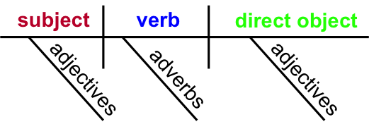
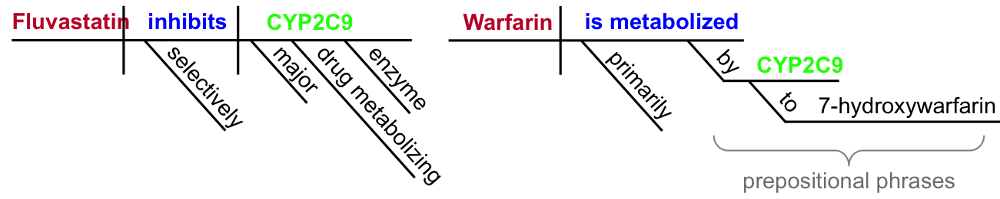
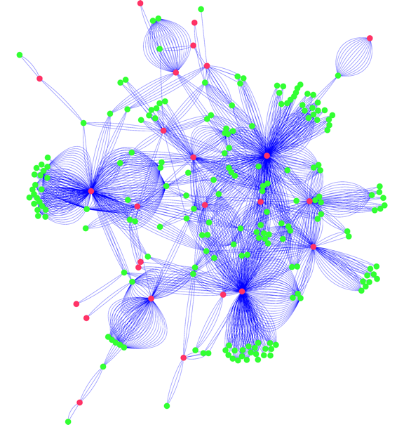

In the past 50 years, the life expectancy for the average American has increased from 70 years to 79 years.1 During that extra decade of life, elderly people are now taking more prescription drugs than ever before to combat cancer, high blood pressure, and other diseases that increase with age. Many elderly people are simultaneously taking multiple medications, which increases the risk of these drugs interacting with each other in a harmful way. These drug-drug interactions are of increasing concern as more and more of the population depends on multiple medications to treat or prevent age-related diseases.

### What is a drug-drug interaction?

About 1 in 50 adults over age 60 take the drug warfarin to reduce blood clotting and consequently lower their risk of stroke. Like most drugs, warfarin must be maintained at the right concentration in the body in order for it to be effective. If there’s too little warfarin, it won’t have a large enough effect on blood clotting to prevent strokes. If there’s too much warfarin, then it prevents blood clotting entirely. This is dangerous because when blood completely loses the ability to clot, then cuts, scratches, and other injuries will not stop bleeding and never form a healing scab.

Another commonly prescribed drug is fluvastatin, which lowers cholesterol to reduce the risk of heart disease. But taking fluvastatin at the same time as warfarin can result in uncontrolled bleeding – yikes! Why does this happen? The human gene CYP2C9 is responsible for metabolizing warfarin, or breaking it down into smaller components that are then safely removed from the body. However, fluvastatin inhibits CYP2C9, which allows warfarin to accumulate in the body and reach an unsafe level. At this level, warfarin does not just reduce blood clotting, but instead completely prevents it, leading to dangerous, unstoppable bleeding.

In general, when two drugs interact with the same gene, an undesirable drug-drug interaction may occur. In the case of warfarin and fluvastatin, one drug hugely increases the effect of the other. In other cases, one drug might reduce the effect of the other or increase its harmful side effects. For example, alcohol and Tylenol are both primarily metabolized in the liver, so taking both at the same time causes more liver damage than just having either one alone, and is very dangerous.

### How do we avoid drug-drug interactions?
Most of the time, drug-drug interactions are discovered when unfortunate patients experience the negative effects of taking certain combinations of medications. Only then is the mechanism of the drug-drug interaction investigated by doctors and scientists. But recent scientific research is changing the way that drug-drug interactions are discovered and documented, in order to minimize patient risk. How? By using computers to read and analyze scientific publications!

Over 23 million scientific papers have been published that describe novel findings about how drugs interact with genes. This is an insurmountable amount of information for a human to read and understand; however, computers can be programmed to extract relevant information for us and are able to do so with incredible speed. You may be wondering how computers can methodically extract important information from structurally diverse sentences. To understand how this is done, we have to remind ourselves about the rules of grammar.

As you may remember from elementary school, sentences can be parsed into their essential components using a sentence diagram.2 A general sentence diagram is shown below:

Now let’s examine the following two sentences, actually taken from two different scientific publications: 
•	“Fluvastatin selectively inhibits a major drug metabolizing enzyme CYP2C9.”3
•	“Warfarin is metabolized primarily by CYP2C9 to 7-hydroxywarfarin.”4

We can diagram these sentences as follows:

As you can see, what began as a more complex statement with excess information can become extremely simple to understand once it’s distilled into its important parts and formatted into a sentence diagram. Breaking down a sentence into its essential components is called parsing. In fact, there is an entire field of research, called natural language processing,5 dedicated to programming computers to extract information from written content by identifying parts-of-speech and parsing sentences. Thanks to natural language processing, we have email spam filters, “predictive text” on our smart phones, and applications like Google Translate. Now scientists can also use natural language processing to help describe and possibly predict drug-drug interactions!

How do we get from parsing sentences to predicting drug-drug interactions? After the two example sentences above are parsed, the sentence diagram can be reduced to a network diagram made of circles (nodes) and lines (edges), where each drug is shown as a pink node, each gene is shown as a green node, and the relationship between them is shown as a blue edge. The edge signifies a drug-gene interaction; if two different drugs share a drug-gene interaction with the same gene, then these two drugs will likely have a drug-drug interaction.

 

Then, all sentences containing both a drug name and a gene name are extracted from the millions of published scientific articles. All of these sentences are reduced to drug-gene interactions like the ones above, and then combined into a giant network that contains all published drug-gene interactions. Here is just a small part of this network:6

 

**A subset of published drug-gene interactions.6**

As you can see, many drugs interact with multiple genes, and many genes interact with more than one drug. Constructing this network by hand would take countless hours of reading, but computers can do it much more quickly. In fact, computers can produce a vast network of drug-gene interactions even more complicated than the one shown above.7

So how many possible drug-drug interactions (pink-green-pink) can you find in this network? The answer: more drug-drug interactions than have been characterized or observed in patients! The drug-drug interactions that can be found in these networks are valuable for explaining symptoms that have already been observed in patients taking multiple drugs, as well as for cautioning doctors against prescribing two drugs that are predicted to interact until more research has been done.

Of course, sentence parsing for drug interactions is still a work in progress, and there are limitations to this approach. So far, it is still difficult for computers to integrate information that is found across multiple sentences – for example, “Fluvastatin is a drug. It inhibits CYP2C9.” This and other barriers still stand in our way of completely automated literature reading for drug-gene interactions. However, with greater advances in the field of natural language processing, unexpected drug-drug interactions may soon become a thing of the past.

###References:
1.	http://www.infoplease.com/ipa/A0005148.html
2.	https://en.wikipedia.org/wiki/sentence_diagram
3.	Transon C, T Leeman, and P Dayer. (1996). *in vitro* comparative inhibition profiles of major human drug metabolising cytochrome P450 isozymes (CYP2C9, CYP2D6 and CYP3A4) by HMG-CoA reductase inhibitors. *Eur J Clin Pharmacol*. *50*: 209-215. [PubMed](http://www.ncbi.nlm.nih.gov/pubmed/8737761)
4.	Kaminsky LS, and ZY Zhang. (1997). Human P450 metabolism of warfarin. *Pharmacol Ther*. *73*: 67-74. [PubMed](http://www.ncbi.nlm.nih.gov/pubmed/9014207)
5.	https://en.wikipedia.org/wiki/natural_language_processing
6.	Percha B, Y Garten, and RB Altman. (2012). Discovery and explanation of drug-drug interactions via text mining. *Pac Symp Biocomput*. 410-421. [PubMed](http://www.ncbi.nlm.nih.gov/pmc/articles/PMC3345566/) 
*Network figure used from this publication with permission.
7.	Percha B, and RB Altman. (2015). Learning the structure of biomedical relationships from unstructured text. *PLoS Comput Biol*. *11*(7): e1004216 (2015). [PubMed](http://www.ncbi.nlm.nih.gov/pmc/articles/PMC4517797/)

