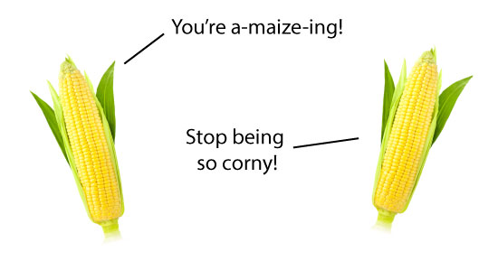

In April of 2015, Chipotle [proudly announced](http://ir.chipotle.com/phoenix.zhtml?c=194775&p=irol-newsArticle&ID=2040322) that they are no longer going to use genetically modified organisms in their food. As a college undergraduate, Chipotle's token demographic, this was very pertinent news to me. In their press release, Chipotle indicated that they are trying to make the tastiest and healthiest food possible by exclusively using food that has not been genetically modified.
	
So what exactly are genetically modified organisms, or **GMOs**, and how do they factor into the taste, health, and environmental impact of the food we eat? Simply put, GMOs are organisms that have had specific changes made to their DNA that do not occur naturally, using genetic engineering. GMO crops are often genetically modified to improve food quality (i.e. appearance or nutrition) and increase the plant's resistance to pests, herbicides, or changes in weather.[^1] Similarly, modifications have been made in animals to improve growth rate, meat quality, and reproductive ability.[^2] 

[^1]: [Ji, Q., Xu, X., & Wang, K. (2013). Genetic transformation of major cereal crops. _International Journal of Developmental Biology_, *57*(6-7-8), 495-508.](http://www.ncbi.nlm.nih.gov/pubmed/24166432)

[^2]: [Świątkiewicz, S., Świątkiewicz, M., Arczewska-Włosek, A., & Józefiak, D. (2015). The use of genetic engineering techniques to improve the lipid composition in meat, milk and fish products: a review. *Animal*, *9*(04), 696-706.](http://www.ncbi.nlm.nih.gov/pubmed/25500170)

Organisms become genetically modified through a process called **transformation**, where DNA from another species is added to the organism's own DNA. Most genetic modification is done in plants and this process starts by infecting the plants with a bacterium carrying the DNA to be added.[^3] The bacterium then invades the plant and inserts the DNA into the plant's genome. The plan then uses this newly inserted DNA to make proteins that it normally does not make, which changes its characteristics. For example, one of these proteins might protect plants from being eaten by a certain type of insect, or allow them to better survive during a heat wave. 
[^3]:[Anami, S., Njuguna, E., Coussens, G., Aesaert, S., & Van Lijsebettens, M. (2013). Higher plant transformation: principles and molecular tools. *International Journal of Developmental Biology*, *57*(6), 483-494.](http://www.ncbi.nlm.nih.gov/pubmed/24166431)
###Journey into the unknown
You may be wondering, why is there so much public skepticism of GMOs? This reputation probably came about due to the ideas people associate with the phrase "genetically modified organism." Perhaps people think of Frankenstein's monster, or two-headed cows, or [this famous picture](https://en.wikipedia.org/wiki/Vacanti_mouse) of a mouse growing a human ear on its back. This ear was grown using human stem cells stimulated to form cartilage, and the ear shape results from biodegradable tubing. The long-term goal of such an experiment is to grow human organs on animals and eventually transplant these organs into human patients who need them. While this rat is not genetically modified (it is actually an example of bioengineering) it is clear that there are negative associations with living things that have been manipulated by humans. Something about them just "isn't right," according to critics.

A lot of this negative association comes from our gut instinct that things "ought" to be a certain way. The "something isn't right" characterization of GMOs falls into that type of thinking - a lot of people instinctually believe it is wrong to interfere with the genetic makeup of other organisms, but may not have a specific reason for this belief. But here is a secret: humans have been genetically modifying organisms for centuries. 
	
Since the dawn of agriculture, humans have participated in **selective breeding**. When farmers breed plants to sow in the next season, they keep only the healthiest and biggest plants each time, causing each harvest to be better than the last. These stellar plants are the biggest and healthiest because they have a naturally occurring change in their DNA compared to the other plants; this mutation affects how they grow and respond to their environment in a positive way. By selecting for these plants, farmers are actually causing crops to gradually evolve into healthier plants that create larger, more desirable produce. This is how we turned many fruits and vegetables into the delicious food we eat today. In fact, many of the foods we eat [looked very different](http://www.sciencealert.com/here-s-what-fruits-and-vegetables-looked-like-before-we-domesticated-them) before we domesticated them. We have artificially bred wheat, rice, grapes, potatoes, cattle, horses, and more. We have also bred pet dogs for selected traits like friendliness, obedience and even looks! Rest assured, we do not modify organisms to grow ears. Except for corn, of course.

	
Understandably, the selective breeding method is very different from modern transformation techniques. However, the fundamental idea is the same; we modify plants and animals we use to be better at what we want them to do. The difference between selective breeding and genetic modification is that genetic modification is faster and more direct. We have always tried to make fish produce more offspring, corn survive cold snaps, and poodles less allergenic, but now we can do it in months instead of decades. 
###Fact and fiction
This leaves an interesting question: why did Chipotle announce that GMOs are not in line with their vision? If genetic modification can make so many useful changes to our crops, then why wouldn't Chipotle want to use them? The answer is a matter of public opinion. The public is skeptical of GMOs. According to a [recent survey](http://abcnews.go.com/Technology/story?id=97567&page=1), 52% of people believe GMOs are unsafe, and a whopping 93% believe that GMOs should be specifically labeled as genetically modified or bio-engineered. Because of their negative perception of GMOs, people are drawn to GMO-free foods and Chipotle has found it in their interest to capitalize on this mentality. 
	
Of course, as with any new technology, a healthy dose of skepticism is always important. Genetic modification has the ability to change a species very quickly, and with such a fast change there is always a risk of ecological disruption. For example, making a crop resistant to a certain pest like flies may cause fly populations to decrease, which could disrupt an entire food chain. There are other issues such as animal rights concerns that changes in an animal's biology may reduce its state of living in an unethical way. Thankfully, studies so far have shown GMOs to be both safe for consumption and safe for the environment. Additionally, unethical uses of genetic modification have been prevented. 
	
Genetic modification is a powerful modern tool, with which we may gain the ability to grow more food in more climates. We could bring crops to impoverished places and reduce famine across the world. Of course, there are safety precautions that must be addressed along the way, but making the public more informed and more comfortable with GMOs will be a significant step toward their widespread use. 

Cover image courtesy of Sam Fentress, via Wikimedia Commons.

####Recommended Further Reading

* [Chipotle GMO page](http://chipotle.com/GMO)
* [Public views on GMOs](http://www.ncbi.nlm.nih.gov/pmc/articles/PMC1083956/)

####References: