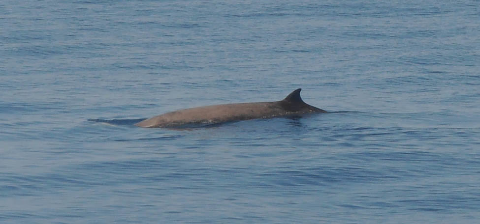
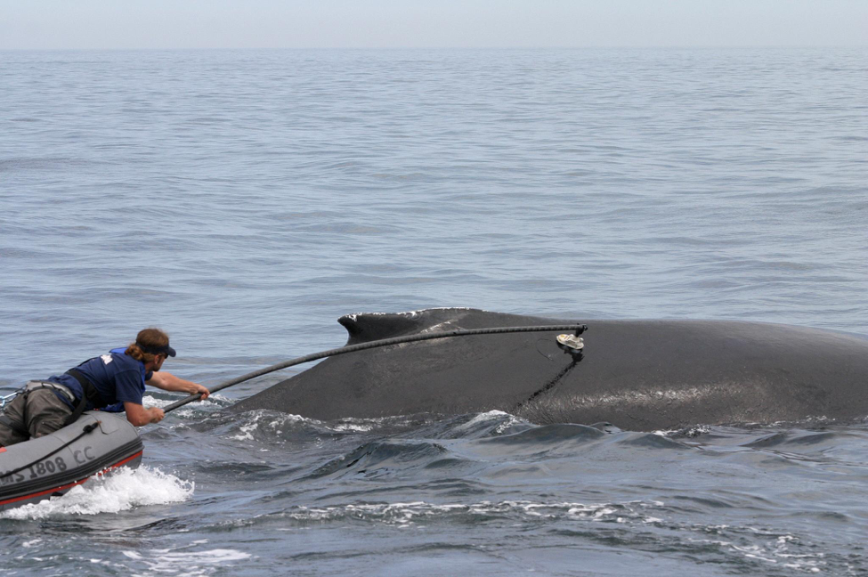
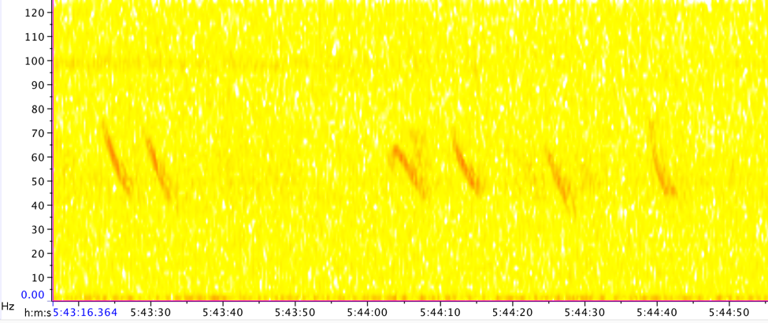

From the blue whale (*Balaenoptera musculus*) to the bottlenose dolphin (*Tursiops sp.*), cetaceans (whales, dolphins, and porpoises) are amongst the most iconic marine animals. Given how recognizable many cetaceans are, the fact that we lack much basic information on the distribution and behavior of many of these species may come as a surprise. But how hard can it possibly be to find and study whales? After all, the blue whale is the largest mammal ever known to have existed on earth, and many of its giant relatives follow close behind. As it turns out, the often extreme behavior and remote habitats of these animals can make finding and studying them quite a challenge. Scientists have turned to a range of techniques in this pursuit, uncovering fascinating information about these cryptic beasts along the way.

## Diving Deep

Part of the problem with tracking and studying whales is the massive spatial scale at which they operate. While it may seem ridiculous that it would be difficult to locate a 15-meter gray whale (*Eschrichtius robustus*), they can be somewhat of a “needle-in-a-haystack” in comparison to the ~20,000 km migratory pathway that these whales follow in the eastern Pacific. Further complicating matters, the enormous saltwater world of whales is not confined to just two dimensions- many species dive to incredible depths and only rarely linger near the easily-observable ocean surface. The most extreme divers of all cetaceans are beaked whales, a rarely-sighted group of whale species resembling large dolphins. Cuvier’s beaked whales (*Ziphius cavirostris*; Figure 1) dive to depths of nearly 2000 meters in pursuit of prey, holding their breath for well over an hour [1]. Due to spending most of their lives in the depths of the open ocean, the majority of the 22 different species of beaked whale are rarely observed alive in the wild. Historically, most of the information gathered about these animals has come from the study of beached individuals.

*Figure 1. Fleeting glimpse of a Cuvier’s beaked whale surfacing in the Ligurian Sea of Italy. Photo credit: Emmanuel Baltasar / CC-BY-SA-4.0.*

## Tracking by Tag
 
With the historical difficulty of tracking individual whales along lengthy migrations or in their lives in the ocean depths, how do scientists know anything at all about the distribution and unique behaviors of the nearly 90 species of cetaceans? Beyond study of beached individuals and opportunistic visual surveys, the development of tagging technology has greatly improved scientists’ ability to study wild whales. Marine mammal tags have developed significantly from the earliest steel cylinder tags deployed in the early and mid-20th century. These primitive tags relied on whaling boats to recapture and kill tagged whales to learn about animal movement patterns [2]. Modern whale tagging studies utilize electronic tags, such as the “DTAG” developed at the Woods Hole Oceanographic Institution [3], attached to an animal via suction cups without harming the whale. After attachment to a whale via suction cups (Figure 2), this tag records data, before detaching from the whale and floating to the surface where it can be recovered by a researcher. This technique has been used to study behavior in a variety of marine mammals including the aforementioned beaked whales. Similar suction cup tags have been outfitted with arrays of instruments to measure biomechanics, monitor surrounding environmental variables (such as temperature or depth below the surface), and even record audio and video for an unprecedented look into the world of whales [4].

*Figure 2. Researchers deploy a suction cup tag on a humpback whale (Megaptera Novaeangliae) in the Stellwagen Bank National Marine Sanctuary. Photo credit: NOAA Fisheries, Permit #775-1600-10.*

## Listening Closely
 
While tagging whales yields detailed information on individual behavior and reveals some information about larger movement patterns, one has to know where a whale is going to be in order to tag it! So how do scientists answer population-level questions and know when different whale species will be in different parts of the ocean? Another area of marine mammalogy that was once mostly confined to opportunistic visual surveys and beached individuals has been greatly expanded through the use of passive acoustic monitoring (PAM). 
This approach takes advantage of two related factors in underwater acoustics: 
1) Sound in water can propagate over great distances, much further than the propagation of light in water.
2) Many cetacean species utilize sound in a variety of behaviors. 
From distinct clicks produced by deep-diving whales when hunting via echolocation in the dark ocean depths to the deep songs of baleen whales, cetaceans are often more easily spotted by sound than by sight. Study of whale populations via PAM has revealed a great deal of information about the distribution, seasonality, and call types of many cetacean species. However, scientists studying whales with PAM data must sort out the complications of noise from human activities in their datasets, similarities in call characteristics between species, and sorting through data over enormous frequency and time ranges [5]. Such issues have led some marine scientists to focus their efforts on applying efficient and powerful computational tools in the realm of machine learning to PAM datasets.

*Figure 3. Spectrogram images of recordings from the Monterey Bay National Marine Sanctuary displaying blue whale “D calls”, characteristic of blue whales foraging for prey. Image created by the author using data from [5].*

## Aiding in Conservation
 
The development of a variety of technologies, including sophisticated tags and PAM techniques, has changed the answer to the question, “how hard can it be to find a whale?” from “extremely difficult” to “a little easier than it used to be.” But what benefit does pouring time and resources into methods for tracking these cetaceans have? Beyond gaining incredible insight into their social structures and interactions with the often harsh and alien marine worlds they inhabit, these scientific advances in the study of cetaceans are playing a central role in the conservation of at-risk populations. Many species of cetaceans were targeted globally for hundreds of years by the whaling industry until the passage of a moratorium on commercial whaling by the International Whaling Commission in 1982. Even since this moratorium, populations have been slow to rebound and face new, unintentional anthropogenic threats. These threats include ship strikes [6] as well as increasing marine noise pollution associated with significant behavioral change and even death by stranding [2]. But conservation-minded scientists have begun using the incredible new tools available for detecting and tracking marine mammals to mitigate these new threats. New “habitat niche models”, combining modern tagging approaches with satellite imagery of oceanographic conditions, have recently been developed to forecast important blue whale habitat areas in the California Current [6]. Through this effort, researchers hope to reduce the risk of ship strikes and subsequent blue whale deaths by informing commercial vessel operators in near real-time about which ocean areas are most likely to attract blue whales. On the Atlantic coast of the US, PAM is used as part of a system to alert commercial vessels to the presence of endangered North Atlantic Right whales (*Eubalaena glacialis*) in hopes of reducing the probability of a ship strike. While these concerns are not entirely resolved and persist in many other areas of the world oceans as well, the increasingly precise tools being developed and used to track cetaceans are certainly closing the gap to solving these problems.

## References

1. Tyack, P. L., M. Johnson, et al. (2006). "Extreme diving of beaked whales." Journal of Experimental Biology 209: 4238-4253.
2. Horwitz, J. (2014). The War of the Whales. London: Simon and Schuster.
3. Johnson, M. P. and P. L. Tyack (2003). "A Digital Acoustic Recording Tag for Measuring the Response of Wild Marine Mammals to Sound." IEEE Journal of Oceanic Engineering 28(1): 3-12.
4. Goldbogen, J., D. Cade, et al. (2017). “Using Digital Tags with Integrated Video and Inertial Sensors to Study Moving Morphology and Associated Function in Large Aquatic Vertebrates.” The Anatomical Record 300, 1935-1941.
5. Ryan, J., D. Cline, et al. (2016). “New passive acoustic monitoring in Monterey Bay National Marine Sanctuary: exploring natural and anthropogenic sounds in a deep soundscape.” OCEANS 2016 MTS/IEEE, Monterey, CA USA, doi: 10.1109/OCEANS.2016.7761363.
6. Hazen, E. L., D. M. Palacios, et al. (2016). “WhaleWatch: a dynamic management tool for predicting blue whale density in the California Current.” Journal of Applied Ecology 54(5), 1415-1428. 
<!--stackedit_data:
eyJoaXN0b3J5IjpbLTE3Nzc3MzIxNzMsLTkwMzkyNjEyMl19
-->