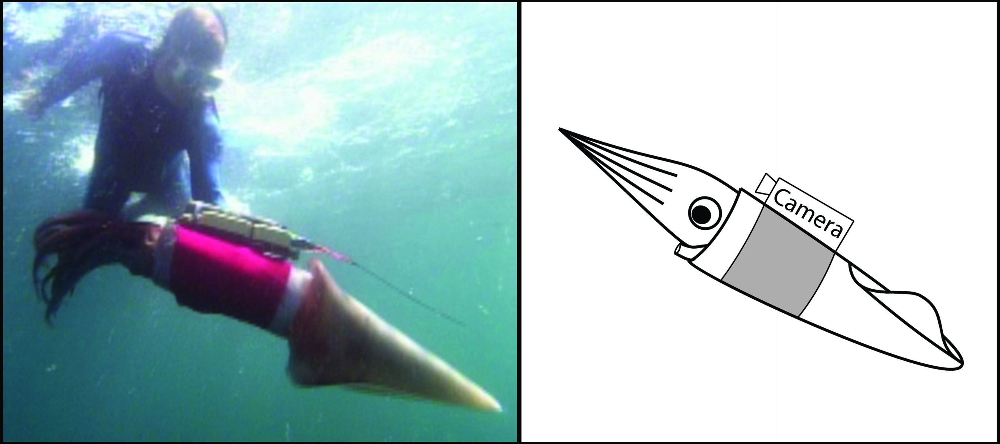
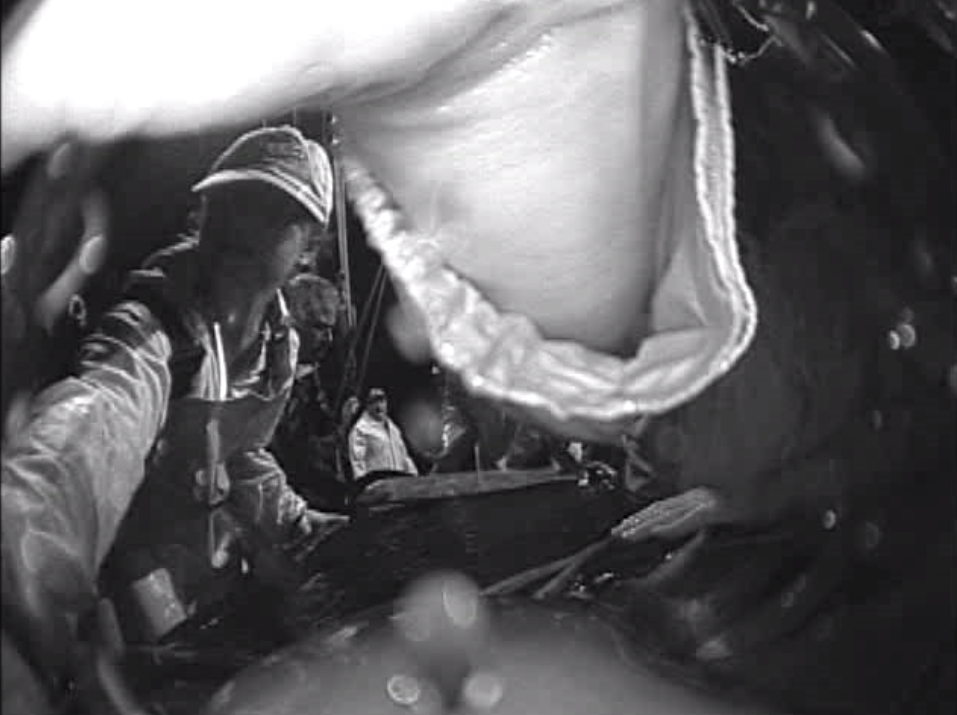

*A Humboldt squid. Photo by Patrick Daniel.*

If you could have any superpower, what would it be? I can’t decide between invisibility and knowing what filling is inside a pastry without having to open it. But Dr. Hannah Rosen, who completed her Ph.D. at [Stanford University’s Hopkins Marine Station](http://hopkinsmarinestation.stanford.edu/) (HMS) knows exactly what she’d choose – the ability to talk to animals. We may never truly know what animals are thinking and saying, but scientists like Rosen are working to crack the animal communication code. This is a particularly challenging pursuit for animals that don’t emit any sound and don’t live in a place that’s easy to observe. The Humboldt squid, which lives in the open ocean, unfortunately falls into both categories, but that didn’t deter Rosen and colleagues at HMS and [National Geographic](http://www.nationalgeographic.com/). In a [study](http://jeb.biologists.org/content/218/2/265) published in 2015, the research team stepped up to the challenge and aimed to figure out the latest gossip among Humboldt squids in their natural oceanic habitat.

Squids don’t communicate the same way we do. Instead of producing sounds, they change the color of their skin. Like octopuses and cuttlefishes, squids have special tiny color organs called chromatophores. If you’ve ever looked closely at a squid and noticed the little freckles all over its skin, you’ve seen chromatophores.

<iframe width="560" height="315"
alt="Video of waves of chromatophore activity on a patch of squid skin"
src="https://www.youtube.com/embed/1E3o2lLq5ek?loop=1&playlist=1E3o2lLq5ek"
frameborder="0" allowfullscreen></iframe>
*Each little dot on this piece of Humboldt squid skin is a chromatophore. Video by Hannah Rosen.*

Each chromatophore is connected to specific muscles and nerves that open or close it. When the chromatophore is open, the color is visible. Chromatophores come in different colors, usually yellow, orange, red, purple, or brown, depending on the type of squid. The Humboldt squid only has red chromatophores, but other species can have many colors. When the chromatophore is closed, it becomes very small, and the white tissue behind it is exposed. By opening and closing chromatophores of different colors in certain places on its body, a squid can come up with a variety of patterns – each possibly conveying a specific message.

Scientists from the early 1900’s had hypothesized all this information, and these ideas were confirmed by the 1970’s. So, Rosen’s team knew what to look for – not sounds, but changing skin color. But how do you watch squids that live in the big, vast ocean? Well, just like double agents who wear hidden microphones to record conversations in spy movies, scientists managed to get squids to wear an underwater camera to videotape their behaviors and interactions. National Geographic’s Remote Imaging team developed the [National Geographic Crittercam](http://animals.nationalgeographic.com/animals/crittercam/), a water-bottle sized camera that can be attached onto an animal, which is then released back into its habitat.

*A Humboldt squid wearing a Crittercam. Left panel by National Geographic. Right panel by Diana Li.*

Prior to 2015, the Crittercam had been used to study behavior in penguins, seals, and sharks but never in an invertebrate. As animals without backbones, the word “invertebrate” usually evokes images of small animals like bugs and worms that couldn’t carry a Crittercam. Squids also lack a backbone, yet the Humboldt squid can exceed 5 feet long and weigh over 50 pounds. A big Humboldt squid would be the perfect candidate for wearing a Crittercam. So all that Rosen’s team had to do was catch a huge Humboldt squid, strap a Crittercam onto it, and release it back into the ocean. Easy enough, right?

Here’s a hint: Science rarely goes as planned. After discovering where in the Pacific Ocean Humboldt squids usually hang out, the research team had to catch over a hundred squids before finding one that was big enough to wear the Crittercam. Once a large enough squid was captured, the scientists had to work quickly to attach the camera before the squid got too stressed. A stressed squid could injure itself or the nearby scientists. The camera, attached to a stretchy tube of fabric, slid onto the squid’s body like a huge wrist band. After everything was secured, the squid was released back into the ocean. Two hours later, the Crittercam would detach and float up to the surface, and the scientists would retrieve the camera, hopefully full of exciting video footage.

The first behavior that Rosen observed when she began to look at the footage wasn’t exactly exhilarating. However, it made up a large portion of the Humboldt squid’s chromatophore activity. The chromatophores kept displaying an irregular pattern that the research team called “flickering.”

<iframe width="560" height="315"
alt="Crittercam video of a Humboldt squid flickering"
src="https://www.youtube.com/embed/Ru9cHSmMKz0?loop=1&playlist=Ru9cHSmMKz0"
frameborder="0" allowfullscreen></iframe>
*View from the Crittercam onto the squid’s head, arms, and tentacles showing the “flickering” skin behavior. Video by National Geographic Remote Imaging.*

They noticed that flickering looked a lot like rippling sunlight on the bottom of a pool. But what was this skin behavior for? Scientists know that squids, octopuses, and cuttlefishes can form and hold different color displays on their skin. These color displays, called static patterning, generally remain still on the body and mimic other still objects, like rocks and debris, to help the animal camouflage itself. But what if there aren’t really any still objects to blend in with? The Humboldt squid is a pelagic animal, meaning it lives in the open ocean and doesn’t encounter rocks, sand, or shores. Sunlight filtering down from the ocean surface would be dynamic – constantly fluctuating with movements of the water. Flickering could serve as dynamic camouflage, a way to blend in with a moving background.

Flickering wasn’t the only display that caught Rosen’s attention – the Humboldt squids had something much more dramatic in store. At times, the squids would suddenly stop flickering and start a behavior that Rosen and her team called “flashing,” a striking display of alternating red and white over the squid’s entire body. Flashing almost always occurred when there were multiple squids near each other.

<iframe width="560" height="315"
alt="Crittercam video of Humboldt squid communicating by 'flashing' each other!"
src="https://www.youtube.com/embed/Osvfr2DASWE?loop=1&playlist=Osvfr2DASWE"
frameborder="0" allowfullscreen></iframe>
*“Flashing” behavior filmed by the Crittercam. Notice the squid on the left change from flickering to flashing. The squid wearing the Crittercam begins flashing soon after, and physical contact eventually occurs. Video by National Geographic Remote Imaging.*

Flashing in different squids can occur at different frequencies, just like how turn signals on cars waiting in traffic don’t always blink at the same rate. But unlike cars, squids can change the timing of their flashing to match each other, respond exactly opposite, or remain somewhere in between. Changes in flashing rate could indicate communication. For example, Rosen’s team observed instances where a squid appeared to “interrupt” a conversation between other squids by making a single sudden flash, as if exclaiming “Hey!”. The squids would then all match up in the red part of a flash before continuing to flash at a certain frequency.

It’s tricky not to assign human behaviors to squids when watching interactions like these, and scientists have to be careful not to interpret animal behaviors too creatively or conclusively. After all, we can’t read squids’ minds. However, Rosen’s team was able to conclude that flashing and changes in flashing rate are likely to be important for communication between Humboldt squids. The fact that flashing exchanges were often associated with some sort of physical contact between squids further supported this idea. But exactly what the squids are saying to each other still remains a mystery.

The Crittercam provided only a first glimpse into the secret lives of Humboldt squid, and Rosen is most excited about her work’s potential for future studies. “There are so many different ways these animals could be using the timing of their flashes to communicate with each other,” she said.

*Rosen has seen Humboldt squids many times, but this is the first time that one has seen her (on left in hat). Photo from Crittercam video by National Geographic Remote Imaging.*

In the future, Rosen hopes to figure out if certain flashing rates might lead to certain behaviors. Maybe differences in flash timing between squids affects how they interact? And what triggers flashing in the first place? She still wishes she could talk to animals like squids and simply ask them, but unless her superpower becomes a reality, she’ll settle for the next-best thing – more data.

Original Article (*PDF available upon request*):

Rosen H, Gilly W, Bell L, Abernathy K, Marshall G. Chromogenic behaviors of the Humboldt squid (Dosidicus gigas) studied in situ with an animal-borne video package. J Exp Biol. 2015;218(2):265-275. http://jeb.biologists.org/content/218/2/265.abstract.
