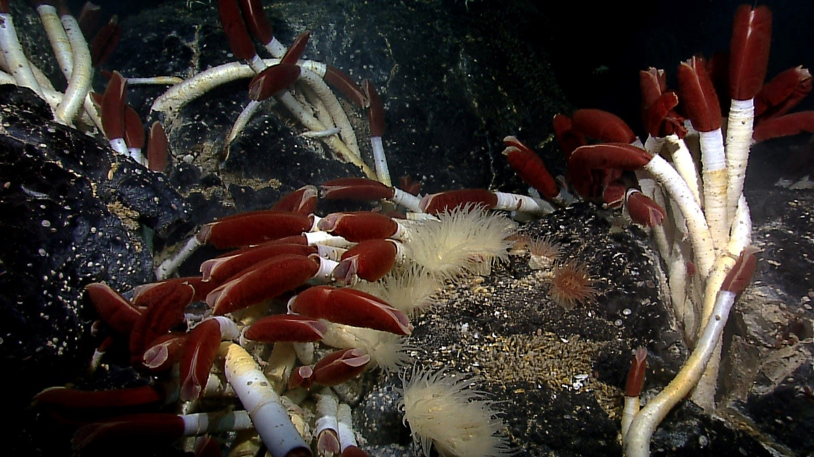

**The Remotely Operated Vehicle [Hercules](http://oceanexplorer.noaa.gov/technology/subs/hercules/hercules.html) captured this image of a deep-sea jelly fish just south of a hydrothermal vent on the Mid-Atlantic Ridge.  Photo Credit: IFE, URI-IAO, UW, Lost City Science Party; NOAA/OAR/OER; The Lost City 2005 Expedition.**

It’s often said that we [know more about space than we do about Earth’s own oceans](http://science.howstuffworks.com/environmental/earth/oceanography/deep-ocean-exploration.htm).  In the case of the midocean ridges, the maxim is pretty much true.  Discovered in the 1950’s, the midocean ridges tower above the seafloor, crisscrossing the globe in long chains punctuated by deep rift valleys.  They house the majority of Earth’s active volcanoes, conceal whole communities of undiscovered organisms, and may have dramatic impacts on the global climate.  But due to the difficulty and expense of studying the deep sea, explorations of the ridges have been rare.

This year, with funding from the [National Science Foundation](https://www.nsf.gov/), the [Ocean Observatories Initiative](http://oceanobservatories.org/) (OOI) aims to change all that.  Scientists have outfitted seven different locations on midocean ridges across the globe with hundreds of sensors, cameras and underwater drones, all of which send information back to shore via electronic cables.  This month, the data are beginning to pour in, and for the first time in history, scientists can observe the bottom of the sea in real-time, with just the click of a button.

###Deep sea change

Over the past 70 years, the relatively few, sporadic studies of the deep sea have overturned long-held scientific theories about the geology, biology and climate of Earth.

At the end of World War II, oceanographers began to map the seafloor in detail for the first time.  Instead of a featureless wasteland, they discovered the midocean ridges: mountain ranges collectively long enough to wrap almost seven times around the moon, and tall enough to match the majesty of the Rocky Mountains.  These observations helped geologists develop the theory of [plate tectonics](https://www.youtube.com/watch?v=kwfNGatxUJI) – informally known as continental drift.  They hypothesized that Earth’s crust is composed of a series of thin plates that drift on a hot liquid core, much like rafts on a lake.  These rafts can spread apart, collide, or even grind along beside each other.

In the 1970’s, teams of researchers began to voyage to the bottom of the sea in tiny submersibles.  They found the anticipated peaks and ridges cut by deep valleys, but they also discovered abundant evidence of volcanic activity.  The ocean floor was littered with flows and pillows of lava.  The researchers realized that the midocean ridges were volcanic spreading centers: gaping seams in the Earth’s crust, where two tectonic plates were slowly pulling apart.  Lava from deep within the planet was rushing up to fill the gaps, forming long chains of low mountains populated by deep sea volcanoes.  This discovery helped plate tectonics gain universal acceptance.  *Terra firma* became obsolete.  

Then, a subsequent expedition off the coast of Ecuador made an even more fabulous discovery.  While exploring near fresh lava, researchers found hydrothermal vents: mineralized towers shooting hot water into the icy sea.  And beside the vents, they found life where none should have been.  Author William J. Broad records the moment in his book *The Universe Below: Discovering the Secrets of the Deep Sea*:   

>“Debra,” a geologist aboard [the submersible] called into a hydrophone, “isn’t the deep ocean supposed to be like a desert?”
>
>“Yes,” came the answer from above.
>
>“Well, there’s all these animals down here.”

The hydrothermal vents were teeming with life: ghostly white crabs and lobsters, brilliantly red shrimps, translucent anemones, hundreds upon hundreds of clams and mussels, and, strangest of all, meter-long tube worms with ruby tips, waving in the water like giant, white-stalked tulips.

**Tube worms (Riftia pachyptila) grow among mussels and anemones in a hydrothermal vent system off the coast of Ecuador.  Photo Credit: NOAA Ocean Explorer; Galapagos Rift Exploration 2011.**

###Alien life

The discovery of life in the deep ocean revolutionized the biological sciences.  The predominant view was that the seafloor should be barren and nearly devoid of life.  The few organisms dwelling there should be scavengers, taking advantage of [whatever food might tumble down from the surface of the sea](https://vimeo.com/29987934).  

This assumption was very reasonable.  Until the 1970’s, all animal life as we knew it depended on the sun for energy.  Plants transformed sunlight into food, herbivores ate the plants and carnivores ate the herbivores.  The ultimate source of life was the conversion of the sun’s energy to plant matter.  

Sunlight cannot penetrate the deep ocean, and yet the profusion of animals there are very much alive.  It turns out that animals dwelling near hydrothermal vents form symbiotic partnerships with special bacteria that don’t need sunlight to live.  The vents spew warm water that contains numerous chemical compounds, including hydrogen sulfide.  Hydrogen sulfide is toxic to most animals, but these special bacteria can transform it into food for their hosts.

Giant tube worms, for example, can grow to be up to 2m long, but they lack a mouth and an anus.  To survive, they rely on the bacteria packed inside their bodies.  The tips of the worms are red because they’re filled with blood.  The blood contains a molecule called hemoglobin, which captures hydrogen sulfide for the bacteria.  The bacteria, in turn, use that hydrogen sulfide to nourish the worm.  This arrangement, although unfamiliar, works well: Giant tube worms can grow up to 33 inches per year, making them the fastest growing invertebrate species on the planet.   

###The bigger picture

Recent studies suggest that the deep sea may have dramatic impacts on the global climate.

[Maya Tolstoy](http://www.ldeo.columbia.edu/~tolstoy/), a researcher at the Lamont-Doherty Earth Observatory of Columbia University, studies midocean ridges.  Her [recent paper*](http://onlinelibrary.wiley.com/doi/10.1002/2014GL063015/abstract), published in the scientific journal *Geophysical Research Letters*, suggests that volcanic eruptions along the midocean ridges are sensitive to the positions of the sun, earth and moon in our solar system.  Furthermore, eruptions may have had dramatic impacts on the global climate in the past, and may continue to do so in the future.  

Tolstoy has hypothesized that a release of pressure in the deep ocean might trigger eruptions along the midocean ridges, and that pressure fluctuations may occur on regular short-term and long-term cycles.  On the short term, eruptions seem to occur about every two weeks, in accordance with Earth’s [tidal cycles](https://www.youtube.com/watch?v=KlWpFLfLFBI), which are controlled by the relative positions of the sun, earth and moon.  During low tides, when the pressure on the bottom of the sea is weakest, Tolstoy has observed eruptions.

On the long-term scale, Tolstoy noticed that underwater volcanoes have been most active during [ice ages](https://www.youtube.com/watch?v=dJ5GYQrkvxI).  During an ice age, much of Earth’s water is transformed into ice.  Sea levels drop and the pressure on the deep ocean decreases, possibly triggering intense periods of undersea volcanism.  Just like land volcanoes, deep-sea eruptions release carbon dioxide – a greenhouse gas.  A period of deep sea volcanism might provide a natural check, causing Earth to warm quickly after long periods of cold. 

###Moving forward

If Tolstoy is correct, then midocean volcanic activity will need to be accounted for in climate change predictions.  But first, numerous questions still need to be addressed.  How much volcanism is there on the sea floor?  How much carbon dioxide does each eruption release?  Are the eruptions truly influenced by the tides and changes in Earth’s orbit?

Over the coming years, Tolstoy and other researchers like her hope to use the OOI data to answer some of these questions.  Among many other things, the scientific instruments on the sea floor will record underwater eruptions and the conditions that cause them in minute-to-minute detail.  

Our brief explorations of the deep sea have already transformed our understanding of Earth.  Now, with new data streaming in, more discoveries are sure to come.  

*PDF provided upon request.

**REFERENCES:**

W.J. Broad, The 40,000-Mile Volcano. *The New York Times.* 11 Jan. 2016. <http://www.nytimes.com/2016/01/12/science/midocean-ridges-volcano-underwater.html?_r=0>

W.J. Broad, The Universe Below: Discovering the Secrets of the Deep Sea. New York: Simon & Schuster, 1997. Print.     

K. Krajick, Seafloor Volcano Pulses May Alter Climate. <http://www.ldeo.columbia.edu/news-events/seafloor-volcano-pulses-may-alter-climate>.

D. Stover, Creatures of the Thermal Vents. *Ocean Planet: Popular Science.* <http://seawifs.gsfc.nasa.gov/OCEAN_PLANET/HTML/ps_vents.html>.

 

