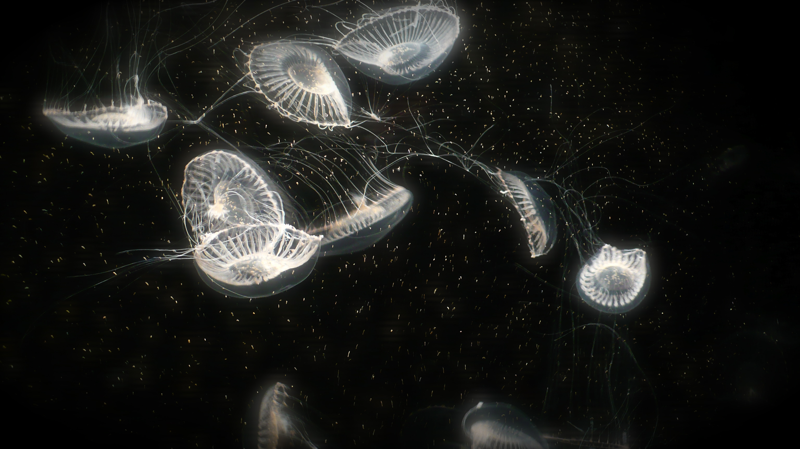

The beautiful image above is a glowing green nematode worm, C. elegans. This worm is naturally translucent, not green. To make it glow, the worm was engineered to contain a jellyfish protein called **Green Fluorescent Protein (GFP)** in each of its cells. This addition allowed scientists to capture this glowing image with a fluorescent microscope. Today, GFP is used in labs around the world to study the behavior of cells, organelles (mitochondri is the powerhous of the cell, anyone?), and proteins in real time. GFP has been adapted to react to changes in a cell’s environment,like pH levels or concentration of specific ions like oxygen or iron. This single protein has provided scientists insight into the mechanisms of cell division, protein dynamics, cell motility, tissue growth, and many other important biological phenomena.

 ### A Scientist's Fascination
 
The story of GFP begins in the 1960s with a scientist named Osamu Shimomura, who was fascinated by the naturally fluorescent jellyfish, Aequorea victoria. Shimomura was a protein biochemist, skilled at extracting fluorescent proteins from living organisms. However, the process of isolating GFP from jellyfish was not easy. Shimomura’s first attempt isolated a protein called aequorin that emits blue light. On his second attempt, Shimomura successfully found what we know today as GFP and would later determine the structure of the protein.

  

### Early Success to a Nobel Prize 
The next step in the journey of GFP from jellyfish to lab bench was assisted by Martin Chalfie. The idea that a scientist could use this fluorescent protein from a jellyfish and have it emit light in another organism was not a foregone conclusion but a previously unexplored possibility! It was possible that other jellyfish proteins would have to be added to the organism along with GFP to allow GFP to fluoresce. Chalfie first cloned the gene for GFP from the jellyfish. This process involves “copying” the piece of DNA that encodes GFP from the jellyfish and “pasting” it into another organism, in this case the worm C. elegans. The glowing worm you see above shows that this “copy and paste” experiment was successful, and opened the door to our ability to visualize cells and proteins in many organisms.

Since these early discoveries, GFP has been adapted by other scientists to increase its utility as a marker in biological experiments. Omamura and Chalfie share the 2008 Nobel Prize in Chemistry with cell biologist Roger Tsien, who used mutations in the GFP gene to slightly alter the colors it could emit. Their **research gave scientists a toolbox** of many colors of fluorescent proteins to work with: yellow fluorescent protein (YFP), cyan fluorescent protein (CFP), and blue fluorescent protein (BFP).

 ### The Future 
Today, we still have not reached full capacity of GFP’s utility in the lab. We use GFP as a tag on other proteins, which allows scientists to easily identify where that protein is located in a cell. Chemists have adapted GFP to fluoresce in response to differences in acidity. GFP has been engineered to help researchers know when two proteins are close together inside of a cell. If you want to learn more about how fluorescent molecules are used everyday in research labs around the world, you should check out our article [Seeing is Believing](https://thedishonscience.stanford.edu/posts/seeing-is-believing-fluo/).

The extensive knowledge we have gained from the use of GFP in the lab, would not be possible without a scientist’s fascination into how the jellyfish A. victoria glows. This is just one example of a **valuable tool that was discovered by studying the beauty of nature**. Similarly, many proteins in bacteria and fungi have proved to be extremely useful for biomedical research. 

This story is one of many that suggests that we should encourage the study of all of nature’s fascinating quirks for the joy of discovery and the unknown tools that we might uncover.

  
  

#### References

O Shimomura. Discovery of green fluorescent protein (GFP). Angewandte Chemie. 2009. 48:5590-5602.

M Chalfie, et al. Green fluorescent protein as a marker for gene expression. Science. 1994. 263:802-805.

RY Tsien. The green fluorescent protein. Annual Review of Biochemistry. 1998. 67:509-544.

M Mahon. pHluorin2: An enhanced, ratiometric, pH-sensitive green fluorescent protein. Advancements in Bioscience and Biotechnology. 2011. 2:132-137.
