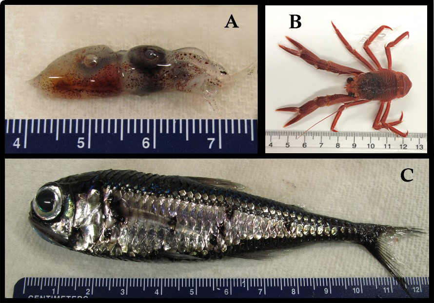
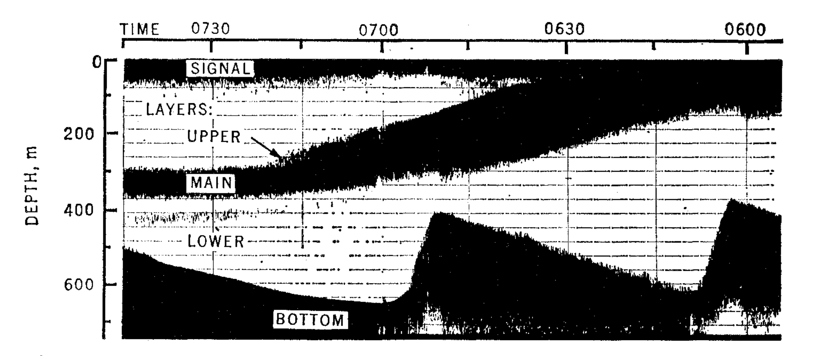
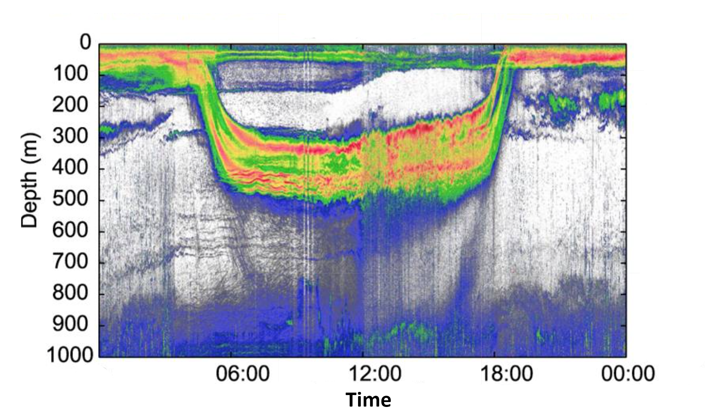

###**This migration is out of sight!**
In all of the world’s oceans, billions of small animals commute between their daytime habitat - 600 to 3,000 feet below the surface of the ocean - and their nighttime feeding grounds - just under the ocean's surface.  These fish, crustaceans, gelatinous organisms, and squid are collectively called *micronekton* for their small size (“micro”), but respectable swimming ability (“nekton”). The few thousand feet these micronekton migrate may not sound impressive compared to the thousands of miles covered during the migrations of [whales](http://news.nationalgeographic.com/2015/04/150414-gray-whale-pacific-migration-endangered-ocean-animal-science/) or [birds](http://news.nationalgeographic.com/news/2010/01/100111-worlds-longest-migration-arctic-tern-bird/), when considered collectively, the migration of all these micronekton is astounding. Micronekton often form dense, diverse groups that span hundreds of square miles. [Scientists estimate that the total weight of micronektonic fish in the world’s ocean exceeds 10,000 million metric tons] [2]. That’s approximately 44 times the weight of the global human population! And that’s only the fish component - the total mass of all types of micronekton is much larger. Micronekton play a central role in open ocean ecosystems as prey for numerous large fish, mammals, and birds. Despite their importance, relatively little is known about micronekton because they are very difficult to observe. However, improvements in our technologies are helping us learn more and more about these little swimmers. 

**Figure 1: Pictured above are a few examples of micronekton: an enope squid (A), a pelagic red crab (B), and a lanternfish (C). Scale bars are in centimeters. Photo credit: Elan Portner.**
###**Why migrate?**
The daily migration of micronekton strikes a delicate balance between the chance of getting eaten and the chance of finding food. Most of the animals in the ocean depend on single-celled marine plants called phytoplankton for their food. Micronekton are one or two steps away from feeding on phytoplankton, they hunt for the animals that eat phytoplankton and sometimes other micronekton. Because phytoplankton need light to photosynthesize, they are forced to live at the surface of the ocean where there is sunlight. This clumping of phytoplankton near the surface results in a similar clumping of animals that eat phytoplankton, and so forth.  Micronekton and many other predators prefer to hunt near the surface of the ocean, where there is a higher concentration of food. Furthermore, predators that feed on micronekton, like tunas, billfish, and sharks, use their eyes to hunt and thus are more effective near the surface of the ocean where there is plenty of light by which to see. [By retreating to deeper habitats during the day, where there is very little light, micronekton reduce their chances of getting eaten by these visual hunters][5]. At night, under the cover of darkness, micronekton migrate toward the surface to feast.
###**Discovery**
Large groups of micronekton were discovered in the 1940s using sonar, which detects objects by [the way they reflect sound](http://www.dosits.org/people/fishing/locatefish/). A beam of sound is produced from a starting point, travels some distance, bounces off an object, and returns to the starting point. The time between when the sound is produced and when the echo is received gives us information on the distance between the object and the starting point. Animals such as dolphins and bats use a mechanism identical to mechanical sonar to find food. People use sonar from ships to determine what lies beneath the waves, whether it be schools of fish just below the boat or shrimp swarming near the bottom of the ocean. Micronekton communities can be so dense and expansive that they’re sometimes mistaken for the seafloor itself (figure 2). These extra thick layers of micronekton in the ocean are often called “sound scattering layers”.

**Figure 2: An image output (called an echogram) from early sonar equipment showing an intense “main” sound scattering layer during its migration from the surface of the ocean (notice that time moves from right to left in the figure). It’s no wonder the main layers were mistaken for the seabed; the signals for both features appear very similar. Reproduced with permission from Barham 1966 (License number: 3916060844511).**
###**Sound Improvements**
Scientists still use sonar to detect micronekton, but the technology has greatly improved. Now, not only can we tell the depth of organisms, but also the size and sometimes the identity (species) of individual organisms within groups (figure 3). We can do this because different types of organisms have varying echo strengths. Fish reflect sound very well and have strong echoes, due to the gas-filled swim bladders that they use to help control their buoyancy. Animals made mostly of water, like jellyfish, don’t reflect sound very well and produce weak echoes. Small differences in echo strengths can tell us quite a bit about the types of animals that make up sound scattering layers and help us identify differences in the timing or magnitude of the migration behavior.

**Figure 3: An echogram produced using modern scientific sonar equipment showing a single migration cycle of micronekton. Warmer colors are stronger echoes and cooler colors are weaker echoes. Notice that within the layers there is complex structure, demonstrated by the variety of colors, that was not observable using early sonar technology. Figure modified from Klevjer *et al.* 2016.**
###**Why does it matter?**
Almost every large oceanic predator eats micronekton at some point in its life, and many of these predators are either commercially fished for human consumption, or are endangered and protected. The daily migration of micronekton helps these predators share a common food source; competition for shared food is reduced when different predators can feed on the micronekton food source at different depths and different times of day. The migration of micronekton also helps the ocean soak up carbon. By consuming carbon-rich food near the surface at night and releasing as waste in deeper water during the day, [micronekton physically “pump” carbon into the ocean depths][3]. This action reduces the concentration of carbon at the ocean’s surface, and allows more carbon to be absorbed from the atmosphere. Improved sonar technologies are helping us understand the size, complexity, and variability of micronekton groups and how these characteristics affect their roles as prey and carbon transporters. But we still have a long way to go. 

The magnitude of the discoveries that are still being made about these small, but incredibly numerous migrators highlights the importance of continuing to study these creatures and demonstrates that there is room for drastic improvements in our understanding of open ocean ecology. By increasing our knowledge of micronekton and how they interact with their environment, we will better understand their role in oceanic ecosystems and food webs, which could lead to new practices that promote sustainable fisheries. Furthermore, understanding the contribution of micronekton to the ability of the ocean to act as a carbon sink may lead to new insights into how that ability might change in the future. For such tiny creatures, there is a lot that we can learn from them.
###**References**
1. 	[T. A. Klevjer et al., Large scale patterns in vertical distribution and behaviour of mesopelagic scattering layers. Sci. Rep. 6, 19873 (2016).](http://www.ncbi.nlm.nih.gov/pmc/articles/PMC4728495/)
2.     [X. Irigoien et al., Large mesopelagic fishes biomass and trophic efficiency in the open ocean. Nat. Commun. 5 (2014), doi:10.1038/ncomms4271.](http://www.nature.com/ncomms/2014/140207/ncomms4271/pdf/ncomms4271.pdf)
3.     [A. Schukat et al., Pelagic decapods in the northern Benguela upwelling system: Distribution, ecophysiology and contribution to active carbon flux. Deep Sea Res. Part I Oceanogr. Res. Pap. 75, 146–156 (2013).](http://www.sciencedirect.com/science/article/pii/S0967063713000447)
4.     [E. G. Barham, Deep scattering layer migration and composition: observations from a diving saucer. Science. 151, 1399–403 (1966).](http://science.sciencemag.org/content/151/3716/1399.long)
5.      [A. S. Brierley, Diel vertical migration. Curr. Biol. 24, R1074–R1076 (2014).](http://www.sciencedirect.com/science/article/pii/S0960982214010677)
6.      [A. J. Hobday, T. Ward, S. Griffiths, Marine Climate Change in Australia Pelagic Fishes and Sharks (2012).](http://www.afma.gov.au/wp-content/uploads/2014/02/Pelagic-fishes-and-sharks-2009-PDF-223-KB.pdf)
7.       [M. Moteki, M. Arai, K. Tsuchiya, H. Okamoto, Composition of piscine prey in the diet of large pelagic fish in the eastern tropical Pacific Ocean. Fish. Sci. 67, 1063–1074 (2001).](http://onlinelibrary.wiley.com/doi/10.1046/j.1444-2906.2001.00362.x/epdf)
[2]:(http://www.nature.com/ncomms/2014/140207/ncomms4271/pdf/ncomms4271.pdf)
[3]: (http://www.sciencedirect.com/science/article/pii/S0967063713000447)
[5]: (http://www.sciencedirect.com/science/article/pii/S0960982214010677) 