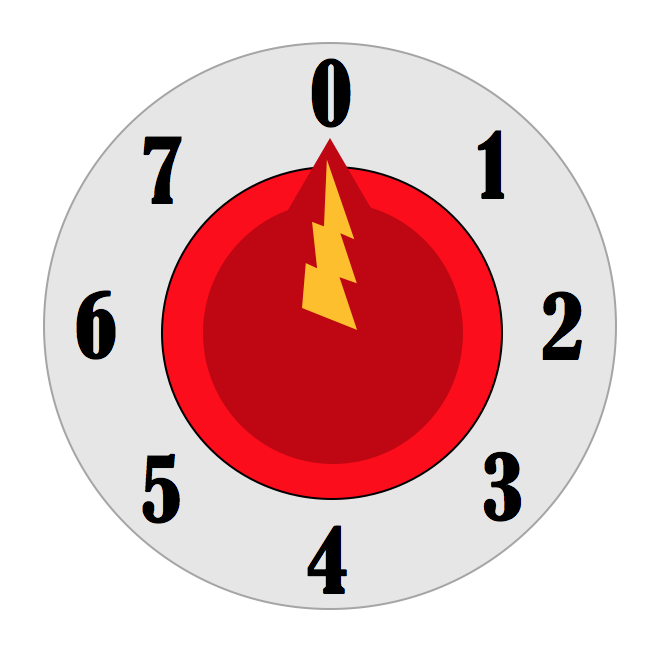
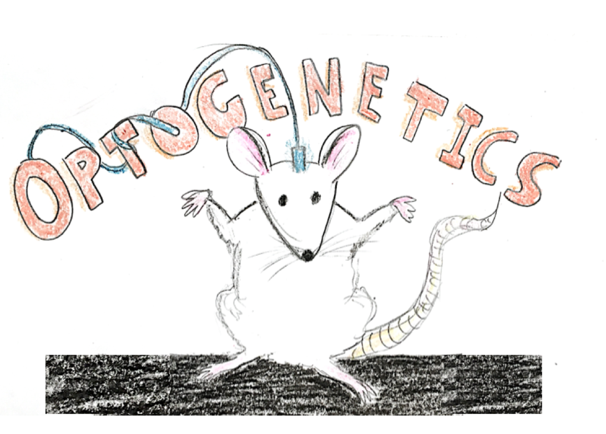
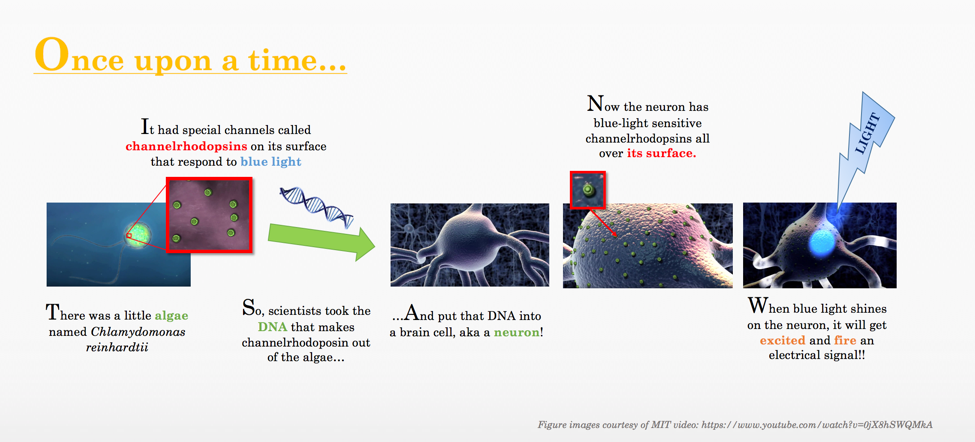

I was once told, “You can bite through your pinkie finger as easily as a baby carrot, but the pain and your brain won’t let you.”  This debate has been hashed out in [multiple online](http://skeptics.stackexchange.com/questions/15231/does-it-take-the-same-force-to-bite-through-a-finger-as-a-carrot)  [forums](https://www.quora.com/Can-you-bite-off-a-finger-as-easy-as-a-carrot.) Whether this is actually true or not, the notion that “your brain won’t let you” points out something important about the concept of pain itself. Pain is actually a defense mechanism against potential damage that produces a reflexive retraction from the painful stimulus. Along this logic, if you were to try to bite your finger off, you would (and should) reflexively pull your finger away. But what exactly is pain anyway? If you have ever had a headache, or a paper cut, or a burn, or even a broken heart, you can understand the spectrum of painful experiences that exist.  Over the years, even pain experts have struggled to truly define pain. The International Association for the Study of Pain's widely used definition states: "[Pain](https://en.wikipedia.org/wiki/Pain) is an unpleasant sensory and emotional experience associated with actual or potential tissue damage, or described in terms of such damage." Again, we see these key words indicating the subjective, sensory nature of pain and that it protects against potential tissue damage.

*Imagine you could dial down your pain (Illustration: J. O'Day)*

But what if you could live a totally pain-free life? What if you had a button or dial to turn down your pain? You might say we do have this in the form of pharmaceuticals, anesthetics or, if you have seen any movie with a birthing scene, you are familiar with the "epidural,” usually the mother’s last desperate plea just before she launches into Hollywood’s ferocious screaming, panting version of labor. But an “epidural” is no cure for anyone suffering from chronic pain diseases such as rheumatoid arthritis. It is certainly not sufficient at relieving the persistent throbbing and gnawing in the stump where an amputee’s leg used to be. The current treatments for conditions such as these are usually invasive or ineffective.

Researchers at Stanford University have recently found and modulated this pain “switch.” They have demonstrated effective, discrete on/off and gradient control over the [primary nociceptors](https://en.wikipedia.org/wiki/Nociceptor) in mice. The primary nociceptors are the first sensory nerve cells that are involved in the complex processing system that regulates normal and pathological pain. You have all different kinds of nociceptors; for instance, when you touch a hot stove and immediately retract your hand (before you’re even conscious of what you’re doing), you have the thermal nociceptors to thank. When you get a paper cut or you hit your funny bone, or you are myth-busting the aforementioned finger bite theory, you have just successfully recruited your mechanical nociceptors.

Anyway, back to the point. By simply shining **light** into a mouse’s brain, the scientists could control how much pain the mouse felt!   This incredibly powerful technique - [optogenetics](https://en.wikipedia.org/wiki/Optogenetics), allowed them to investigate the pain circuit.  Let’s take a quick detour to learn some of the basics and background behind this mind-blowing tool.

----------

If you were to ask a neuroscientist what the hottest technique in the field is, they would probably say “[optogenetics](https://en.wikipedia.org/wiki/Optogenetics)."

*Optogenetic mouse with fiber optic cable (Illustration: J. O'Day)*

If we go back to what our first grade teachers taught us, we can see that this is really just the marriage of two familiar words: optics + genetics. Aha! So optogenetics uses techniques from optics (like lasers and LED lights) and genetics (DNA, RNA, viruses, and all that yummy stuff). Basically, it uses light to **control neurons** in **live brain tissue**. The genetics part comes from the fact that the cells have to be genetically modified to produce light-sensitive ion channels.

Don’t be worried if you still don’t understand optogenetics. I always find things easier to understand if I have a story and some pretty pictures, so let’s try that.

*The story of optogenetics. (Illustration: J. O'Day)*

> And if you want to see the full video these images came from, here’s the awesome [video about Optogenetics from MIT.]( https://www.youtube.com/watch?v=0jX8hSWQMkA) If you are still hungry for *more* optogenetics then check out this awesome [TED Talk that will really blow your mind.](https://www.ted.com/talks/ed_boyden?language=en)

Ok so that was the quick and dirty of how optogenetics started and briefly how it works. Basically, it gives us a kind of on-or-off “light-switch,” if you will, for certain areas in the brain (cue Twilight Zone theme music).

Researchers all over the world are doing all sorts of novel experiments with this tool, and can turn certain brain circuits on and off simply by shining a blue light on the particular brain region. It's important to note this is being done in non-human organisms, and most of studies have been carried out in mice. There are various reasons why human brains are not quite ready for this light-switch (phew)! If you’re interested in learning about one clinical trial testing whether optogenetics could be safely used in the eye to restore photosensitivity, then check out this [article](https://www.technologyreview.com/s/600696/in-first-human-test-of-optogenetics-doctors-aim-to-restore-sight-to-the-blind/)

----------

## Shedding some light on pain, literally ##

So, back to our neuroscientists at Stanford.

As we talked about earlier, most of optogenetics has been done in the brain to control things from the “top” down.  Researchers have been able to target specific areas in the brain and elicit a behavior or action – for instance, they could “light up” the movement-associated-part of a mouse’s brain and make him run around in circles! This study, however, investigated the [peripheral nervous system](https://en.wikipedia.org/wiki/Peripheral_nervous_system), and delivered the light-sensitive proteins ([channelrhodopisn-2 or ChR2](https://en.wikipedia.org/wiki/Channelrhodopsin) to the primary nociceptors via the [sciatic nerve](https://en.wikipedia.org/wiki/Sciatic_nerve). This nerve is like a super highway to connect all of the branching nerves in your lower body, and it’s a convenient place for an injection.

With the help of a fluorescent marker that was also injected with the ChR2, the researchers saw that there was a lot of ChR2 expression in the nociceptors in the mouse paws. Because of this, they were able to do something remarkable – **transdermal activation**, shining blue light **through the skin** of the mouse to activate the ChR2 from outside! Most optogenetic studies require adept and highly invasive brain surgery in order to actually get the light into the area of the brain that needs to be stimulated, so being able to do this **non-invasively** is a huge advantage.

The researchers could shine blue light on the ChR2-neurons and record clear electrical signals, but could they get any behavioral effects with transdermal activation of the mouse paw nociceptors? While shining blue light (intensity 1 mW/mm2 which is about the same as the max intensity of [sunlight on the ground](http://www.egismos.disonhu.com/support/lasersafety2.htm)) on the hind paws of their mice, they observed distinct pain responses such as flinching, vocalizing or prolonged paw-licking. What’s more, these effects were salient even twelve weeks later in all of the mice but one.   Check out a [video](http://www.nature.com/nbt/journal/v32/n3/fig_tab/nbt.2834_SV1.html) to see this in action. Also, in case you’re skeptical, they demonstrated that the majority of neurons they had targeted were nociceptors and not neurons that mediate touch or proprioception. This ensures that they were only activating pain circuitry and not just touch sensations in the paws of mice. Additionally, they had a control group (without ChR2) that showed no pain behavior with light stimulation.

They also checked whether the optogenetic activation of pain was tunable. In other words, would lower intensities of light (0.25 mW/mm2) cause subtler effects? They tested this by putting mice in a chamber divided into two rooms (see picture below) – one room with a floor illuminated by low intensity blue light, and another with a floor illuminated by low intensity red light (should have no effect on the blue light-sensitive ChR2).  If low intensity blue light can activate nociceptors in mice, then the mice should behaviorally show an aversion (a strong dislike) for the blue chamber. In fact, this is exactly what the researchers observed. In fact, this is exactly what the researchers observed. The light wasn’t strong enough to elicit the pain-indicative behaviors like paw-licking or flinching seen earlier, but the mice showed a **significant preference** for the red chamber over the blue. To make sure that mice don’t just like standing on red light and not on blue light, they did a control experiment using mice without ChR2. It is interesting to note that these control mice actually showed a slight, _non-significant preference_ for the blue chamber (the one the ChR2 mice didn’t like).

*The divided chamber of blue and red LED light to test aversion to optogenetically induced pain. The blue chamber should be more "painful" because it activates the nociceptors in the mouse's paw, and thus the mouse should prefer the red chamber. (Adapted by permission from Macmillan Publishers Ltd: [Nature Biotechnology] Iyer et al., copyright 2014.)*

Okay, so they could induce pain, which is kind of scary but let’s get to the cooler side of the pillow. Could they lessen or stop pain altogether with optogenetics?  To do this, they had to switch out ChR2 for a yellow light-sensitive [chloride pump halodrhodopsin](https://en.wikipedia.org/wiki/Halorhodopsin) (also known as eNpHR3.0). This is because we can excite neurons (cause them to fire) by letting a bunch of positively charged molecules flow into them and we can likewise inhibit them by letting a bunch of negatively charged molecules flow into them. ChR2 is a special “gatekeeper” for positively charged molecules so it was perfect for exciting the nociceptors. But, if we want to inhibit neurons from firing, then we need a gatekeeper for negatively charged molecules, and thus enters our chloride pump eNpHR!

So the researchers injected the viral vector with eNpHR into mice neurons and looked at the electrical signals coming from these neurons when yellow light was shone on them. The neurons in fact hyperpolarized, which meant that their electrical charge became negative (what we want to see if a bunch of negative molecules are flowing through) indicating that they had the desired electrical behavior. What about behavioral effects? They conducted a von Frey test, which basically involves poking the mouse’s paw (which nociceptors are being stimulated here – perhaps mechanical?) with von Frey hairs (see tool and setup in Fig 3.b below) and measuring how long it takes for the mouse to withdraw its foot. Generally observed behaviors include the usual pain-associated flinching and paw-licking – mice don’t like to be poked in the foot, do you?

After injecting **eNpHR** into the sciatic nerve of mice and shining **yellow light** on the paws of mice while they were doing this test, they saw a significant, 78% increase in the time before a mouse withdrew its paw as compared to control mice (without eNpHR)! (See Fig 3.c below). They also did a similar test, only this time with heat (looks like we are testing thermal nociceptors here) instead of the von Frey hair, and significantly increased the withdrawal latency by 97% from control groups (Fig 3.d below).

*Figure 3.b,c,d from paper, demonstrating desensitization of mice to painful stimuli. Reprinted by permission from Macmillan Publishers Ltd: [Nature Biotechnology] Iyer et al., copyright 2014.)*

But wait, the best news is still to come! The researchers tested their ability to optogenetically inhibit [neuropathic pain](http://www.webmd.com/pain-management/guide/neuropathic-pain). According to WebMD, “With neuropathic pain, the nerve fibers themselves may be damaged, dysfunctional, or injured. These damaged nerve fibers **send incorrect signals** to other pain centers. The impact of nerve fiber injury includes a change in nerve function **both at the site of injury and areas around the injury.”** After physically handicapping mice injected with eNpHR, they did the von Frey and heat tests (_without_ yellow light stimulation) to see if mice had lower pain tolerance – and they did, which was expected. Wouldn’t you have lower paint tolerance if your leg had been impaled? Unlike high school parties and movie theatres, the fun started when they turned *on* the light! By shining yellow light on the mouse paws, they were able to increase withdrawal times in both the von Frey and the heat tests, demonstrating that they could **inhibit nociception to inhibit neuropathic pain!**

## Wrapping it all up... ##

So the findings from this study show that light sensitive proteins or [opsins](https://en.wikipedia.org/wiki/Opsin)  (like ChR2 and eNpHR) can be expressed with high specificity in nociceptors through a relatively simple injection. What’s more, it enabled noninvasive transdermal light-mediated control of nociceptor activity – a.k.a. we can inject mice neurons with special channels and use light to modulate their **acute and neuropathic pain**. No one has ever demonstrated this precision noninvasively and it is a huge leap in the fields of neuroscience, bioengineering and scientific innovation in general.

(Hungry for more studies like this? Here’s the [most recent work](http://www.nature.com/nmeth/journal/v12/n10/full/nmeth.3536.html) from these researchers demonstrating wireless optogenetics in both peripheral and central nervous systems!)

## Take Homes ##

Obviously the potential for a tool like this is vast. The transdermal activation used here could also be used to study the peripheral nervous system. Additionally, it could help screen for drugs that decrease pain – after first inducing pain, you could test your drug to see if it relieved the light-stimulated pain. This approach could be applied to study chronic pain on longer time scales. Eventually, perhaps we could live in a world that doesn’t “know” pain at all! But… let’s not get carried away, for there are still many challenges before this technique can be clinically translated, i.e. light delivery through thicker skinned or differently pigmented organisms (mice have more translucent and thinner skin than us humans) and reliable ChR2/eNpHR expression that lasts longer than a few months. However, the future for optogenetics is bright (pun intended) and new tools are innovated daily. Perhaps some day we will be able to **shed our pain with a little light** (and even bite through that baby finger).

----------

>#####On one final note, I couldn’t help but say to all the Harry Potter fans out there, is this resonating too closely with the [Cruciatus Curse?](http://harrypotter.wikia.com/wiki/Cruciatus_Curse) According to the experts of Harry Potter Wikipedia, the Cruciatus Curse, “when cast successfully, inflicts intense, excruciating pain on the victim. Considering that the curse does not physically harm the victim, it is possible that it only stimulates pain receptors.” Eerily familiar?

>#####I’ll leave it at that my friends, and with the cliché yet paramount truth, one that echoes louder and louder with every advancement made – **with great power, comes great responsibility.**

----------
####_References:_

*Original Article:*

 - Iyer, S. M., Montgomery, K. L., Towne, C., Lee, S. Y., Ramakrishnan, C., Deisseroth, K., & Delp, S. L. (2014). Virally mediated optogenetic excitation and inhibition of pain in freely moving non-transgenic mice. _Nature Biotechnology,_ 32(3), 274.

*Other resources:*

 - Boyden ES, Zhang F, Bamberg E, Nagel G, Deisseroth K. Millisecond-timescale, genetically targeted optical control of neural activity. _Nature Neuroscience,_ 2005 Sep;8(9):1263-8.
 - Dubin, A.E. & Patapoutian, A. Review series: nociceptors: the sensors of the pain pathway. *J. Clin. Invest.* 120, 3760–3772 (2010).
 - Bonica, J. J. (1979). The need of a taxonomy. *Pain*, 6(3), 247.
