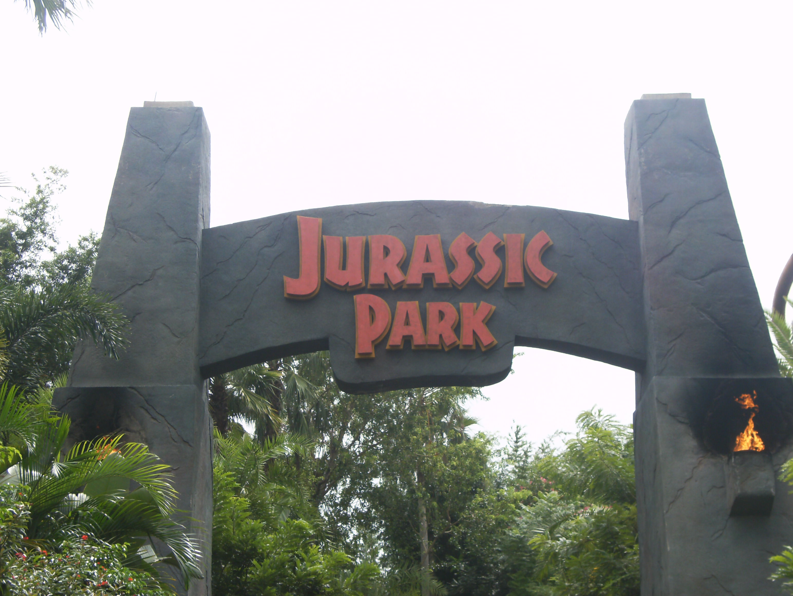
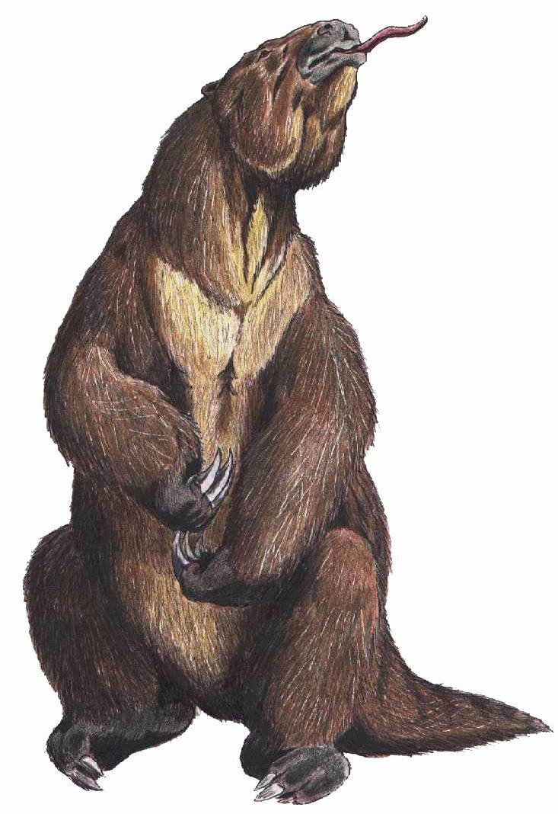
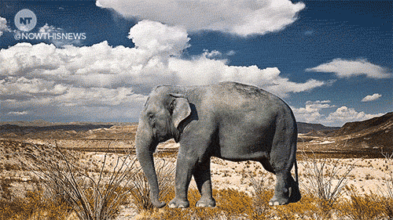

You probably remember the 1993 film, Jurassic Park. If not, the skinny is that a bunch of ambitious scientists use dinosaur DNA from preserved mosquitoes combined with modern reptile DNA to create a family fun dinosaur theme park (with real-life dinosaurs). However, you might also remember this scenario is not all sunshines and rainbows for the humans. A.K.A, the dinosaurs bring down the hammer, eat a lot of people, and destroy the park.

But…. why am I talking about Jurrasic Park? It is because this work of science fiction is a little more science and a little less fiction these days. I am not actually talking dinosaurs here, but we are now in an era where de-extinction is becoming possible.

Due to recent advances in biotechnology the resurrection of recently extinct species has become a distinct possibility, provoking a [debate](http://www.nature.com/news/is-it-right-to-reverse-extinction-1.15212) about the wisdom of what has become known as de-extinction. Jurassic Park did have some of their ducks in a row- modern technologies (such as [CRISPR](https://en.wikipedia.org/wiki/CRISPR))could be applied to make animals similar to extinct ones using current species DNA as a template. There are many [unique challenges](http://www.nature.com/news/is-it-right-to-reverse-extinction-1.15212) to this problem that scientists need to address before this can happen. Mainly this cannot be done for any animal. There must be well-preserved DNA of the species to attempt a de-extinction project. So these animals would not be as old as dinosaurs. Think more along the lines of woolly mammoths and giant ground sloths--still pretty cool. Some near successes of de-extinction include the [Pyrenean ibex](http://www.sciencedirect.com/science/article/pii/S0093691X08007784) (which ultimately died, but was the first animal born from an extinct subspecies) and the [gastric brooding frog](http://search.informit.com.au/documentSummary;dn=332925114076125;res=IELHSS) [1, 2]. But, why bring these animals back? Well, my inquisitive reader, with the proper studies and precautions, de-extinction could be utilized to restore valuable ecosystems.

[Woolly mammoth](https://en.wikipedia.org/wiki/Woolly_mammoth)

[Giant ground sloth](https://en.wikipedia.org/wiki/Megatherium)

These animals, along with numerous other megafauna (i.e. huge animals) went extinct in North America and Eurasia around 50,000 to 10,000 years ago during the Pleistocene [Pleistocene extinctions](http://www.pnas.org/content/106/49/20641.full) for reasons that are likely related to climate change and human activity [3]. The thing is, these animals had an important role in their areas of the world. The extinction of megafauna from North America and Eurasia appears to have changed the structure, diversity, and composition of temperate (forests such as those in the Great Smoky Mountains National Park) and [boreal](https://en.wikipedia.org/wiki/Taiga)(sub-arctic forest such as what covers most of Alaska and Sweden) ecosystems, in particular grassland and [woodland communities](https://books.google.com/books?id=s01cZFwB190C&pg=PA193&lpg=PA193&dq=Zimov,+S.+A.,+Zimov,+N.S.+%26+Chapin,+F.+S.+(2012)+The+past+and+future+of+the+mammoth+steppe+ecosystem.+In+Paleontology+in+Ecology+and+Conservation.+(ed.+by+Julien+Louys),+Springer,+Berlin,+Heidelberg.&source=bl&ots=uVlnh35JvJ&sig=2PxJIt5iXasJsAuIJVu80znQvZU&hl=en&sa=X&ved=0ahUKEwiUu6_XgLnKAhVJ7GMKHfnKAvAQ6AEIHTAA#v=onepage&q=Zimov%2C%20S.%20A.%2C%20Zimov%2C%20N.S.%20%26%20Chapin%2C%20F.%20S.%20(2012)%20The%20past%20and%20future%20of%20the%20mammoth%20steppe%20ecosystem.%20In%20Paleontology%20in%20Ecology%20and%20Conservation.%20(ed.%20by%20Julien%20Louys)%2C%20Spr) [4].

[Temperate grasslands](http://www.notulaebotanicae.ro/index.php/nbha/article/viewFile/3090/2929) are important centers of biodiversity and help prevent erosion, keep water systems functioning properly, and control nutrient cycles in the soil [5].  Grasslands are among the world’s most threatened ecosystems.  First of all, woody vegetation is encroaching on space usually taken up by grasses – perhaps due in part to the reduction of megafauna browses, such as horses and mastodons, who used to clear out these woody plants. Additionally, domestic herbivorous grazing animals, like herds of cattle, have been steadily increasing since the Pleistocene extinctions, and are eating up the grasses.

Let's take an example from present day African and Asian grasslands and savannas. In these habitats, extant large mammals have a major impact on the distribution and abundance of woody plants and in ecosystem processes as described above. Therefore, if extinct megafauna performed similar roles as mammals in today's grasslands, it would be reasonable to infer that these extinct mammals probably created more grassy areas in their habitats in the past. And, grasslands sequester more carbon than the ecosystems we have with more woody plants. This is beneficial for our environment because less carbon in the atmosphere could mean less carbon that will induce global climate change.

Although de-extinction has the possibility of mending broken and lost ecological processes, it does not go without its Dark Side. There are substantial [ecological risks](http://bioscience.oxfordjournals.org/content/63/9/719.full) involved in reintroducing formerly extinct species, including [invasiveness, disease transmission, and unforeseen species interactions](http://escholarship.org/uc/item/2x70q4nk) [6, 7]. However, some argue that these risks are not significantly different from the risks faced when we introduce living species, such as wolves, to new habitats today. What should be agreed upon, whether ye be on the light or the dark side, is that we need much more research on the topic to ensure that, when de-extinction happens, it happens with the necessary precautions and back-up plans.

How can we know what impact extinct species will have on an environment? There is a potential solution; Ecologists can use modern equivalents of recently extinct animals to determine what impact they are likely to have on the ecosystem. For example, because they are presumed to be behaviorally and biologically similar, elephants and modern horses can be used as stand-ins for mastodons and Pleistocene horses, which is already being done in some [studies](http://www.bioone.org/doi/full/10.1656/058.014.0109) [8]. Additionally, reintroduction of large mammal analogs have been initiated by scientists in Asia with the establishment of the [“Pleistocene Park”](http://science.sciencemag.org/content/308/5723/796.1.short) along the Kolyma River in northeastern Siberia [9]. It has been a rough road for the researchers to get animals to the park - literally. It is difficult to get there and the climate is not exactly always conducive. However, the researchers have already shown drastic changes in plant communities, including an increase in grasses and declines in mosses and shrubs.  Also interesting was an apparent [change in ecosystem processes](https://books.google.com/books?id=s01cZFwB190C&pg=PA193&lpg=PA193&dq=Zimov,+S.+A.,+Zimov,+N.S.+%26+Chapin,+F.+S.+(2012)+The+past+and+future+of+the+mammoth+steppe+ecosystem.+In+Paleontology+in+Ecology+and+Conservation.+(ed.+by+Julien+Louys),+Springer,+Berlin,+Heidelberg.&source=bl&ots=uVlnh39SAJ&sig=H1qTTqq4lna-wXVOPBF0XFss5cc&hl=en&sa=X&ved=0ahUKEwiHu9iPk7nKAhVV52MKHT4ZAB0Q6AEIHTAA#v=onepage&q=Zimov%2C%20S.%20A.%2C%20Zimov%2C%20N.S.%20%26%20Chapin%2C%20F.%20S.%20(2012)%20The%20past%20and%20future%20of%20the%20mammoth%20steppe%20ecosystem.%20In%20Paleontology%20in%20Ecology%20and%20Conservation.%20(ed.%20by%20Julien%20Louys)%2C%20Spr) that models indicate could modify greenhouse gas emissions by reducing methane release. Scientists are starting the work to make sure de-extinction happens in the best way possible with the necessary knowledge and back-ups, but the research can be challenging to conduct [10].  This is a case where many more need to jump on the bandwagon and join the research efforts.

As a run-down, there used to be a lot of large mammals in North America and other places that shaped the landscape. Some not-so-Kosher stuff went down and humans (presumably) made some mistakes by overhunting or bringing disease and had to say goodbye to all these megafauna and the landscape of that time. There is a chance to bring back some of these animals and possibly their valuable habitats along with them. Although some people have doubts about bringing back megafauna from extinction, if we do the proper studies we could usher in a new, carbon-catching, more breathing-friendly ecosystem to certain parts of the world. Finally, no matter what happens with de-extinction, it is important to realize it is in preliminary stages and it will be through a sequence of many, rigorous studies and precautions before we see de-extincted animals.

[1] Folch J, et al. (2009). First birth of an animal from an extinct subspecies (Capra pyrenaica pyrenaica) by cloning. *Theriogenology*. *71*(6):1026-34
[2] White, A. The Lazarus project: Australian scientists lead the way in trying to restore extinct species. Science Education News. 2013.
[3] Faith and Surovell. (2009). Synchronous extinction of North America's Pleistocene mammals. *P. Natl. Acad. Sci.* *106*(49): 20641–20645.
[4] Ed. Louys. (2012). *Paleontology in Ecology and Conservation.* Springer Earth Systems Sciences.
[5] Carlier et al. Importance and Functions of Grasslands. Not. Bot. Hort. Agrobot. Cluj. 37 (1) 2009, 25-30.
