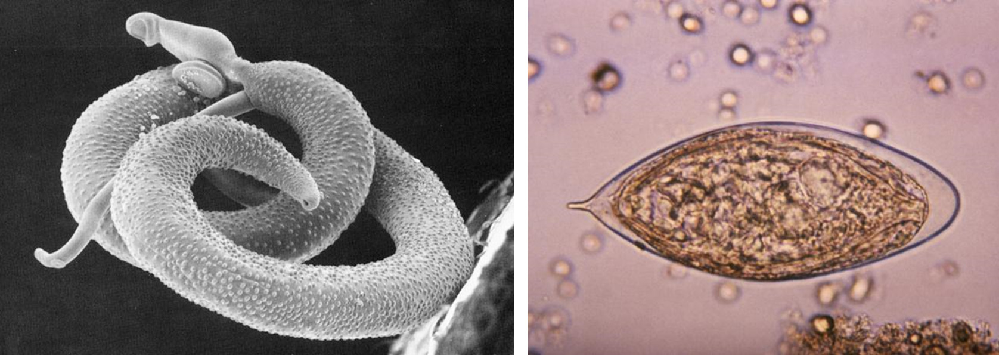
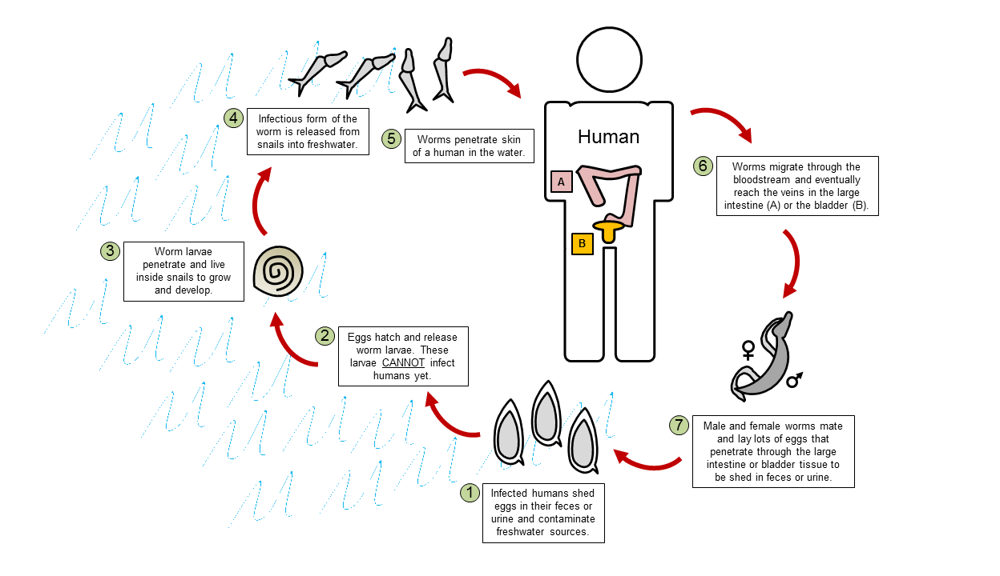

Imagine that it's a hot summer day. You're taking a nice bath in the local river to cool down. Suddenly, you feel a tiny pinch on the skin of your feet. Thinking nothing of it, you get out of the river to dry off and walk home. You didn't realize it, but tiny parasitic worms in the river just slipped through your skin and are now traveling through your bloodstream to your intestine and bladder. There, the worms will mate and lay up to 3000 eggs a day. Some of these eggs are shed back into the environment through your urine or feces, while the remaining eggs can migrate through your body. Sometimes, these eggs get stuck in organs like the intestine, liver, bladder, or kidney, where they cause [inflammation](https://en.wikipedia.org/wiki/Inflammation) and serious damage. This scenario sounds like something that can only happen in your worst nightmares. Unfortunately, this story is very much a sad reality for many people living in sub-Saharan Africa who are suffering from a devastating disease known as [schistosomiasis](http://www.cdc.gov/parasites/schistosomiasis/).

**Figure 1.** *Left*: A schistosome male (thicker) and female (thinner) worm in the process of mating. *Right*: Schistosome egg. Each egg has a sharp spine that is thought to help it penetrate through tissues and stick to organs.

Schistosomiasis is caused by the parasitic worms *Schistosoma* (also known as schistosomes), which infect a whopping 220-240 million people worldwide. Most of us have probably never heard of this disease, since a majority of the people affected primarily lives the poorest and most neglected regions in the world. A safe and effective treatment exists for schistosomiasis (a drug called [praziquantel](https://en.wikipedia.org/wiki/Praziquantel)). So why haven't we been able to completely eliminate this disease? First, even with a treatment that costs only $0.32 (US) per person, it quickly becomes expensive to treat all 200+ million infected people. Second, even after a successful treatment, cured individuals are constantly re-infected because they rely on local freshwater sources, which are filled with schistosomes, for their everyday needs. For these reasons, we cannot rely on drugs alone to get rid of schistosomiasis; we also need to exterminate the worm reservoirs in the environment. But how do we do it?

In their search for new methods to control schistosomiasis, a team of researchers known as [The Upstream Alliance](http://www.theupstreamalliance.org/), led by Susanne Sokolow from Stanford, turned to an interesting aspect of the worm's life cycle. When infected humans shed schistosome eggs into freshwater sources, worm larvae hatch from the eggs and spend the next few weeks living inside certain species of freshwater snails. This stage is absolutely necessary for the worms to grow and develop into a form that can infect humans. The researchers thought that by targeting these snails, they may be able to reduce the number of worms that properly mature into the infectious form, and in turn, reduce the number of human infections. Their strategy? Releasing river prawns to gobble up the snails that harbor schistosomes.

**Figure 2.** Life cycle of the schistosome worm. Objects not drawn to scale. Figure simplified and adapted from a diagram from the CDC. If interested in more details of the life cycle, refer to the original CDC diagram [here](http://www.cdc.gov/parasites/schistosomiasis/biology.html).

The idea of targeting the snail population to reduce the spread of schistosomiasis is not new. In fact, infested freshwater sources used to be treated with chemicals to kill off worm-carrying snails. However, people soon realized that this method was problematic because the chemicals were also harming other animals that lived in the water. The practical thing about Sokolow's idea is that it specifically targets the snails by taking advantage of a naturally occurring predator-prey relationship between the river prawn *Macrobrachium vollenhoveni* and the snails. If the prawns consume infected snails, they can also get rid of the worms, since the prawn's digestive system destroys schistosomes. If there are fewer infected snails, then fewer worms will be present in freshwater sources to infect humans.

To test whether their proposed strategy would actually work, Sokolow and her team ran a pilot study at the Senegal River Basin in West Africa, where a massive schistosomiasis outbreak occurred right after the construction of the Diama Dam in 1986. The dam was built at the mouth of the Senegal River to prevent saltwater from flowing upstream so that the river could be a stable freshwater source for the surrounding villages. Unexpectedly, the construction of the dam also created the perfect freshwater habitat for the snails that host schistosomes. For one, algae and plants grew abundantly in this habitat, providing a food source for the snails. Secondly, the native river prawn *Macrobrachium vollenhoveni* disappeared from the river because the dam prevented them from migrating to their breeding grounds. With an abundance of food and the absence of their prawn predators, the snail population exploded. Unfortunately, so did the incidence of schistosomiasis.

To see if restoring prawns could reduce worm infections in this region, Sokolow and her team recruited two similar villages located upstream of the dam. The researchers first treated all villagers to cure them of the worm infection. Next, for one village, the researchers enclosed a part of the river that villagers use to access water, and introduced prawns to that location ("prawn-stocked"). For the other village, the researchers did nothing ("normal"). Eighteen months later, the researchers compared what happened in the presence or absence of prawns, and made several interesting observations:
1.	The prawn-stocked village had half as many snails compared to the normal village.
2.	The prawn-stocked village had 80% less worm-carrying snails than the normal village.
3. The percentage of re-infected individuals was lower in the prawn-stocked village (58%) compared to the normal village (78%).
4. The odds of getting re-infected are about four times higher in the normal village compared to the prawn-stocked village.
5. The people in the prawn-stocked village had less schistosome eggs in their urine compared to the normal village.

These results are extremely promising, since they are consistent with the team's prediction that introducing prawns can help control and reduce snail numbers, and in turn, decrease the number of worm infections in humans. Nonetheless, the researchers still need to conduct wider scale studies to make sure that this strategy works at additional sites.

Even if this method is effective, there are still a few potential problems to consider. First, one might worry about how re-introducing the prawns and reducing snail numbers may change the river [ecosystem](https://en.wikipedia.org/wiki/Ecosystem#Ecosystem_dynamics). Although it is difficult to predict the long-term ecological effects of prawn restoration, we do know at the very least that the prawns naturally resided in the river and preyed on the snails before the Diama Dam was constructed. Hence, re-introducing the prawns into the Senegal River may just restore this habitat back to its pre-dam state. Second, one might wonder how the prawn population will re-establish itself in the Senegal River and help control schistosomiasis in the long run. If you remember, the dam still prevents the prawns from traveling to and from their breeding grounds. One solution that the research team suggested is to raise prawns in [aquaculture](https://en.wikipedia.org/wiki/Aquaculture) to regularly stock water sources in areas where schistosomiasis is common. This is actually a great idea because the prawns are also a valuable food source. In that regard, villagers will be motivated to raise these prawns to help control disease, since they can use the excess for food or for commerce.

Schistosomiasis is a major global health concern that has been extremely challenging to treat and control. Due to the sheer numbers of people affected and the constant cycles of re-infection, drugs alone will not eradicate this disease. Treatments must be combined with the elimination of worms in freshwater sources using methods that are low-cost and sustainable. The approach presented by The Upstream Alliance seems to fit the bill. In addition to controlling disease, it can also help restore a displaced animal back in its natural habitat and alleviate poverty by providing villagers with a food and income source: truly a win-win-win situation!

*To follow what The Upstream Alliance is up to in their ongoing efforts to control schistosomiasis, check out this [website](http://www.theupstreamalliance.org/)!

**References**

 1. Sokolow SH, Huttinger E, Jouanard N, Hsieh MH, Lafferty KD, Kuris AM, Riveau G, Senghor S, Thiam C, N'Diaye A, Faye DS, De Leo GA. (2015). [Reduced transmission of human schistosomiasis after restoration of a native river prawn that preys on the snail intermediate host.](http://www.ncbi.nlm.nih.gov/pubmed/26195752) *Proc Natl Acad Sci* USA. 112(31): 9650-5.
 2. 	http://www.cdc.gov/parasites/schistosomiasis/

