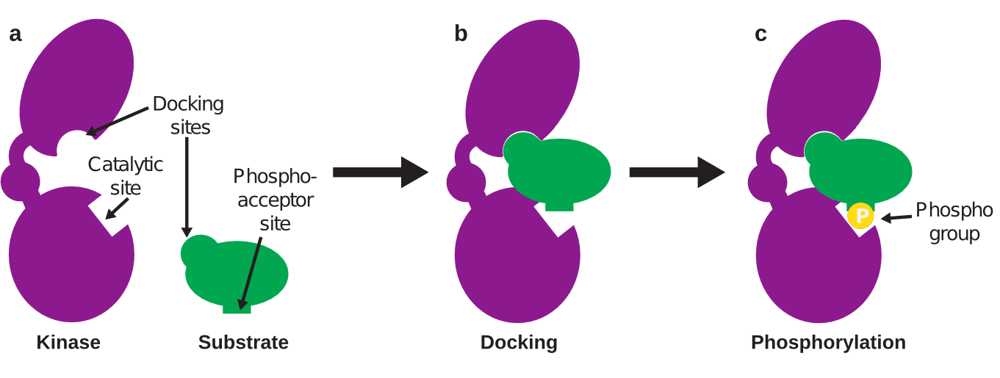
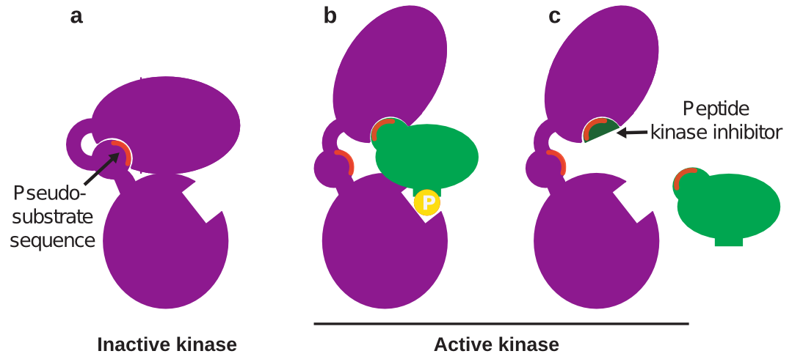

The cells in our body are constantly experiencing changes in their surrounding environment, like nutrient availability, temperature and light intensity. To respond to these external stimuli, cells must transport information from the outside to their interior. They do this through signaling processes, also called signaling pathways, in which proteins interact with each other to relay a message. Many diseases, such as cancer, arise from misregulation in these signaling pathways, causing the proteins to convey the wrong message to the inside of the cell. Drugs that modify these pathways are highly sought after. However, cellular signaling networks are very complex: a given protein can participate in multiple signaling pathways, and two different signaling pathways can involve proteins that are very similar in nature and function. This makes it challenging to develop a drug that is specific to a single step in just one pathway.  Recently, however, scientists have started using a new approach to develop specific inhibitors of kinases, one of the most common types of proteins involved in signaling pathways.

### Phosphorylation in signaling 
Signaling pathways rely heavily on chemical modifications of proteins, which change the protein’s activity so it can convey the desired signal. One of the most common modifications is **phosphorylation**, in which a small chemical group called a **phosphate group** is permanently added to one of the amino acids on the surface of a protein. In comparison to the overall size of a protein, this chemical modification is very small; however, phosphorylation can have a huge effect on the 3D structure of the protein and what it interacts with. The phosphate group, consisting of a phosphorous atom surrounded by three oxygen atoms, carries a negative charge that makes it **hydrophilic**, meaning it interacts favorably with water. Therefore, an interaction between two **hydrophobic** (does not interact with water) protein surfaces could be fully disrupted by the introduction of a hydrophilic phosphate group. A single phosphorylation event can cause enough conformational change in a protein to switch its activity completely on or off.

So how are phosphate groups added to proteins in signaling pathways? Many proteins in our cells (about 2% of human genes) are **kinases**, or proteins that add a phosphate group to specific target proteins, called **substrates**. Each kinase may have one or many substrates that it specifically recognizes and phosphorylates at the substrate’s **phosphoacceptor** site. The kinase uses its **catalytic** site to make this change (Figure 1a).

**Figure 1. Kinases phosphorylate substrates**

Let’s look at an example of phosphorylation in a signaling pathway that regulates cell growth. When certain molecules called growth factors are present in a cell’s environment, they activate a kinase called EGFR (epidermal growth factor receptor). EGFR then phosphorylates proteins that signal for the cell to grow. In some cancers, a mutation in EGFR keeps it active all the time (even in the absence of growth factors), which causes too much cell growth and eventually tumor formation. An inhibitor of this kinase, called erlotinib, binds the catalytic site of EGFR and inhibits its activity: it's ability to phosphorylate other proteins. This mechanism of treatment is very effective, and consequently Erlotinib is one of the most widely used cancer drugs on the market today1.

### Developing kinase inhibitor drugs

Thirty percent of all newly approved drugs are kinase inhibitors2. Many of these kinase inhibitors are identified by screening hundreds of thousands of molecules to find one that inhibits the desired kinase, followed by hundreds of incremental changes to optimize the inhibitor’s potency3. However, since all kinases perform the same basic function, all their catalytic sites are very similar; therefore, many kinase inhibitors that bind at the catalytic site also inhibit other kinases, leading to off-target effects (also called side effects). For example, the EGFR inhibitor erlotinib also inhibits the kinases STK10 and SLK, which are involved in inflammation-related signaling pathways; this is why rashes and sores (inflammation of the skin) are a common side effect of erlotinib4. 

One strategy to avoid these off-target effects is to instead target sites on a kinase outside of its catalytic site that still inhibit kinase activity. Thankfully, many kinases bind to their substrates through two interactions. One interaction is between the kinase catalytic site and the substrate phosphoacceptor site. The second interaction occurs between the **docking sites** on the kinase and substrate; this interaction brings the kinase catalytic site close to the substrate phosphoacceptor site so that the phosphorylation interaction becomes easier (Figure 1b). The docking site is unique to each kinase-substrate interaction, and therefore is easier to target specifically. 

### Targeting docking sites

Drugs that target docking sites are often **peptides** (short strings of amino acids) that copy the amino acid sequence of the docking site. Inside the cell, these peptides block the docking interaction between kinase and substrate, therefore reducing the likelihood of interaction between kinase catalytic site and substrate phosphoacceptor site. Designing such a peptide is easy when a kinase’s docking site has been identified. But what about kinase-substrate pairs for which the docking site has not been identified? 

In some cases, the kinase-substrate docking site can be predicted computationally, even without any knowledge of the three-dimensional structure of either protein. As mentioned, proteins can flip between active and inactive conformations (often switched on or off by phosphorylation). In the inactive conformation, the kinase docking site is hidden by another part of the kinase – a part that binds to the docking site in the same way the substrate would.  This part of the kinase is called the **pseudo-substrate** sequence, because it mimics the substrate and has a similar amino acid sequence to that of the substrate docking site2 (Figure 2a).

So how does this help predict kinase docking sites? Since the substrate and pseudo-substrate are so similar, the substrate docking site can be identified by looking for short sequences of **homology** (sequences that share the same or similar amino acid sequence) between the kinase and substrate. Then, a peptide copying this sequence can be synthesized and used in the lab to inhibit the desired kinase-substrate interaction (Figure 2b,c). This approach is referred to as **rational design** and has been used to identify several peptide inhibitors that block the activity of a kinase towards its substrate without affecting any other kinase activity2. It works because docking sites are unique to each kinase, so targeting that site will not affect any other kinase-substrate docking. In fact, sometimes one kinase will have different docking sites for different substrates – so a docking inhibitor can prevent phosphorylation of one substrate without preventing phosphorylation of any other substrates of that kinase, reducing the risk of off-target effects. 

**Figure 2: Rationally designed peptide kinase inhibitor.**

### The future of designing kinase inhibitors

One advantage of this approach over traditional methods of developing kinase inhibitors is that kinase inhibitors can be designed rationally and quickly using only protein sequence information, avoiding the long and expensive process of screening and optimizing hundreds of thousands of molecules which can cost up to $400 million per drug5. A major hurdle facing this rational design approach is that peptides as drugs are relatively new and not commonly used yet. However, as of 2015 there were 60 approved peptide drugs and 140 more in clinical trials6. As peptide drugs become more established as drugs, rational peptide design may change the future of drug development. 

### References
1. D. Singh, B.K. Attri, R.K. Gill, J.Bariwal. Review on EGFR Inhibitors: Critical Updates. _Mini Rev. Med. Chem._ __16__, 1134-1166 (2016). [PubMed](https://www.ncbi.nlm.nih.gov/pubmed/26996617)
2. A.D. Cunningham, N. Qvit. Specific kinase inhibition using peptides to target kinase-substrate docking. _Chemistry Today._ __34__, 22-25 (2016). [PDF]( http://newsite.teknoscienze.com/wp-content/uploads/2016/09/Qvit.pdf)
3. D.M. Goldstein, N.S. Gray, P.P. Zarrinkar. High-throughput kinase profiling as a platform for drug discovery. _Nat. Rev. Drug Discov._ __7__, 391-397 (2008). [PubMed](https://www.ncbi.nlm.nih.gov/pubmed/18404149)
4. N. Yamamoto, M. Honma, H. Suzuki. Off-target serine/threonine kinase 10 inhibition by erlotinib enhances lymphocytic activity leading to severe skin disorders. _Mol. Pharmacol._ __80__, 466-475 (2011). [PubMed](https://www.ncbi.nlm.nih.gov/pubmed/21606217)
5. M.D. Segall & P. Hunt in _Lead Generation: Methods and Strategies_, J. Holenz, Ed. (Wiley-VCH, Germany, 2016) vol . 68, p. 425.
6. K. Fosgerau, T. Hoffmann. Peptide therapeutics: current status and future directions. _Drug Discov. Today._ __20__, 122-128 (2015). [PubMed](https://www.ncbi.nlm.nih.gov/pubmed/25450771)
