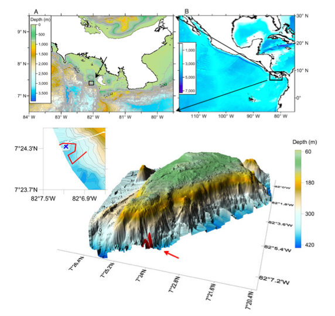

###### Swarming crabs discovered at the bottom of an underwater mountain. (From Pineda et al. 2016). 
A trip to the depths of the ocean is rarely dull, but last April, a group of scientists exploring the waters of Panama in a manned submersible found something unexpected. They were taking pictures, video, and DNA samples on the Hannibal Bank seamount, an underwater mountain 40 miles off the Pacific coast of Panama, in order to understand why it has such diverse animal communities. On their last dive of the month-long trip, at a depth of about 1000 feet, Woods Hole Oceanographic Institution (WHOI) scientist Jesús Pineda and his team saw the clear black water give way to the biggest, thickest, mud cloud they, or any other deep sea scientist, had ever seen. “We just saw this cloud but had no idea what was causing it,” Pineda said in a [WHOI press release](https://www.whoi.edu/news-release/swarming-red-crabs). As the submersible moved through the cloudy layer toward the seafloor, the team noticed shapes emerging from the murk. “At first, we thought they were…rocks,” Pineda continued. “Once we saw them moving—swarming like insects—we couldn’t believe it.” Not rocks, but thousands and thousands of crabs, were creating this massive cloud. 

######[Watch submersible footage of never-before-seen swarming red crab behavior]( https://www.whoi.edu/page.do?pid=7545&tid=8562&cid=42)

Scientists aren’t sure what these crabs were doing on the seafloor. They were pelagic red crabs (*Pleuroncodes planipes*), the very same species that [washed ashore on California’s beaches](http://www.grindtv.com/wildlife/pelagic-red-crabs-swarm-onto-monterey-bay-shore-first-stranding-since-1982-83/#bLCxQpth4d1vRwa7.97 ) during this year’s El Niño. The swarming behavior that Pineda and his team observed, with crabs densely packed in the middle of the crowd and most crabs facing the same direction, was similar to swarming behavior seen in other animals during feeding, breeding, or migration. But these crabs didn’t seem to be doing any of these things. Pineda’s the team wasn’t able to figure out what the crabs were doing or where they were going. 

Another intriguing thing about this swarm of crabs is that the water they were in had very little oxygen. Pelagic red crabs are known to do well with minimal oxygen, which might provide them refuge from the many animals that like to eat them—these crabs are often called “tuna crabs” because they’re a favorite snack among yellowfin and skipjack tuna, among other fish. In low-oxygen water, the crabs are safely out of reach of their highly active predators that need plenty of oxygen to swim and survive. The crabs’ aggregating behavior on the seafloor might have also been a protective measure: power in numbers. 

It’s always exciting to discover animals in unexpected places, but finding this massive swarm of crabs is also important for other reasons. First, these crabs are a key part of the ocean food web because they make up a big part of the diet of many different animals. Part of the mission for Pineda’s trip was to understand why the Hannibal Bank habitat was so diverse. This swarm of crabs may be a key part of the puzzle: an abundance of food can support an abundance of different animals. Second, the crabs were stirring up a massive cloud of sediment, performing an ecological role sometimes seen in other crab species, but never observed in pelagic red crabs: bioturbation. Bioturbation occurs when crabs or other organisms move around and disturb the ocean floor, allowing minerals and oxygen to move around in the sediment and water column. This can make the habitat more fertile, just like worms or aeration tools do for your garden—they disturb the soil and spread around nutrients. 

######Hannibal Bank Seamount (Adapted from Pineda et al. 2016)

This crazy crab discovery is one example of the many exciting things we can learn by studying seamounts. Seamounts, mountains formed by volcanic activity below the ocean floor, are one of the most important underwater habitats. Entire ranges of these mountains crisscross every ocean; they take up more of the Earth’s surface than any type of terrestrial habitat. They interrupt deep ocean currents, creating flows of nutrients up their steep slopes. This feeds diverse assemblages of animals, making seamounts “biodiversity hotspots”: islands of abundance in the otherwise relatively barren open ocean. Where seamount tops rise into the mid ocean, itinerant fish like tuna gather, knowing they can find a stable source of food. The Hannibal Bank seamount in Panama, where Pineda and his team discovered the crabs, supports large populations of fish as well as a robust artisanal and sport fishery.  

Seamounts have so much to teach us—less than one percent have been explored, and scientists are still discovering new ones. Submersible explorations constantly discover new species and reveal new insights into the evolution and ecology of life in the deep sea. The environment at the bottom of seamounts, which can sometimes be highly acidic and/or low in oxygen (like the water those crabs were swarming in), may also show us what the oceans will look like and which creatures will thrive, decline, or adapt to climate change conditions. 

But seamounts and the animals that inhabit them may be threatened: they’re targets for commercial fisheries and deep sea mining, and may be particularly vulnerable to ocean change. Most ocean animals can move along with changing waters, and we’ve seen them move toward the poles to find cooler water as the oceans warm. Seamount communities, on the other hand, are stuck. As sea levels rise and suitable habitats shift, the animals that live on seamounts may have nowhere to go. Further exploration of these undersea mountains can help us understand our earth’s future, protect these amazing and diverse underwater habitats, and uncover more of what Pineda called “unexpected and mesmerizing” encounters like this mysterious crab congregation. 

Read the original paper [here](https://peerj.com/articles/1770/)
######Article and reproduced figures available under a Creative Commons CC-BY license. 

Read and watch more about the Hannibal Seamount mission [here](http://oceanmediainstitute.org/hannibal)!

References:
1.	Pineda, J., W. Cho, V. Starczak, A.F. Govindarajan, H.M. Guzman, Y. Girdhar, R.C. Holleman, J. Churchill, H. Singh, and D.K. Ralston. 2016. A crab swarm at an ecological hotspot : patchiness and population density from AUV observations at a coastal , tropical seamount. doi:10.7717/peerj.1770.