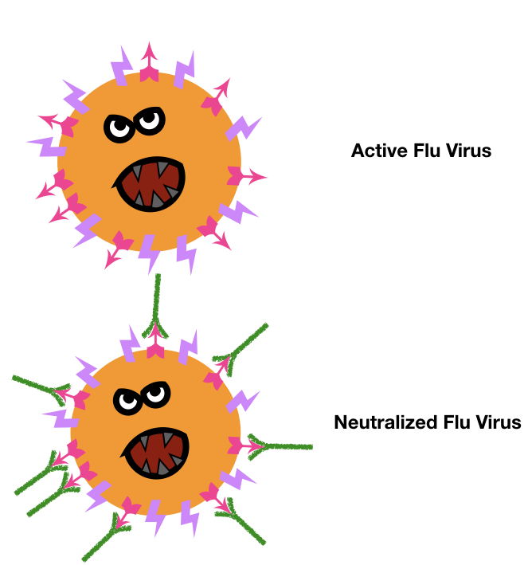
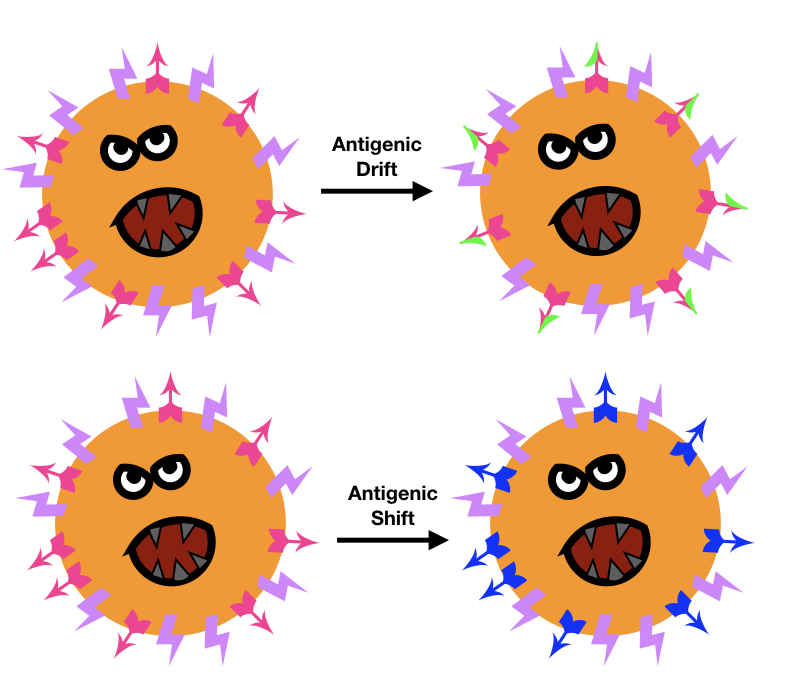
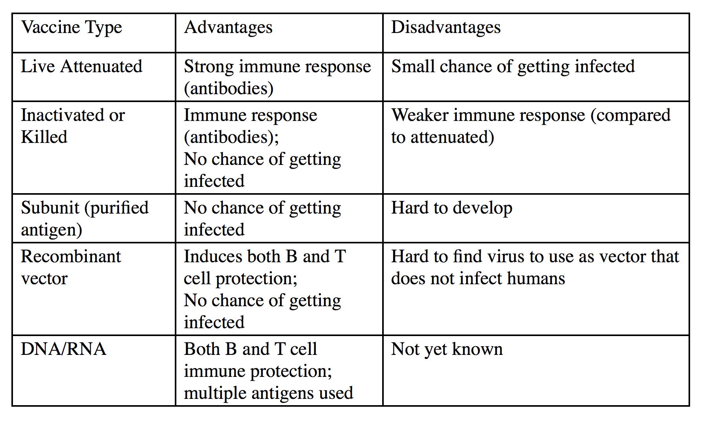
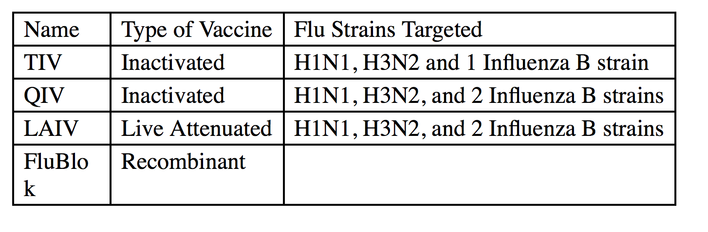


## How Do Vaccines Protect Us? 
 Most vaccines are given to induce your body’s B cells (a type of immune cell) to produce antibodies against a pathogen to protect you3.  Antibodies are a special type of protein made by your B cells that bind to *antigens*, or specific molecules typically produced that are either part of disease-causing microbes or made by the microbe3.  Antibodies can activate the killing of infected cells by binding to the cell surface and serving as an alert signal that the cell is infected3.  Antibodies are sort of like having a Wanted Ad stuck to the criminal’s forehead.  Some vaccines are also capable of generating a protective T cell (another type of immune cell) response. T cells can protect you from infection in two basic ways.  One way is that some T cells directly kill infected cells.  The second way is that some T cells activate B cells which causes the B cells to make more antibodies to target the microbe, boosting the B cell response.  
 
In order for antibodies to provide protective immunity, they have to be present in your body before you get infected, which is why you either must experience the disease at least once so your body makes antibodies in response or you need get the vaccine to get your body to make antibodies.  These pre-existing antibodies protect you by preventing pathogens from damaging your body or stopping an infection from occurring3.  This ability to stop a repeat infection is termed “*neutralization*”3.  The seasonal flu vaccine works by generating these neutralizing antibodies before you are exposed to the flu3.  Neutralizing antibodies, the kind that prevent infection, target the flu HA surface proteins (HA is the H in the name of the flu, ex. H1N1)1.

HA is the protein the flu virus uses to enter your cells, so if the antibody binds to HA, it blocks the virus from entering and stops the infection in its tracks, similar to handcuffs stopping a criminal from attacking1. The antibodies induced by the seasonal flu vaccine target HA to prevent you from getting the flu5. 

T cell protection doesn’t require previous exposure to be effective, though previous exposure does make the T cell response a lot quicker.  The major advantage of a vaccine that also involves T cells is that T cells can both kill the infected cell and activate B cells to produce protective antibodies.  T cell protection is not neutralizing since it doesn’t block infection but is still effective in cutting down on the duration and severity of flu by killing off more of the virus.  

###What’s So Interesting About the Flu Virus?

There are three types of flu virus, A, B and C1; types A and B are the seasonal flu that we are all too familiar with unfortunately1.  The flu virus has a lipid envelope surrounding its genome or genetic code and this envelope is coated with proteins on the virus’ surface1.  Flu viruses have two surface proteins, *hemagglutinin* (HA, or H) and *neuraminidase* (NA, or N)1. There are many different varieties of HA and NA and flu viruses are named for the types of surface proteins they have.  For example, the 2009 flu outbreak was of a strain with hemagglutinin type 1 and neuraminidase type 1, so we refer to it as H1N11.  The common seasonal flu is H3N21.

As humans, we have a DNA based genome with a lot of protective enzymes that are careful to avoid making any mistakes when copying our DNA.  In contrast, the flu virus has a RNA based genome1. Viral enzymes that replicate the RNA genome have much higher mutation rates than our DNA replication enzymes, partially due to their lack of proof-reading correction mechanisms in these enzymes5. These mutations enable the flu virus to experience antigenic drift and antigenic shift1.  

**Antigenic drift** is when the flu viral proteins undergo point mutations, or small changes to a portion of the surface protein.  If these small mutations change the area that our antibodies used to target, the virus is now able to avoid antibody binding and subsequent death.  

**Antigenic shift** is when the flu virus creates a new version of one of its proteins, such as HA, via reassortment of segments of the viral RNA genome. Antigenic shift is particularly threatening to us because it leads to greater differences in the viral surface proteins, similar to how someone getting a new face would make them harder to identify.  If the protein shifts enough, our antibodies wouldn’t be able identify the new protein and protect us. The Wanted Ad no longer matches the criminal’s new face and can’t tag them for the police to spot.  Without antibody protection, everyone, even healthy young adults, is more susceptible to getting the flu.  

Another dangerous feature of the flu virus is that it infects *both* animals and humans1.  This ability means that the flu virus can more easily undergo antigenic shift by introducing genes from animal flu strains into flu strains that infect humans1.  For example, either avian or swine influenza genes being introduced to human flu strains has created unique human flu strains that caused pandemics and many more deaths than usual, as evidenced in 1918 (spanish flu)  and 2009 (swine flu)2,6. This type of drastic antigenic shift makes it even less likely that our immune system will have seen the viral proteins before and will be that much less able to respond to them.  More young adults got sick and more young adults died from these strains of the flu where antigenic shift had occurred2.6. 

###How Does the Flu Vaccine Protect Us? 
The seasonal flu vaccine is designed to protect us from the current circulating flu strains including H1N1, H3N2, and two types of strain B influenza5.  The main reason you need to get the flu vaccine each year is due to the antigenic drift and shift that change the viral protein HA that antibodies target.  The World Health Organization (WHO) evaluates the currently circulating strains to identify the HA targets twice a year, once for the Northern and once for the Southern Hemispheres5.  They screen over 500,000 virus samples and then study 8,000 of these viruses in greater detail to determine what HA’s the antibodies need to target that particular year5.  The evaluation has to be completed seven to eight months prior to flu season so the vaccines can be made in time to be administered to the public5.  Flu season in the US lasts from October to May7. The Center for Disease Control (CDC), from 2010 onwards, recommends that everyone from six months of age and older should get the flu vaccine each year7.  
        	
### How Are Vaccines Developed?
There are five basic approaches to developing vaccines: 

 - use weakened live organisms
 - use dead pathogenic organisms
 - use a subunit from the organism
 - use a recombinant viral vector
 - use genomic content (DNA or RNA) from the organism3.  

The first type, using a weakened or “attenuated” organism, refers to a pathogen that has been weakened in effect; these organisms provoke a protective immune response without being able to cause disease. 
The second method, which uses killed organisms, includes using a heat- or chemically-inactivated pathogen that is essentially “dead”.  These killed organisms will not replicate or cause disease, but will induce an immune response although it will be a weaker response compared to the live attenuated vaccine3. 
The third method of using a subunit of the organism, like a surface protein or secreted toxin that may have been the target of the immune system during an actual infection, induces protection to that particular subunit and has no risk of infection3.  
The fourth method of a recombinant viral vaccine involves inserting antigen genes into viral chromosome and mimicking natural infection3.  This method can invoke both a B and T cell response which leads to greater protection3.  The tricky part is that the viral vector used to mimic the infection can’t be infectious to us or else we will just get sick from that virus instead.  
The fifth method also mimics a natural infection by delivering antigen DNA or antigen RNA into cells.  The DNA or RNA-based vaccine have the potential to involve both B and T cells3.  This method is still being researched and has yet to pass clinical trials (as of 2017) so it is unknown how this type of vaccine compares to the others though researchers are very hopeful.  
 
There are three different types of flu vaccines available: inactivated, live attenuated, and recombinant virus5.  

The most common type is the trivalent (three parts) inactivated vaccine (TIV) that is made up of the three current strains of H1N1, H3N2 and the dominant strain of the influenza type B1.  
There is also quadrivent (four parts) inactivated virus QIV that targets the HA’s of H1N1, H3N2 and both types of influenza B5.  
The live attenuated influenza vaccine (LAIV) is similar to the QIV but contains live virus and is given through the nose.  However, for the 2017-1018 flu season, the LAIV was not recommend because it has been shown to be less effective compared to the TIV and QIV through both CDC  and other independent studies7,8. The elderly population is given a version of TIV with more HA proteins called Fluzone High-Dose to help compensate for their aging, less responsive immune system1.  The CDC is currently researching to determine why the LAIV seems to be less effective8.  
The third type of flu vaccine is called FluBlok5.  The unique features of this third type is that it contains HA proteins made by insect cells which means it can be given to people with an egg allergy5.  Typically, the HA proteins needed for the vaccines come from eggs that are injected with the individual virus type followed by harvesting and purification to both isolate and enrich the HA proteins1.   

###What Are the Challenges Involved with the Flu Vaccine?
The biggest challenge with creating effective seasonal flu vaccines is trying to determine the best HA’s for antibodies to target.  As we experienced in 2009 flu season, this process is not foolproof.  
However, the future of flu vaccines is promising.  Scientists are researching ways to improve the protection provided by the vaccine by finding other mediums (besides eggs) to generate the viral proteins, looking into ways to improve vaccine delivery to generate a better immune response (adding a boost to make it more effective or changing the delivery method from muscle to skin or mucous lining), and trying creating vaccines that invoke T cell defenses1.  

Researchers are also looking to develop a “**universal vaccine**”, one that won’t need to be changed each year because it would target proteins that the flu virus can’t mutate since these proteins have to be conserved to carry out their function5.  
One of these universals targets in the M2 flu protein5.  The M2 protein helps uncoat the flu virus after it enters our cells so it can start make more flu viruses5.  Antibodies that target M2 are not neutralizing antibodies but do help decrease the duration and severity of flu5. So far, M2 antibodies found in nature (our bodies) are not very long lived, so that is one obstacle scientists have to overcome so that protection can last for years instead of months5. However, it may be worth it because these M2 antibodies have been shown to protect against multiple flu strains from different seasons5.  

Another potential universal target is the stem or base of the HA surface protein.  This **stem is conserved** among the different HA types, which makes it a great target since the HA’s change constantly5.  Antibodies that target the HA stem are neutralizing, a very desirable feature in the flu vaccine5.  However, it’s been difficult to generate antibodies against it due to its being covered by the surface protein, so it's hard to target5.  In our bodies, we only make very low amounts of antibodies to the HA stem compared to HA itself because the HA is easier to reach5. Scientists are continuing to work on new ways to generate these HA stem antibodies5.  

Many of these new ideas have already entered clinical trials.  Perhaps within the next couple of years, we will see flu vaccines that generate both antibody and T cell protection, vaccines that target viral proteins besides HA and NA, and vaccines that don’t depend on eggs.  Maybe one day we will even have a seasonal flu vaccine that will no longer be seasonal but instead protect us from all strains of the flu, current and future. 

#### References
1.    	Wong, S.-S. & Webby, R. J. Traditional and new influenza vaccines. Clin. Microbiol. Rev. 26, 476–92 (2013).
2.    	Morens, D. M. & Fauci, A. S. The 1918 Influenza Pandemic: Insights for the 21st Century. J. Infect. Dis. 195, 1018–1028 (2007).
3.    	Murphy, Kenneth, Janeway, Charles A. Jr., Travers, Paul, and Walport, M. Janeway’s Immunobiology, 8th Edition. (Garland Science, 2012).
4.    	Riedel, S. Edward Jenner and the history of smallpox and vaccination. Proc. (Bayl. Univ. Med. Cent). 18, 21–5 (2005).
5.    	Houser, K. & Subbarao, K. Influenza vaccines: challenges and solutions. Cell Host Microbe 17, 295–300 (2015).
6.    	Popovici, V. et al. Effect of training-sample size and classification difficulty on the accuracy of genomic predictors. Breast Cancer Res. 12, R5 (2010).
7.    	Key Facts About Seasonal Flu Vaccine | Seasonal Influenza (Flu) | CDC. Center for Disease Control and Prevention (2017). at <https://www.cdc.gov/flu/protect/keyfacts.htm>
8.    	CDC Newsroom. ACIP votes down use of LAIV for 2016-2017 flu season | CDC Online Newsroom | CDC. Centers for Disease Control and Prevention (2016). at <https://www.cdc.gov/media/releases/2016/s0622-laiv-flu.html>
 

> Written with [StackEdit](https://stackedit.io/).
