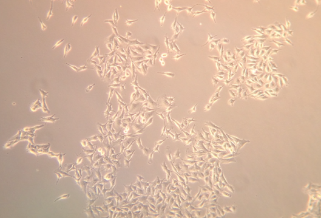
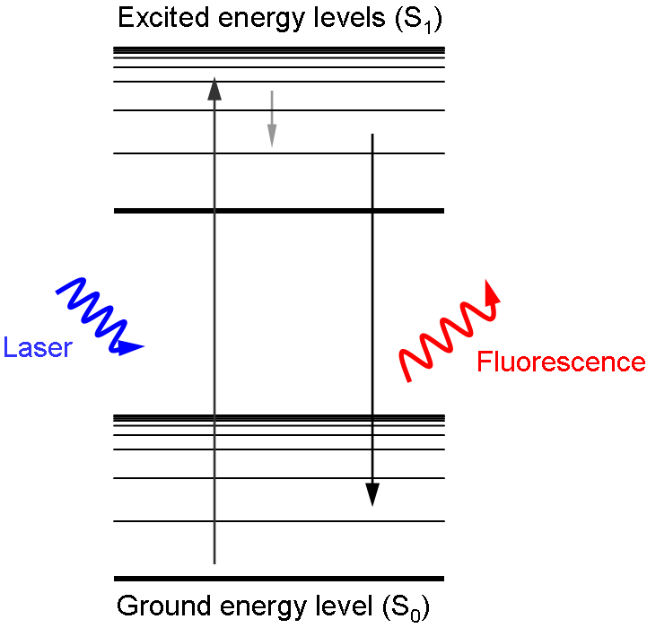
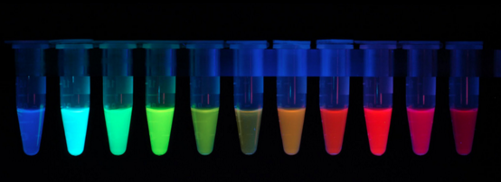

Seeing is believing. It’s hard to believe something that you haven't seen with your own eyes.  How do we know where DNA and proteins are located in the cell? How do we know what our immune cells look like and where they are located in our body? How do we know neutrophils, a type of white blood cells, protect our bodies by “eating” bacteria? By directly observing what is going on in the cell with their own eyes, scientists discovered new knowledge such as that proteins and DNA can move around in the cell, B and T cells reside in certain areas in the spleen, and neutrophils engulf bacteria to eliminate them. Click [here] (https://www.youtube.com/watch?v=JnlULOjUhSQ) to view a video of the last example. There are several imaging techniques that allow us to peer into the cellular world and study the phenomenon that takes place at a microscopic level. Here, I will talk about how scientists view things inside the cells using fluorescent dyes as well as provide examples of how it is used in immunology research.

*Figure 1: How can we tell these cells apart?!*

### How Fluorescence Works

When I was a child, I had glow-in-the-dark stars and planets plastered all over my room. In order for the glow-in-the-dark effect to work, they had to be exposed to light. This is true for any glow-in-the-dark toy. The rule is “in order to get light out, you need to put light in”. Fluorescence works in a very similar way - some materials can absorb light and re-emit it later in a lower energy state, which means they absorb light in one color and emit it as a different color. Red light has the lowest energy, followed by orange, yellow, green, blue, indigo, and violet. The emitted light is always in a lower energy state, and hence a different color, than the absorbed light, because of energy lost in this process. For example, if green light is absorbed, then the resulting fluorescence observed will be in the form of red, orange, or yellow light. 

*Figure 2: Diagram of how fluorescence works!*

### How do we use fluorescence to see at the cellular level? 

There are two common “types” of fluorescence we choose from in the lab: fluorescence generated by proteins and fluorescence generated by small molecules. 

#### How Scientists Design Animals that Glow in the Dark:  Fluorescent Proteins

Fluorescent proteins were first purified from jellyfish in the 1960s by Osamu Shimomura. This particular fluorescent protein produces green light, and it is commonly referred to as green fluorescent protein, or GFP for short. Later on, another scientist, Doug Prasher, determined the DNA sequence of GFP, and working with Martin Chalfie at Columbia University, expressed this sequence in bacteria to make them produce GFP and light up. In fact, with modern technology, it is very easy nowadays to express GFP in whatever living system you choose. However, it is hard to distinguish between different biological components, like different cell types, with only one color. Roger Tsien at UC San Diego was one of the first people to address this problem by creating a palette of different colors of fluorescent proteins derived from GFP. Not only is there GFP, but now scientists can use red fluorescent protein, cyan fluorescent protein, and yellow fluorescent protein, to name a few. In fact, there even exist different shades of color fluorescent proteins named after fruits (i.e. cherry fluorescent protein, cranberry fluorescent protein). This makes it possible to tag different cell types and tell them apart.  

*Figure 3: Panel of fluorescent proteins!*

And for fun, you can express different fluorescent proteins in bacteria and draw beautiful bacteria art!

*Figure 4: Bacterial art!!*

#### Small Molecule Fluorescence

Even though small molecules are not proteins, they can also generate fluorescence. However, unlike with fluorescent proteins, there is no easy way to manipulate cells to create these molecules. Instead, the fluorescent molecules need to be added to the cell and directed to attach to the object of interest. For example, if we want to visualize DNA, we can add DAPI, a fluorescent molecule that can pass through the cell membrane and bind DNA. Scientists can then visualize where DNA is in the cell by applying a laser of the correct wavelength to activate DAPI, making it fluoresce where it’s bound to DNA. Another common method of using fluorescent molecules to visualize where things are in the cell is immunocytochemistry, which uses antibodies and fluorescent molecules to target proteins of interest. An antibody against the protein of interest is added to a cell to target that protein. Then a second antibody conjugated with a fluorescent molecule is added to target and bind to the first antibody. This allows scientists to then view where the target protein is in the cell by activating the fluorescent molecule with the right laser making the molecule glow.

### Fluorescence in Immunology

Fluorescence isn’t just limited to still images – you can also make videos, imaging where cells are and how they move in real time. This is very useful technique used by many fields of biology including immunology, which studies how the immune system works. For example, a [video](https://www.youtube.com/watch?v=TcioRc9Myoo) taken by the lab of Dr. Jason Cyster, an imunology lab at UC San Francisco, captures an interaction between B cells and T cells; the B cells are labeled red and the T cells are labeled green. The B and T cell interaction is necessary to activate B cells so B cells can start making antibodies.  For more videos, check out the [Cyster group’s video page](http://cysterlab.ucsf.edu/video-gallery).

Check out other posts on The Dish on Science to see how fluorescence is used!

