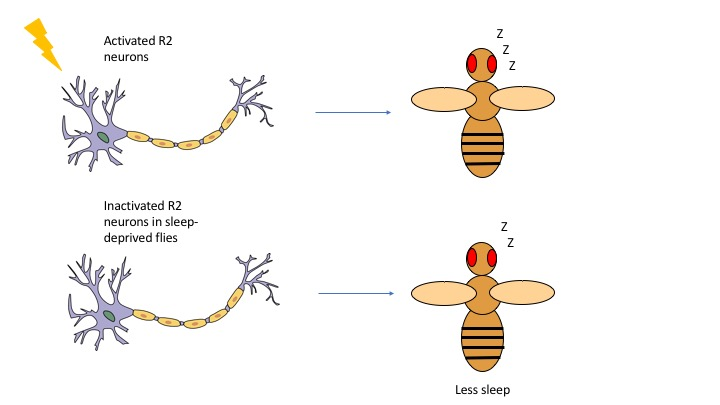

It’s 7am. Your alarm goes off, and you know it’s time for class…but you choose to hit the snooze button and go back to sleep. Or it’s time for work, so you get out of bed and walk to the kitchen, bee-lining to the coffee machine because you know you’ll need that caffeine to stay awake. That night, you feel tired and decide to go to bed (or for the night owls, continue on with those extra cups of coffee). 

Isn’t it strange how you wake up and go to sleep, day after day? Have you ever wondered why you even need to sleep, or what is happening when you sleep? 
We all know intuitively that sleep is important. If we get less sleep than we need, we have a hard time concentrating when we work or drive. We dedicate a significant portion of our time to sleeping – on average, we spend about a third of our lives asleep! 

Despite the large amount of time we devote to sleep each night and the importance it holds for our survival and day-to-day functioning, we still don’t know very much about sleep. For one thing, it's not really clear why we sleep. There are [four prevailing ideas](https://www.caltech.edu/news/why-do-we-sleep-1863) as to why we sleep: to repair cells that have been damaged by harmful molecules; to replenish the body’s fuel, which gets used when we’re awake; to clean up extra neural connections in the brain; and to reinforce learning and memory. While we have evidence supporting each of these ideas, we don't know whether a combination of these, or even any of these ideas, contributes to the reason we sleep. 

We also don’t really know how the brain controls sleep. To get at this question, we first have to understand how we define sleep. We currently understand that two separate yet interconnected processes control our sleep-wake cycles. The first process is the circadian system, which controls when we get up in the morning and when we go to sleep at night. The second process is the sleep homeostatic system, which controls our sleep drive – basically, the longer we stay awake, the more we want to sleep, and the longer we have been asleep, the less we want to sleep. So to answer the question of how the brain controls sleep, researchers are interested in figuring out what genes, molecules, and neurons are responsible for controlling the circadian and sleep homeostatic processes. 

Ideally, we would want to directly study how sleep is regulated in people. However, we can’t do this readily because of experimental constraints: for example, imagine sleep-depriving a person and then excising his/her brain to analyze what molecules or neurons are active! To avoid this problem, we use model organisms that are easy to work with but have similar sleep characteristics to ours. Amazingly, researchers have turned to the humble fruit fly for this endeavor. Yes, fruit flies indeed have [brains](http://www.virtualflybrain.org/site/vfb_site/overview.htm)! And yes, fruit flies actually sleep! In fact, when they are sleeping, they show changes in position, increased arousal threshold (meaning that it takes more effort to wake them from sleep), and periods of inactivity that can last several hours1. What’s even more interesting is that flies and humans share [several similarities](https://blogs.brandeis.edu/flyonthewall/fly-life-watching-fruit-flies-sleep/) when sleeping. For example, flies sleep at night and are inclined to take afternoon naps. If flies are sleep-deprived, they will try to catch up on sleep the following day, and will perform poorly on memory tests. They are even sensitive to the same stimulants we are. Just as people drink coffee to stay awake,  caffeine keeps flies awake, as well!

So how do we study the genes, molecules, and neurons that control sleep in fruit flies? A very common, effective approach is to manipulate the fly’s genes or neural activity to see what alters their sleep. As mentioned before, flies and humans share a lot of similar sleep characteristics. Just as people have difficulty sleeping because of insomnia, researchers can create mutant flies that simply can’t sleep. Dragana Rogulja’s lab at Harvard, for example, studies these [insomniac flies](http://www.npr.org/sections/health-shots/2015/09/18/441159913/catching-zzzzzzs-fly-insomnia-might-help-you-sleep-better) to figure out genes that control how flies fall asleep and how they stay asleep. 

In addition to identifying genes, researchers at Johns Hopkins, are teasing apart [neural circuits that regulate sleep](http://www.npr.org/sections/health-shots/2016/05/19/478672500/you-are-getting-sleepy-said-the-scientist-to-the-fruit-fly). Mark Wu’s lab found a group of neurons, called R2 neurons, which control sleep drive in flies. When they genetically activated these R2 neurons, the fruit flies began to sleep, and even continued to sleep hours after the neurons were activated (Figure 1). The researchers then inactivated these neurons in sleep-deprived flies to see how removing R2 neuronal activity affected sleep. Normally, sleep-deprived flies get extra sleep, called rebound sleep, to make up their sleep debt. When R2 neurons are silenced in sleep-deprived flies, however, they get less rebound sleep. This means that R2 neurons are important for helping the flies get more sleep after deprivation (Figure 1). By using a special technique to visualize neurons in live animals, Dr. Wu’s group also found that R2 neurons were more active in sleep-deprived flies and became less active after 24 hours of rebound sleep. These results are exciting because they suggest that changes in activity of a specific group of neurons can control sleep drive. 
 

Figure 1. R2 neurons important for sleep drive. When R2 neurons were activated in flies, the flies slept. When R2 neurons were blocked in sleep-deprived flies, the flies slept less than they normally would after sleep deprivation. 

But figuring out what controls sleep isn’t the end of the story. The incentive for studying sleep in fruit flies is to understand how we can treat human sleep disorders and other diseases linked with sleep problems. One [study](https://www.sciencedaily.com/releases/2014/04/140417141905.htm) has shown that sleep deprivation in young flies impacts their brain development, which suggests that sleep during childhood is critical for proper brain development. Another [study](https://www.sciencedaily.com/releases/2016/03/160324133839.htm) showed that a gene called translin is important for keeping hungry flies awake. This result ties sleep regulation to metabolism and points to the possibility that sleep loss in humans might be linked to metabolic disorders such as obesity and diabetes. 

These studies in fruit flies are important because they potentially show what is happening at the genetic and molecular level during sleep in animals - findings that may hold true for humans. But they are also powerful because they reinforce our intuitive understanding of sleep. Sleep affects several other processes important for health, such as development and metabolism. The fact that disrupting sleep impacts animals as distant from humans as flies demonstrates the evolutionary importance of sleep and it's ancient relationship to our health - we need to better understand the science underlying sleep and ways to treat sleep disorders in humans. With so much excitement in research on sleep, scientists are choosing to study hard now and catch some zzz’s…later. 

More reading:
1.	Hendricks JC, Finn SM, Panckeri KA, Chavkin J, Williams JA, et al. (2000) Rest in Drosophila is a sleep-like state. _Neuron_ 25: 129–138.