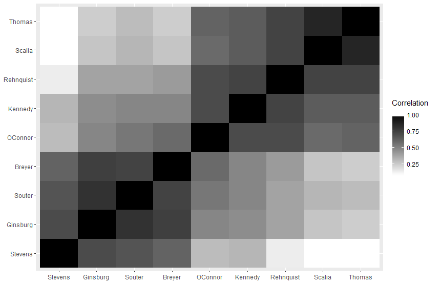
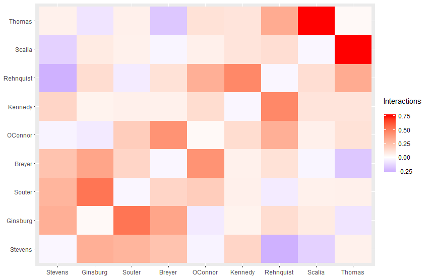
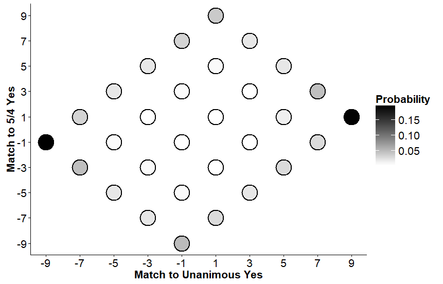
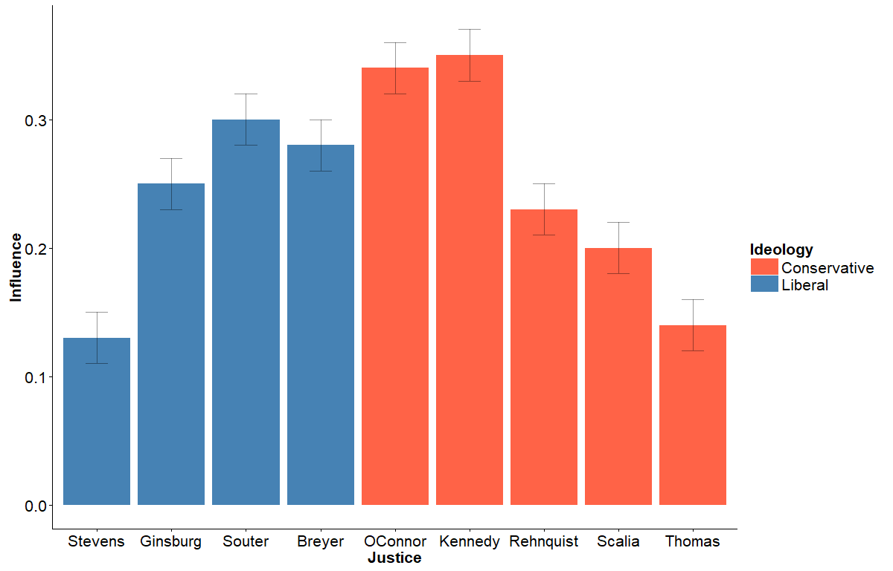

The death of Supreme Court Associate Justice Antonin Scalia in February 2016, and his eventual replacement by Neil Gorsuch, spurred [much][latimes] [discussion][politico] about the future direction of the US Supreme Court. Despite a larger-than-life personality, Scalia often had [difficulty][atlantic] convincing other members of the court of his views. Neil Gorsuch has been described as "Scalia with a smile" and has voted with fellow conservative Clarence Thomas on [every single case][npr] so far, but it's still too early to really know how he's going to affect the court and, subsequently, our country. One thing we can do is try to find general patterns of behavior on the court that may help us answer this question as well as better understand how the court works in general.

The fundamental unit, so to speak, of a Supreme Court decision is a **vote**: yes or no, meaning the justice either agrees or disagrees with a decision made by a lower court. Outside of the context of a case, a "yes" or "no" vote does not indicate anything in particular, but we can get a lot of insight from which justices’ votes match each other and which do not.

In 2015, Edward Lee, Chase Broederz, and William Bialik [studied][paper] these "yes" and "no" votes from the Rehnquist Court, which was unchanged from 1994 to 2005 and took 895 total votes. The nine justices in this court were the late conservative Chief Justice William Rehnquist, current moderate Anthony Kennedy, retired moderate Sandra Day O'Connor, current liberal Stephen Breyer, retired liberal David Souter, retired liberal John Paul Stevens, current liberal Ruth Bader Ginsburg, the late aforementioned conservative Antonin Scalia, and current conservative Clarence Thomas[^thomas].  Lee, Broederz, and Bialik wanted to analyze the Rehnquist Court votes to see if there were any interesting patterns of agreement between the justices. 

#### Statistical Mechanics and the Maximum Entropy Approach

To analyze the Rehnquist Court, Lee, Broederz, and Bialik got creative and looked for inspiration in a branch of physics called **statistical mechanics**. Statistical mechanics studies the microscopic behavior of atoms and molecules and connects their behavior to the more familiar "macroscopic" quantities of thermodynamics (such as heat, temperature, and entropy). At first glance, this sort of strategy doesn't really seem to make much sense in the context of nine justices casting a hundred or so total votes every year. It really won't make sense no matter how many glances you take; there aren't anywhere near as many Supreme Court votes as there are atoms in a roomful of air. No, the role of statistical mechanics here is as the origin of the mathematical idea---and hammer perpetually in search of its next nail---called **[Maximum Entropy][maxent]**.

For every case, we have a vote from each justice, "yes" (which we write down as 1) or "no" (which we write down as -1).  So we can represent each case by a list of nine 1s and -1s.  Just tallying up these lists for each case gives us the actual distribution of voting results. We can then describe how people vote by...just simply stating how they voted. That's a start, but it doesn't tell us anything about the underlying patterns of behavior that we want to study. The goal of Lee, Broederz, and Bialik---and of maximum entropy analysis in general---is to describe the important features of the data (in this case, the votes) with as little machinery as possible; we want the simplest possible, most generalizable way to describe the voting patterns. We need to do more than just tally votes.

#### Correlations Between Justices

The first step is to determine what the important features of the data are. In this case, we want to analyze the voting patterns of the justices, and in particular the influence that each justice has on the others. One way to do this is to look at the correlations between the votes of each pair of justices. The following figure shows these correlations:

The big takeaway here is that *all the correlations are positive*. This seems strange, especially because in the current political climate we expect everything to be highly polarized. The reality is quite different; about 40% of cases are unanimous, and only about 20% of them are 5-4.  The high proportion of general agreement makes all the correlations at least slightly positive[^corr].

#### Entropy

If we keep the averages and the correlations fixed, then we need to make at least one more assumption to define a voting distribution (there are infinitely many voting distributions that can result in the same voting averages and voting correlations between pairs of justices). The additional assumption that the researches made in this case is: the voting distribution will have *maximum entropy*. The following box explains this assumption:

>The simplest way to describe entropy is by imagining some gas (say, oxygen), in a box. There are an enormous number of possible configurations that the oxygen molecules could be in, and the gas will be constantly changing between these configurations as the oxygen molecules move around the box. Entropy is a way of measuring how evenly-spread the overall behavior of the gas is across all these possible configurations. If you scrunch all the molecules into a corner of the box, then the gas will only exist in a small fraction of the possible configurations, and the entropy is low. If you release the molecules from their cramped misery, they will start zipping around the box. The gas now moves through many more of the possible configurations, and the entropy is high. The more spread-out the behavior is over the possible configurations, the higher the entropy. As it turns out, if you just let this box sit there, the gas molecules will eventually be the most spread-out over the possible configurations as they can be: the system will eventually maximize entropy.

>We can construct an analogy to our Supreme Court votes. The average vote value and the correlations between voters act like the size of the box and the total amount of oxygen: they are "macroscopic" measurements that place restrictions on the possible behavior of the "microscopic" entities (the molecules or the votes). The list of voting configurations (nine 1s and -1s) is analogous to the list of oxygen molecule positions and energies (the configuration of the gas in the box). Finally, assuming that the vote distribution has maximum entropy is analogous to letting the gas molecules in the box move as freely as possible; the maximum entropy assumption enforces that we add no additional restrictions to our voting behavior aside from the averages and correlations.

#### The Maximum Entropy Model

The mathematical solution to the "match the correlations with maximum entropy" problem is[^Boltzmann]:
> The probability of a particular set of votes $v = \{v_1, v_2, \dots, v_9\}$ is proportional to $e^{-E(v)}$, where $E(v)$ is the energy of the votes $v$: $E(v) = -\frac{1}{2}\sum\limits_{i\neq j}J_{ij}v_iv_j$, where $J_{ij}$ is the interaction between justice $i$ and justice $j$.

The important characteristic of this result is that the probability of a particular set of votes decreases as the "energy" of that set of votes increases. This "energy" of votes is computed as the sum over each pair of justices of the product of each of their votes and a constant that describes the interaction between the justices.

#### Interactions Between Justices

If two justices have a positive interaction, then the energy will go down if their votes match and it will go up if their votes don't match. Conversely, if two justices have a negative interaction, then the energy will go down if their votes don't match and it will go up if their votes match. Thus, a positive interaction means that the justices encourage vote matching, and a negative interaction means that the justices encourage vote opposition. 

We can compute the interaction values that best match the average vote values and correlations.  The following figure shows these interaction values:

These interaction terms are different from the correlations in the following way: the correlations tell us that, for instance, if you see a positive vote by Antonin Scalia, the second-most conservative justice, you are more likely to see a positive vote by John Paul Stevens, the most liberal justice.  As we have already seen, this effect is primarily achieved through the unanimous vote. It is thus impossible to disentangle the effect of Scalia on Stevens specifically from the tendencies of the group to agree as a whole using correlations. In contrast, the interactions tell us much more precise information: the interaction between Scalia and Stevens is negative; by isolating the effects of one justice on another, we can see that a vote in one direction by Scalia makes it about 30% less likely that Stevens will vote the same way, averaging over the behavior of the other justices.  

One interesting thing to note is that the correlations have a clear block structure, with the liberal/conservative 4-5 split and the Stevens-Centrist-Conservative 1-6-2 split very clear just from the plot.  However, with the interactions, this block structure disappears, and we no longer have an easy liberal/conservative behavior. There are both negative and positive interactions between liberal and conservative justices. Most of the positive interactions are along the diagonal, which means justices mostly influence those that are ideologically nearby. The negative interactions occur when the justices of opposing ideologies react to each other.

#### The Energy Landscape

If we continue to follow the statistical mechanics metaphor, then the probability of the system being in a particular state (the probability of a particular vote) will be higher at lower-energy states. We can compute the energy of each set of votes using the inferred interactions between the justices and plot them in an *energy landscape*:

The axes in this figure are a little complicated. The x-value is basically the sum of the votes, so unanimity is 9 or -9 and the 5-4 split is 1 or -1. The y-value is the amount of overlap of the votes with the 5-4 ideological split (so if the vote matches the 5-4 ideological split, add 1, and if not, subtract 1). Darker means more probable. We can look at this plot and find *energy minima*, places where flipping one vote increases the energy (and decreases the probability); these are red arrows in the figure. There are three energy minima: first, the unanimous votes $\pm$(9, 1). These states are by far the most probable. Next come the 5-4 ideological split $\pm$(1, 9). There is also a third energy minimum, the 7-2 split where Scalia and Thomas dissent $\pm$(5, -3)[^yexp]. These three states satisfy the tendencies and opinions of the justices the best.

The vast majority of cases appear on the boundary of this landscape. What does this mean? Well, the boundary consists of all cases where the minority is all of the same ideology.  Thus, it is extremely unlikely (though not impossible) to see a minority that is ideologically mixed. 

I guess it's important to note that the probabilities of each state obtained from the maximum entropy model of the votes look a lot like the actual observed frequencies of each state, which is one indication that the model is a good fit.

#### Measuring Influence on the Court

Now we can use some intuition from physics to try to get at the "influence" of each justice.  Our model matches a model that is very well-studied in physics: the [Ising][ising] model[^ising]. The Ising model is based on magnets with spins; each magnet induces a magnetic field that encourages nearby magnets to align with its spin (matching spins lowers the energy of the state). In our situation, each justice can be considered to exude some sort of field of influence that encourages the other justices to agree with them, like the magnets. We can compute the strengths of these fields directly from the average vote values and the interaction terms. Here are the results:

The justices in the plot are ordered from left to right in terms of ideology, with the left being the most liberal and the right being the most conservative. The most extreme ideological justices (Stevens and Thomas) have the lowest, and almost identical, influence on the court. You might be surprised to see Antonin Scalia with a relatively small amount of influence, but it has been well-documented that though he was highly influential in constitutional law in general, he had a hard time getting the other non-Clarence-Thomas justices to agree with him. The traditional "swing" justices, O'Connor and Kennedy, have the most influence. One interesting thing to notice is how symmetric the distribution of influence is; it seems that how likely you are to drag other justices to your viewpoint depends more on where you are on the ideological spectrum than your personality, seniority, or role on the court (notice that Chief Justice Rehnquist is only the fifth-or-sixth-most influential justice on his own court).

#### The Future

So, can this tell us anything about the future of the court? The first thing to note is that, overall, the court has moved to the right since the Rehnquist era. With the retirement of Stevens, Ginsburg became the most liberal justice. Both Stevens and Souter were replaced by more centrist justices in Sonia Sotomayor and Elena Kagan. The move from Rehnquist to John Roberts was mostly lateral, and it appears that the Scalia-to-Gorsuch move is as well. Perhaps most notably, the centrist O'Connor was replaced by the fairly conservative Samuel Alito. It would therefore be very interesting to see the results of this analysis on the results of the new court. Many characteristics will probably remain the same: the energy minima (with the Scalia-Thomas bloc replaced by the Gorsuch-Thomas bloc) and the general shape of the influence distribution, though it may be shifted rightwards a bit. There may be some interesting things to see in the specific individual interactions. In particular, Harvard Law professor Larry Tribe once [advocated][tribe] for the nomination of Kagan to the court specifically because he thought she could influence Kennedy. Kagan was expected to be able to influence Kennedy more than the other justices, and one would expect such an effect, if true, to be seen in the interaction value of Kagan on Kennedy.  It would also be interesting to see if similar patterns can be found in lower-level circuit courts.  If you're interested in taking a look at the data used in this study, check out the Supreme Court database [here][data].

The results I have discussed in this article were only possible because a few scientists decided to ingeniously apply an idea from one field into another. This study may be small in scope, but it’s a good demonstration of the benefits of creativity in science and that it is important to keep an eye out for situations where you can apply something you know to something completely different; you never know what could happen.

#### References

1. Lee, Edward D., Chase P. Broedersz, and William Bialek. ["Statistical mechanics of the US Supreme Court."][paper] Journal of Statistical Physics 160.2 (2015): 275-301.
2. Spaeth, H.J., Epstein, L., Ruger, T.W., Whittington, K., Segal, J.A., Martin, A.D.: [Supreme Court database.][data] Version 2011 Release 3 (2011).
3. Tribe, Laurence H. [Letter.][tribe] 4 May 2009.
4. Rosen, Jeffrey. [“What Made Antonin Scalia Great.”][atlantic] The Atlantic, Atlantic Media Company, 15 Feb. 2016.
5. Blackman, Josh, et al. “What Could Gorsuch Mean for the Supreme Court?” POLITICO Magazine, 1 Feb. 2017.
6. Savage, David G. [“Gorsuch's Impact on Divided Supreme Court Will Begin Immediately – LA Times.”][latimes] Los Angeles Times, Los Angeles Times, 9 Apr. 2017.
7. Totenberg, Nina. [“Justice Neil Gorsuch Votes 100 Percent Of The Time With Most Conservative Colleague.”][npr] NPR, NPR, 1 July 2017.
8. [“Principle of Maximum Entropy.”][maxent] Wikipedia, Wikimedia Foundation, 2 Dec. 2017, 
9. [“The Silence of the Clarence.”][silence] The Daily Show with Jon Stewart, 15 Jan. 2013.
10. [Boltzmann Distribution.”][Boltzmann] Wikipedia, Wikimedia Foundation, 17 Nov. 2017.
11. [“Ising Model.”][ising] Wikipedia, Wikimedia Foundation, 29 Nov. 2017

[^ising]: This model is named after Ernst Ising, who, as a graduate student, solved the 1-dimensional version of the model (think magnets on a string), found nothing interesting, and concluded that the model will generally produce nothing interesting.  Unfortunately for him, in higher dimensions (think magnets on a grid or in a cube) the model has *very* interesting behavior and is incredibly useful. We named the model after him and he didn't even do anything important with it!  We all pronounce his name "Eye-zing", though, which is not the correct pronunciation, so I guess it evens out.

[^yexp]: The y-value here comes from the following:  Let's say the majority vote is +1.  Then there's only a match with the 5-4 ideological split from three conservatives and no liberals, so the overlap with that split is 3(1) + 6(-1) = -3.

[^unan]: You could argue that while a plurality of cases are not ideologically split, perhaps the most "important" cases (and certainly the most "political" cases) are, so it is still important to pay attention to the ideology of the court.

[^box]: Sometimes, to think outside the box, you have to think about the things *inside* a box.

[^thomas]:  Fun Clarence Thomas fact: On January 4th, 2013, he broke a seven-year stretch of silence on the court when he, as stated by Wikipedia, "was understood to have joked that a law degree from [Harvard] may be proof of incompetence."  *Was understood to have joked?*  What does that mean?  [Jon Stewart explains][silence].

[^Boltzmann]: This is the [Boltzmann][Boltzmann] distribution and it has applications in many fields.

[^corr]: If you're still unsure about this, consider the following simple model focusing in on two voters. There are four possible votes: (-1, -1), (-1, 1), (1, -1), and (1, 1). Let's assume that the overall sign doesn't matter, so (1,1) and (-1,-1) happen equally as often and (-1,1) and (1,-1) also happen equally as often. You can imagine weighting each of these points by how often they occur, and drawing a best-fit line through the four points.  The correlation term will have the same sign as the slope of the best-fit line. Here's a helpful figure.

If every vote is unanimous ((1, 1) and (-1, -1); left panel), the correlation between the two votes is perfect and positive. If every vote was split ((1, -1) and (-1, 1); right panel), then the correlation is perfect, but negative. If unanimity happened exactly half the time (middle panel), there is no correlation. In this toy example, if more than half the votes are unanimous, you get a positive correlation even between people who vote against each other in every other vote. In the real situation, unanimous votes occur 40% of the time, but the guaranteed-opposite votes only occur about 20% of the time, so there's 40% of the votes where agreement some of the time is enough to get the correlations to positive.

[data]:http://scdb.wustl.edu/index.php
[tribe]:http://eppc.org/docLib/20101028_tribeletter.pdf
[atlantic]:https://www.theatlantic.com/politics/archive/2016/02/what-made-antonin-scalia-great/462837/
[politico]:http://www.politico.com/magazine/story/2017/02/neil-gorsuch-supreme-court-future-214724
[latimes]:http://www.latimes.com/politics/la-na-pol-gorsuch-court-impact-20170409-story.html
[npr]:http://www.npr.org/2017/07/01/535085491/justice-neil-gorsuch-votes-100-percent-of-the-time-with-most-conservative-collea
[paper]:https://link.springer.com/content/pdf/10.1007%2Fs10955-015-1253-6.pdf
[maxent]:https://en.wikipedia.org/wiki/Principle_of_maximum_entropy
[silence]:http://www.cc.com/video-clips/wn0d9f/the-daily-show-with-jon-stewart-the-silence-of-the-clarence
[Boltzmann]:https://en.wikipedia.org/wiki/Boltzmann_distribution
[ising]:https://en.wikipedia.org/wiki/Ising_model

<!--stackedit_data:
eyJoaXN0b3J5IjpbMTcxMDIxMTExXX0=
-->