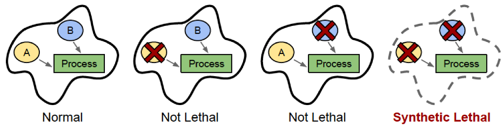
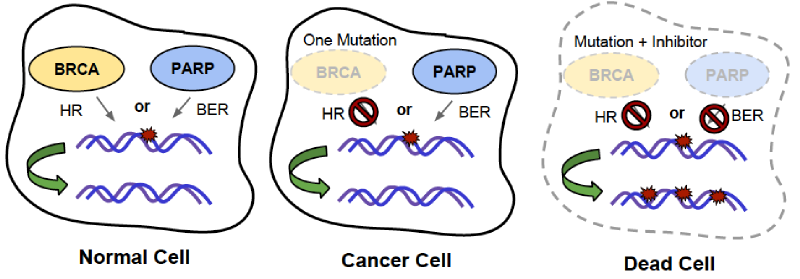
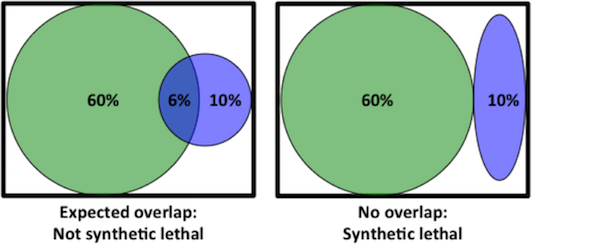

Cancer is the second leading cause of death in the United States, making it a huge area of scientific research. Although cancer is one of the most studied diseases in drug development, the number of new FDA-approved cancer therapies per year is exceptionally low – only 8% of cancer drugs that enter clinical trials are eventually FDA-approved.1 Drug side effects are the main barrier to FDA approval, as many developing cancer therapies kill tumor cells, but also damage normal cells in the body.2  For this reason, scientists are on the hunt for treatment strategies that specifically target cancer cells. So what makes a cancer cell different from a normal cell? While there are many differences between cancer and normal cells, a major difference lies in the DNA.

###Cancer results from DNA mutations

Our DNA is constantly being damaged by environmental factors, such as UV rays from sunlight or chemicals in cigarette smoke as well as air pollution and asbestos. Most of the time, our cells repair this damage efficiently – but sometimes DNA repair fails and cells can begin to accumulate DNA mutations. Many of these mutations may be harmless, but eventually a DNA mutation can occur that triggers uncontrolled cell growth and division. That cell, which would now be considered a cancer cell, will grow and divide and eventually form a tumor. As the tumor grows, the cells within it will continue to accumulate DNA mutations. Because of this process, cancer cells look and behave very differently than the tissue from which they originated. 

Much of the difference between a cancer cell and a normal cell lies in gene expression. Gene expression describes the process by which a gene encoded by a section of DNA is transcribed into RNA, which is then translated into proteins; if a lot of RNA (and therefore protein) is made from the DNA then the gene is considered highly expressed. The proteins then carry out important cellular functions, such as regulating cell survival, growth, metabolism, expression of other genes, and many other signaling processes. Mutations in cancer cells often increase expression of some genes (usually genes that increase cell growth) and decrease expression of other genes (usually genes that repair damaged DNA or limit cell growth). 

###What is synthetic lethality?

While these numerous changes in gene expression make cancer unpredictable and difficult to treat, scientists have recently begun to exploit these changes in gene expression for therapeutic benefit, using a concept called synthetic lethality. In some cases, when two genes are involved in the same cellular process, inactivation of either gene alone has little or no effect on cell survival, while inactivation of both genes at the same time kills the cell.  These two genes would be synthetic lethal (SL) partners, named after the word “synthesis”, or coming together. If a cancer naturally has mutations that reduce the expression or function of one of these genes, then a drug that inactivates the SL partner will kill only the cancer cells, and not affect the normal cells in the body that still retain the other gene’s expression. 

**A general illustration of synthetic lethality**

###Synthetic lethality in DNA repair

For example, the gene PARP1 (poly-ADP-ribose polymerase 1) is involved in a DNA repair pathway called base excision repair (BER).3 In BER, a damaged nucleotide base is recognized and removed from DNA, leaving an empty position in one DNA strand. The PARP1 protein recognizes this empty position and binds to it, recruiting other proteins to repair the broken DNA strand with the correct nucleotide base.

Another gene involved in DNA repair is BRCA1, which plays a role in another DNA repair mechanism called homologous recombination (HR).3 During DNA replication, sometimes DNA polymerase comes upon a mutation that it can’t fix. Because we have two copies of most genes – one copy from each parent – the other copy of the DNA sequence (the homologous sequence) is used as a template for replication instead. Once the damaged section of DNA has been replicated using the homologous template, the homologous template is released and replication can continue as normal. The BRCA1 protein is important in the process of HR; mutation of BRCA1 gene reduces the efficiency of HR, and makes cells less able to fix mutations during DNA replication. This causes the number of mutations to rise, consequently increasing the risk of a cancer-causing mutation occurring. In fact, a person who inherits a mutation of BRCA1 will have a five-fold increased chance of breast and ovarian cancer. 

However, cancers with mutation of BRCA1 are specifically treatable by drugs that inhibit PARP1, because PARP1 and BRCA1 are SL pairs! PARP1 and BRCA1 are both important for DNA repair, but through different mechanisms. This contributes to synthetic lethality between the two genes. Inhibiting only PARP1 is not lethal because cells can use other DNA repair mechanisms like HR to fix DNA damage during DNA replication. We know this because mice that have been genetically engineered to not express PARP1 are healthy and nearly indistinguishable from normal mice.4 Similarly, mutation of BRCA1 alone is not lethal because cells can use BER to fix DNA damage instead. However, inhibiting both genes together by inhibiting PARP1 in BRCA1-mutated cancers prevents both avenues of DNA repair, resulting in too much DNA damage, and subsequence cell death, in those cancer cells. 

**Illustration of synthetic lethality between BRCA mutation and PARP1 inhibition**

###How can we identify SL pairs? 

BRCA1 and PARP1 aren’t the only SL pair out there; there could be many such pairs that could be exploited in cancer cells due to their differential gene expression. One way of identifying SL pairs is through lab experiments. Scientists isolate cancer cells from human tumors, grow them in a lab, and monitor cell death under different conditions. Using this system, scientists can use molecular tools to inhibit the expression of one gene at a time. If inhibition of a gene kills cancer cells but not normal cells, then that means the gene is a SL pair with another gene that has been mutated in cancer cells. Finally, the cancer cells can be analyzed for gene mutations, revealing what the SL partner might be. For example, this type of approach identified the genes MSH2 and DHFR as SL partners, where MSH2 is commonly mutated in colon cancers, and DHFR has become a target for drugs that specifically kill these cancers. In fact, one such drug is currently in clinical trials!5

As an alternative to the time-consuming process of inhibiting genes individually, SL pairs can also be identified computationally.6 With the recent rise of genome sequencing, there are thousands of DNA sequences of tumors available online. These sequences can be analyzed in order to predict SL pairs. As an example, let’s say BRCA1 is mutated in 60% of breast cancers, and PARP1 is mutated in 10% of breast cancers. Based on these numbers, you would expect both genes to be mutated in 6% of cancers, since 10% of 60% is 6%. However, the actual proportion of cancers in which both BRCA1 and PARP1 are mutated is 0%, since inhibition of both genes is synthetic lethal. Therefore, SL pairs can be predicted by finding pairs of genes that are mutated together less often than expected given the mutation rate of either gene alone. Computational prediction of SL pairs is still a growing field, but as genome sequencing becomes less and less expensive, it will become a more and more effective strategy to predict SL pairs. 

Cancer is difficult to treat because it mutates quickly and frequently, enabling cancer cells to develop resistance to many therapies. However, synthetic lethality has allowed scientists and doctors to use the many mutations in cancer to our advantage by giving hints to new therapeutic targets that are specific to cancer cells. In the future, we can look forward to a new class of cancer therapeutics that are customized to different types of cancers with different mutations and also have fewer side effects than traditional therapies.

###References
1. I.W. Mak, N. Evaniew, M. Ghert. Lost in translation: animal models and clinical trials in cancer treatment. _Am. J. Transl. Res._ __6__, 114-118 (2014). [PubMed](https://www.ncbi.nlm.nih.gov/pubmed/24489990)
2. M Hay, D.W. Thomas, J.L. Craighead, C. Economides, J. Rosenthal. Clinical development success rates for investigational drugs. _Nat. Biotechnol._ __32__, 40-51 (2014). [PubMed](https://www.ncbi.nlm.nih.gov/pubmed/24406927)
3. T. Helleday. The underlying mechanism for the PARP and BRCA synthetic lethality: clearing up the misunderstandings. _Mol. Oncol._ __5__, 387-393 (2011). [PubMed](https://www.ncbi.nlm.nih.gov/pubmed/21821475)
4. J.M. de Murcia _et al._ Requirement of poly(ADP-ribose) polymerase in recovery from DNA damage in mice and in cells.
_Proc. Natl. Acad. Sci._ __94__,  7303–7307 (1997). [PubMed](https://www.ncbi.nlm.nih.gov/pubmed/9207086)
5. R. Brough, J.R. Frankum, S. Costa-Cabral, C.J. Lord, A. Ashworth. Searching for synthetic lethality in cancer. _Curr. Opin. Genet. Dev._ __21__, 34-41 (2011). [PubMed](https://www.ncbi.nlm.nih.gov/pubmed/21255997)
6. L. Jerby-Arnon _et al._ Predicting cancer-specific vulnerability via data-driven detection of synthetic lethality. _Cell._ __158__, 1199-1209 (2014). [PubMed](https://www.ncbi.nlm.nih.gov/pubmed/25171417)
