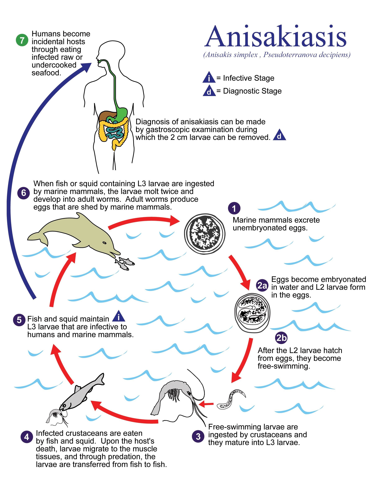
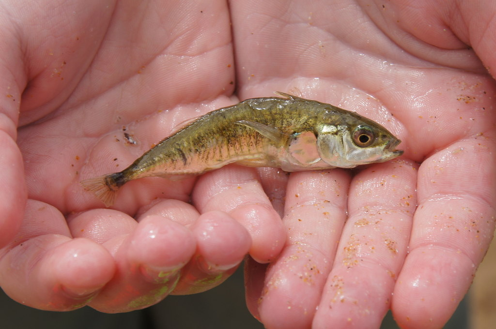

##### A peaceful scene of sardines in a kelp forest. Unseen are the multitude of parasites reproducing within some of these important commercial fish. *Image by Robert Schwemmer, NOAA National Marine Sanctuaries (CC BY 2.0).*

If someone asks you what the most common life strategy on earth is, you might be surprised by the answer. It turns out that some 40% of known species on our planet are parasites. Parasites are organisms that spend at least some part of their life on or in a host species, at that host’s prolonged expense or eventual death. Rarely inspiring respect, parasites are more commonly considered scoundrels and degenerates, exploiting other species in order take the easiest route to reproductive bliss. But there is nothing easy about being a parasite. Many parasites have complex transmission, requiring successive infection of multiple different hosts in order to complete their lifecycle. In fact, that parasitism is so successful in the face of such complexity is a testament to the strategy’s evolutionary elegance. But how will this elegant life strategy hold up to accelerating climate change?

Despite the ubiquity of parasitism in nature, little is known about the diversity and abundance of parasites in the world’s largest habitat, the ocean. Yet, scientists are increasingly aware of the critical role that parasites play in marine ecosystem as key players in food webs and as an important path of energy flow. Along with growing interest in deducing the ecological significance of parasites in the ocean, scientists increasingly want to understand how these important creatures will respond to oceanic climate change. Moreover, some marine parasites can infect humans, too. For example, humans can get anisakiasis disease from eating raw or uncooked sardines, herring, and other fish infected with larval nematode parasites. Anisakiasis disease is currently on the rise, as sushi and fish protein becomes more popular worldwide. Infected people aren’t happy, but nor is the nematode, which prefers to be gobbled up by marine mammals where it can grow up, reproduce, and continue its life cycle.  As parasites - like *Anisakis* - seek hosts in hotter waters, will they sink or swim?

##### Life cycle of the marine nematode that causes Anisakiasis disease in humans when people consume uncooked or raw infected fish. This parasite evolved to complete its lifecycle entirely within the marine food chain from crustaceans, to fish, to marine mammals. *Image by CDC/Alexander J. da Silva, PhD and Melanie Moser 2002 from Wikimedia Commons.*

A general, albeit controversial, hypothesis is that parasite transmission will go up with increasing temperature. Warmer waters might speed transmission rates – the transfer of parasites from one host to another – and expand the amount of time that the oceans are warm enough for parasite transmission, which is often seasonal.  While it’s nearly impossible to measure this rate in the ocean directly, a trip through geologic time can give a sense of how some parasites might respond to global warming. Fossils of some common hosts, like mollusks, show signs of past parasitism, and can help us understand how well parasites have fared during natural warm spells of the earth’s past.

Take the trematode, for example. Trematodes, or flukes, are flatworm parasites that live an exceedingly complex life. Flukes need at least two hosts to complete their lifecycle, with asexual reproduction occurring in a mollusk host - like a snail - and sexual reproduction occurring in a vertebrate host - like a human. To get inside a vertebrate, free-swimming larvae that emerge from the mollusk either penetrate the vertebrate’s skin directly, or, often, infect a second intermediate host – like a fish - which is subsequently consumed by the final vertebrate host. There are thousands of flukes on an endless circular path of life in the ocean, and a group of scientists recently showed that they may just like it hot A 9,600 year record of flukes from the last 10,000 years indicates that parasite transmission spikes during the course of the sea-level rise associated with a warming climate. Another group of scientists backed up this finding using laboratory studies showing that the production of larval fluke in mollusks booms when subject to environments manipulated to create heat wave conditions like those anticipated in the future.

Flukes are not the only type of flatworms predicted to benefit from warmer waters. Consider, for example, the mind-bending avian tapeworm, *Schistocephalus solidus*, with a transmission strategy sophisticated enough to challenge any parasite ick-factor with awe. Before being gobbled up by birds, *S. solidus* replicates in the bird’s prey, a fish called the threespine stickleback. Not only does *S. solidus* grow faster in warmer water, but it manipulates its zombie-like host to seek out warmer water. The parasitized stickleback’s behavior gets even weirder, and it starts to spend more time on the surface of the water, where it becomes easy prey for the tapeworm’s final bird host. Thus, warmer water increases the rate of tapeworm replication and transmission between their fish hosts and their bird hosts.

##### A threespine stickleback impregnated with maturing tapeworms. *Photo by Mike Pennington (CC BY 2.0).*

There is no way to predict how all complex marine parasites will respond to oceanic warming. There will be winners and losers, because parasites with different transmission strategies and thermal tolerances will respond differently to environmental change. Plus, transmission success depends on how both the parasite *and* its host species respond to change. For parasites with complex lifecycles, like trematodes and tapeworms, success or failure will depend on the success of many different species in the face of climate change. But so far, it seems, at least some parasites like it hot.

#### References

J. W. Huntley, F. T. Fürsich, M. Alberti, M. Hethke, C. Liu, A complete Holocene record of trematode-bivalve infection and implications for the response of parasitism to climate change. Proc. Natl. Acad. Sci. U. S. A., 1–6 (2014).

V. Macnab, I. Barber, Some (worms) like it hot: Fish parasites grow faster in warmer water, and alter host thermal preferences. Glob. Chang. Biol. 18, 1540–1548 (2012).

A. Studer, R. Poulin, Differential effects of temperature variability on the transmission of a marine parasite. Mar. Biol. 160, 2763–2773 (2013).

