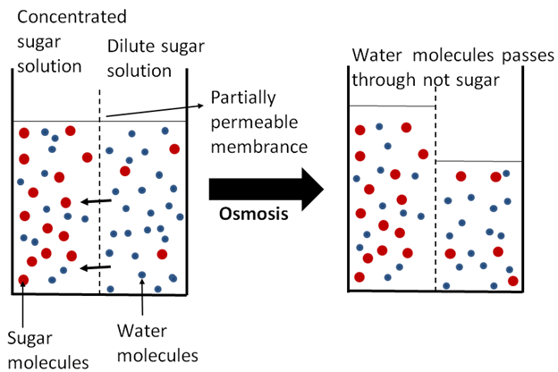
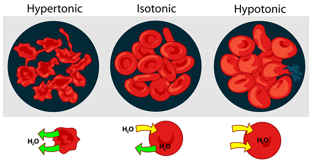

While scrolling through my newsfeed one evening, happily procrastinating, I happened upon an interesting video a friend posted [Water Bottles Don't Freeze?](https://www.youtube.com/watch?v=GBvF_hb3TyA), demonstrating concern over the fact that bottles of Aquafina that had been resting on ice overnight, were *not frozen*. How could this be?! What secret, insidious chemical was added to the water that could possibly prevent it from freezing?! This was posted with a short tag: “Any chem majors out there have any ideas/ Can any of my chem major friends please explain this?”.

While I’m not a chem major, I posted a response – as this concern is actually of central importance to pretty much every biologist and chemist out there (or anyone who drinks bottled water). 
#### So what chemical can possibly change the way water freezes? 
In short: any and every chemical… other than water. The water we encounter in our everyday lives doesn’t exist in isolation. Our water is exposed to chemicals aerosolized in the air and salts and minerals present on and in the surfaces containing it. Water molecules are always in random motion because they have a certain amount of energy. All of these chemicals come into contact with the water’s molecules and the random jostling of these tiny H2O molecules can knock loose the molecules of the other materials, incorporating them into the water itself, forming what we call a **solution**. 

Water is pretty good at knocking molecules off of substances, due to its chemical makeup. H2O refers to the two hydrogen atoms and a single oxygen atom that compose each water molecule. These atoms all have their own electrons, even though the oxygen atoms are much more massive than the hydrogen atoms. This difference in size between the oxygen and hydrogen atoms pulls the electrons closer to the oxygen, resulting in a uneven distribution, much like the person with the stronger grip ends up with all the blankets on the bed.  In water, this uneven distribution of electrons gives the water molecules a pseudo-charge that we call **polarity**. The water has two partial positive charges (δ+) around the two hydrogens and one partial negative charge (δ-) around the oxygen.

This polarity attracts other polar (partially charged) molecules as well as other charged molecules and this attraction is what makes water so good at ripping molecules away from the solids that make up.  Water is like an attractive person at singles night, they get everyone's number by the time the night is over.  Minerals, salts, sugars, and many other compounds found on earth and in life are polar, and therefore **hydrophilic** meaning that they like (‘phile’) water (hydro) and are relatively easily dissolved in water or mixed with water to form a solution.

#### How are solutions different from pure water? 
Due to the abundance of “stuff” on earth and the ability of water to dissolve a lot of different things to some varying degrees of success, almost all water contains some molecules that are not water, and thus **water is in fact a solution**. For the most part, solutions look and act like plain water, but under closer inspection, they have **different physical and chemical properties**. Put enough sugar in water and the refined chemical sensor, aka your tongue, will promptly detect its presence (and probably enjoy it). The foreign molecules also change water’s density because the foreign molecules take up space and can either weigh significantly more or significantly less than the water molecule itself, thus changing the density of the solution.  If you think of solution as cake mix, when you add dried fruits, you get a denser cake (fruitcake) because the the weight of the dried fruit is heavier than weight of the cake mix it displaced.  On the other hand, if you mix in more air, you get a lighter cake, like angel food cake because the air weighs less than the cake mix it displaced.  

The foreign molecules in solutions can also interfere with the interactions between the water molecules. Because of water’s polarity, it’s very good at sticking to itself. This is responsible for water’s fluid nature, it’s thickness or viscosity, and it’s surface tension or the ability to form droplets. However, the foreign molecules can get in the way of the water molecules and block them from interacting with themselves. Water molecules are like a pair of best friends, always hangout together till a new friend splits up them up.  
#### Why don't solutions freeze at the same rate as pure water? 
Changing how well water sticks to itself has a few implications. As you cool water, you slow down the random motion of its molecules and eventually slow it to a point that the molecule’s act of sticking together holds them still in place, in a crystalline structure more commonly called ice. However, when there are foreign molecules present, the water molecules can’t stick together as well so, it takes more cooling to solidify the water solution than it would for pure water. This is the case with the water in that viral video, the water that wasn’t freezing overnight had more chemicals dissolved in it. This is also why salt is added to icy roads, to decrease the melting temperature of the ice so that it will melt in the colder winter temperatures. 

#### Why are water bottles filled with solution instead of 100% pure water? 
As I mentioned before most water has some level of foreign stuff in it because it doesn’t exist in isolation. But all the water in the video was drinking water – why was one bottle of water freezing at different temperatures than the other? This then begs the question: who is putting this stuff into our drinking water… and why? In short: Aquafina, Dasani, SmartWater and every other bottled water company, because it makes the water tasty and better for us. Most tap water and spring water has trace amounts of different **ions** in it. Ions are the charged components of a salt that separate when it’s dissolved in water. Take table salt for example: NaCl or sodium chloride dissolves into positively charged sodium ions and negatively charged chloride ions. We often call the ions found in water **electrolytes**, a term that might sound familiar. These ions often include the positively charged sodium, magnesium, potassium metal ions and the negatively charged chloride and bicarbonate ions. Depending on what spring you get your water from, the mix will be different.  Different mixes are associated with different subtle tastes to water – some of which are much more pleasant than others. Often times, tap water has too many ions or ions with some heavy metals in it making it taste a bit unpleasant – this is called hard water, and removing the excess ions with a water purifier makes the water taste better. 
The other end of the spectrum – truly pure water with no ions – tastes disgusting to our taste buds as well. So most water bottling companies purify their water as much as possible to a near blank state and then add back different electrolytes to achieve their tried and true mixture with the best taste that we mistakenly identify as “pure water”. Real pure water tastes eerily like nothing. 

But do we really want to go to such lengths just to optimize the taste of our water? Is it worth putting all of these random salts in our bodies everyday?... This is one of those exceedingly rare occasions where our evolved desire for a particular taste is in line with water our body demands for a healthy existence. We like the taste of water with some electrolyte content, and associate it with a taste of pure water, because **it’s good for us**. **In fact, just as seawater cannot quench your thirst, neither can truly 100% pure water.** 

#### Why is it bad to if we drink seawater or pure water? 

To understand exactly why this is, we need to take a closer look at our bodies- particularly our cells and we need to understand the concept of **equilibrium**. All of the water in our cells is in a solution state like the solutions discussed above. This cellular water (called cytoplasm) is full of proteins, salts, sugars, and nutrients many of which are essential to life and need to be maintained at particular concentrations. The water is free to interact with the environment outside of the cells but the cell membrane that encapsulates our cells is *semi-permeable*, meaning that although the water is free to move from one side to another, the molecules inside it are not. Equilibrium refers to the fact that all substances in an area try to achieve a state of equableness – in the case of two liquid solutions, like a red food coloring mixed with water, equilibrium is achieved when the solutions have completely mixed and formed one solution with a single concentration of red dye. 
When **you drink seawater** you expose your cells to a solution that is incredibly concentrated with sea salt. To attempt to achieve an equilibrium concentration water rapidly leaves your cells to concentrate the cellular solution and dilute the seawater in your gut, **dehydrating your cells and consequently your body**. Alternatively, if **you drink totally pure water**, water will rush into your cells to attempt to achieve an equilibrium and this causes the cells to **swell and potentially explode**. 

As you can see, the relative overall concentration of different solutions is very important, so important in fact, that it gets its own word: **tonicity**. Solutions that are more concentrated than our cells are **hypertonic** and those less concentrated are **hypotonic**. And the movement of water through a semi-permeable membrane like a cell membrane is called **osmosis**. Regulating the tonicity of our blood relative to our cells is extremely important to our health. Luckily, our bodies do this for us. 
In a manner similar to the purification of bottled water discussed above, our blood is filtered down to a nearly blank state in the kidneys, which are each made up of around a million individual purifiers called nephrons. A concentrated solution of unnecessary waste ions are excreted as urine and the remaining blood can be recirculated through the body to receive new ions. Likewise, in the lab we use heavy duty purifiers to remove as many electrolytes and other impurities as possible to make “nanopure” water. We then add back different electrolytes in known quantities to minimize variation in experiments. This ability of water to carry ions and other compounds of all different types – it’s broad solvency – is one of the many qualities of water that lends itself to life and our enjoyment.  

	
	

