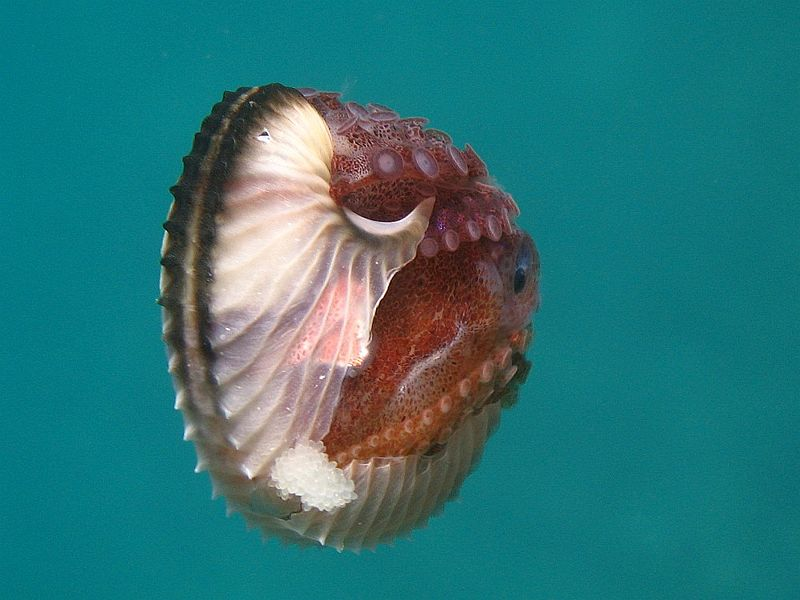

###### Pelagic red crabs, an unusual warm-water visitor to Monterey waters. Photo used with permission from Patrick Anderson (Instagram: [@underwaterpat](https://www.instagram.com/underwaterpat/))

Those of us living in California have seen El Niño flooding the local news, and [the streets of Los Angeles](http://www.cbsnews.com/news/el-nino-southern-california-record-breaking-storms-floods-mudslides-damaged-homes/). The name “El Niño” has come up in relation to recent storms and strange weather across the U.S., and you may have heard that this season’s was a “Godzilla” El Niño. But what is El Niño, exactly?

### The short version
El Niño is one part of a cycle of wind and ocean current patterns that brings warmer waters to the west coast of the Americas, which raises temperatures and changes weather patterns across the globe.

This year’s El Niño has received so much attention because it’s one of the strongest on record (although we’ve only been keeping track since 1950), meaning even warmer waters in the eastern Pacific than what is usually seen during an El Niño. The change in temperature and winds brought rains to drought-stricken California and a warmer winter to the east coast, but other regions of the world were drier: Indonesia fought massive forest fires, and South Africa faced water shortages and crop failures. Understanding El Niño helps us better predict and manage these ecological, economic, and social consequences. We also need to study El Niño because these large-scale climatic cycles and their interactions are crucial to our understanding of climate change. Conditions in El Niño can show us what’s to come in warmer years, where this year’s El Niño conditions may be the standard instead of the extreme.

### Okay, now the long version
Under normal conditions, winds known as the trade winds blow east to west across the Pacific Ocean, pushing on the ocean and piling warm surface water up against Asia and Australia. This actually gives the ocean surface a slope, higher in the western Pacific and lower in the east. Think about blowing on a hot cup of coffee: the air depresses the surface near you and pushes the coffee up against opposite side of the mug. This slope doesn’t rise indefinitely, leaving you with a dry mug and coffee-stained shoes—the coffee from the bottom of the mug comes up to replace what you blow away. Similarly, cold, deep ocean water is pulled up to the surface on the west coast of the Americas to replace what the trade winds push toward Asia. This creates a massive circulation with warm water by Indonesia and Australia getting pushed down to the deep ocean and cold water welling up by California and Peru.

 ![alt text] (./images/ENSO.png)
######The trade winds blow east to west across the Pacific Ocean, pushing warm water up by Asia and Australia and driving circulation. Graphic by Julia Mason

About every three to seven years, the trade winds weaken for reasons scientists still don’t understand. Just like when you run out of breath and your coffee levels out, the warm water piled up near Asia flows back “downhill” toward the Americas: this is El Niño.

All that warm water sloshing toward California means lots of warm, moist air, which is a recipe for rain. The massive flow of water toward the Americas (called a Kelvin wave) also disrupts the upwelling of cold water, with big consequences for fisheries.

In fact, Peruvian fishermen who for centuries noticed changes in currents and the disappearance of their fish around Christmas time are credited with the name El Niño, Spanish for “the boy,” referring to the birth of baby Jesus. In the U.S., we tend to see the biggest effects between December and March. As mentioned earlier, these wind and current patterns are part of a cycle, and we call the opposite part (stronger trade winds, stronger upwelling, colder water) “La Niña,” the girl. The standard way we measure El Niño events, and thus make claims about the strength of the El Niño, is by how much warmer than usual the ocean surface is in a particular region of the central Pacific, called “Niño 3.4.” If the temperature in Niño 3.4 is 0.5°C  above average, that’s sufficient to declare an El Niño. This winter, the temperature in Niño 3.4 was 2.3°C above average, which puts it in a tie with the 1997-1998 extreme El Niño. In 1982-1983, during the second most extreme El Niño we have on record, the anomaly was 2.1° C.

###El Niño in Monterey Bay
Marine biologists get especially excited about El Niño because the warm water brings many ocean creatures into unexpected places. Central California’s Monterey Bay, home to [Stanford University’s Hopkins Marine Station](http://hopkinsmarinestation.stanford.edu/),  has been a fantastic platform from which to observe how El Niño changes life in the ocean. Some unusual El Niño visitors to Monterey Bay this year have included tuna, bonito, and anchovies. [NOAA](https://swfsc.noaa.gov/) scientists have found animals never seen before in this region: the fancifully named argonauts and slender snipefish, and record numbers of warm-water ribbonfish called king-of-the-salmon. In October and again in January, swarms of pelagic red crabs [washed up on Monterey beaches](http://www.mercurynews.com/central-coast/ci_29933056/red-tuna-crabs-back-shores-monterey-bay). These open ocean crabs, usually Baja Mexico and Southern California residents, haven’t been seen in these numbers in Monterey since the 1982-83 extreme El Niño.

###### Argonauts, or paper nautilus, are open-ocean octopuses not commonly found in coastal waters. Picture from Wikimedia commons.

El Niño, however, can also be cause for marine biology concern. The inflow of warm water shuts down normal circulation of nutrients to the ocean surface, meaning less food to go around for the entire marine food chain--seabirds and seals go hungry; fishermen’s nets go empty. This year’s oceanographic and weather conditions in California have been especially alarming because of the [“blob,”](https://www.sciencedaily.com/releases/2015/04/150409143041.htm) a persistent mass of warm water off the Pacific Northwest that appeared in 2014. The warm blob waters of last year in combination with the warm El Niño waters of this year meant a double whammy for ocean creatures. Scientists hope that this strong El Niño will bring an equally strong La Niña to jumpstart circulation of colder water and more nutrients.  If not, fisheries forecasts and the general health of the coastal ecosystem will be in unprecedentedly bad shape.

As Francisco Chavez, an oceanographer at the [Monterey Bay Aquarium Research Institute](http://www.mbari.org/), says, “Just as every child is different, every El Niño is different.” Scientists can’t perfectly predict how each El Niño will impact the California coast, but studying its impacts now can help us prepare for those still to come.

Sources:
[1] NOAA ENSO Information Website: https://www.climate.gov/enso
