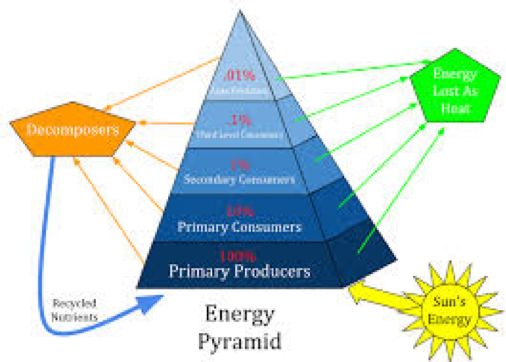

**How much impact can a single person’s lifestyle have on the entire planet’s carbon footprint?** 
The answer, and where it lies, might surprise you.
 
New estimates predict that Earth’s temperature will increase by 2.7º F by 2040 (which isn’t that far away), which would cause devastating climate changes, even worse than those that would have accompanied the previously predicted 3.1º increase by 2060. The estimates also predict nearly $54 trillion dollars spent in damage control due to the secondary symptoms of climate change like the California forest fires seen within the last few months (1). With the current administration’s planned exit from the Paris Agreement and lack of other environmental reform efforts, it might seem like little can be done to reverse the effects of the century’s buildup of carbon emissions. However, we might be able to help the planet more easily through **individual changes** than via national and international legislation.
 
 Growing evidence suggests that you aren’t the only one affected by what you put in your body. **The most feasible and impactful way to immediately help the planet lies in your stomach**! Science suggests that decreasing meat and dairy consumption, even without completely eliminating them from your diet, can drastically impact yearly greenhouse gas emissions and land and water use.
 
### **Red Meat – The #1 offender**

NPR recently reported that production of beef, lamb, and goat meats are the most detrimental to the environment, closely followed by cheese, milk, and poultry. The foods that have the lowest impact? Fish, nuts, and even eggs (1). Time magazine estimates that the average **American eats 270 lbs of meat each year**, whereas the average across the w**orld is only 80 lbs per year.** 

### It Takes a Lot of Energy to Get Meat to Eat

One of the most pressing environmental issues surrounding the meat production process is the inefficient use of energy required to raise and keep the animals until slaughter. While only 4 million acres of land in the US are designated to produce vegetables for human consumption, 56 million American acres are used to grow feed for livestock, that’s **10x more land devoted to meat instead of veggies** (2). Globally, this estimate sits around 30% of the world’s ice-free surface, ⅓ of the usable land is devoted to feeding livestock (3). This astonishing statistic translates into the production of 1.3 billion tons of grain produced to feed cattle and poultry each year worldwide. 

Thinking about this in terms of the amount of meat produced for human consumption, a cow generally consumes between 75 and 300 kilograms of grain just to produce 1 kilogram of protein (3). One of the most glaring issues associated with meat production and consumption, therefore, is the inefficient use of resources to result in such a small amount of meat for human consumption. Think this sounds familiar? It’s a direct example of the 10% rule of the energy pyramid you most likely learned about in middle school biology.

 
  

Research suggests that these problems aren’t going away anytime soon, either. The global per capita consumption of meat is expected to rise in coming years due to an increase in average income compounded with global population growth (4). Based on income, a factor that often correlates with household meat consumption, annual intake is projected to double by 2050!

  

### Dairy – The Unlikely Culprit

 
Right behind meat, dairy is the secondary culprit of food production’s harmful effects on the environment. Cheese alone is ranked as the **third greatest contributor to greenhouse gas** emissions right after beef and lamb (5). This in part is due to America’s love for cheese, with the average American consuming 31 lbs of cheese per year! Unfortunately, this means we are each individually responsible for 401 lbs of carbon dioxide emissions every year (5). On top of greenhouse gas emission, dairy production requires immense amounts of water, especially when compared to fruits and vegetables. Below is the breakdown for the gallons of water required for each individual dairy cow daily and the amount of water required to sustain the nearly 9 million working dairy cows in the US.

 

To take this one step further, included is just how many gallons of water go into a single serving of your favorite dairy products.

  
  

### What Can We Do to Help?

 
All of these daunting statistics may make you want to you quit meat and dairy immediately, but for many of us, that diet just isn’t feasible (or enjoyable). Recent studies even suggest that the vegan and vegetarian diets might not even be the best choice environmentally, but that “healthy omnivore diets”, diets that consume very small amounts of meat, might be the most efficient use of our limited land and resources while still cutting back on carbon emissions (6). So, if you aren’t able (or don't want) to become vegan or vegetarian, still being aware of your meat and dairy intake and decreasing consumption by just a small amount can have a huge impact on greenhouse gas emissions and water usage. 
**The important thing to know is that every bit counts.** Even if everyone skipped just one serving of chicken a week, the decrease in emissions would be equivalent to taking half a million cars off the roads!! (7). Considering that a completely vegetarian diet would decrease emissions by 63% from the current value, even a day or two a week without meat could have a substantial, positive impact on the environment. 

Along with eliminating meat and dairy from certain meals each week, another way to help the environment is to consider reducing the amount of these food groups consumed in a single sitting. For example, many restaurants are experimenting with supplementing burger meat with mushrooms to form a burger patty that can still assume the flavor and protein of red meat, but reduces the total amount of meat used per patty. If you are considering fully eliminating meat from your diet, but love the taste and texture, consider trying plant based substitutes. Given that these alternatives have been on the market for a number of years, most grocery stores stock a wide variety made with different grains and vegetables and therefore have varying consistencies and flavors (and hopefully one that appeals to your taste buds). These substitutes also come in a number of different formats, including: sausage, deli meat, hot dogs, and meatballs.

### Key Takeaways
  
The most important takeaway here is that **balance is key**: decreasing consumption of meat and animal byproducts by even a small amount can have a huge effect.

  

For a ranked list of the best meatless substitutes made by a die-hard meat fan, check out this article: [Best Fake Meat Substitutes](%28https://www.thrillist.com/eat/nation/best-fake-meat-vegetarian-substitutes%29)

  

And a few extra, popular brands here: [Popular Vegan Meat Brands](%28https://www.bestproducts.com/eats/food/g3532/delicious-vegan-meat-brands/%29.)

  

#### References:

1. Chew On This For Earth Day: How Our Diets Impact The Planet [Internet]. NPR.org. [cited 2019 Jan 24]. Available from: https://www.npr.org/sections/thesalt/2017/04/22/525113726/chew-on-this-for-earth-day-how-our-diets-impact-the-planet

2. Meat and the Environment [Internet]. PETA. [cited 2019 Jan 24]. Available from: https://www.peta.org/issues/animals-used-for-food/meat-environment/

3. Walsh B. The Triple Whopper Environmental Impact of Global Meat Production. Time [Internet]. [cited 2019 Jan 24]; Available from: http://science.time.com/2013/12/16/the-triple-whopper-environmental-impact-of-global-meat-production/

4. Godfray HCJ, Aveyard P, Garnett T, Hall JW, Key TJ, Lorimer J, et al. Meat consumption, health, and the environment. Science. 2018 Jul 20;361(6399):eaam5324.

5. Milk Life? How About Milk Destruction: The Shocking Truth About the Dairy Industry and the Environment - One Green PlanetOne Green Planet [Internet]. [cited 2019 Jan 24]. Available from:[https://www.onegreenplanet.org/animalsandnature/the-dairy-industry-and-the-environment/](https://www.onegreenplanet.org/animalsandnature/the-dairy-industry-and-the-environment/)

6. Peters, C.J., Picardy, J., Darrouzet-Nardi, A.F., Wilkins, J.L., Griffin, T.S. and Fick, G.W., 2016. Carrying capacity of U.S. agricultural land: Ten diet scenarios. Elem Sci Anth, 4, p.000116.

7. New Study Shows Major Environmental Impact of Meat Consumption [Internet]. Impacting Our Future. [cited 2019 Jan 24]. Available from: http://www.impactingourfuture.com/news/new-study-shows-major-environmental-impact-of-meat-consumption

